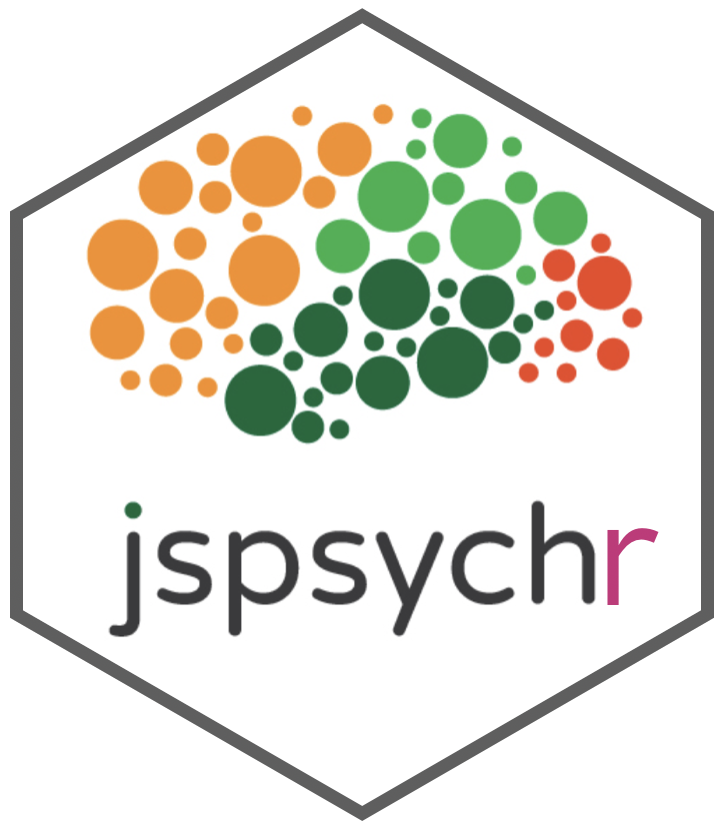

Shiny Apps, R packages, and various things

---

## R Packages

----

<div class="row">
<div class="col-sm-8">

#### [vertical](https://crumplab.github.io/vertical/)

R-studio project template and workflow for sharing psychological research projects in the form of a website.

</div>
<div class="col-sm-4">
```{r vertical, out.width=100, echo=F}
knitr::include_graphics("images/vertical.png")
```
</div>
</div>

----

<div class="row">
<div class="col-sm-8">

#### [RsemanticLibrarian](https://crumplab.github.io/RsemanticLibrarian/)

R functions for creating semantic librarians, a tool for vectorizing and visualizing semantic spaces from text

</div>
<div class="col-sm-4">
```{r rsl, out.width=100, echo=F}
knitr::include_graphics("images/sl_hex.png")
```
</div>
</div>

----

<div class="row">
<div class="col-sm-8">

#### [jspsychr](https://crumplab.github.io/jspsychr/)

Write and run jspsych experiments using R studio.

</div>
<div class="col-sm-4">
```{r jspsychr, out.width=100, echo=F}

```
</div>
</div>

----


<div class="row">
<div class="col-sm-8">

#### [playjareyesores](https://crumplab.github.io/playjareyesores/)

Functions for detecting textual overlap (e.g., possible plagiarism) between documents [https://crumplab.github.io/playjareyesores/](https://crumplab.github.io/playjareyesores/)

</div>
<div class="col-sm-4">
```{r playjar, out.width=100, echo=F}
knitr::include_graphics("images/playjareyesores.png")
```
</div>
</div>

----

<div class="row">
<div class="col-sm-8">

#### [conflictPower](https://crumplab.github.io/conflictPower/)

Monte-carlo based power analysis for cognitive control designs. [https://crumplab.github.io/conflictPower/](https://crumplab.github.io/conflictPower/)

</div>
<div class="col-sm-4">
```{r CP, out.width=100, echo=F}
knitr::include_graphics("images/ConflictPower.png")
```
</div>
</div>

-----

#### [crumplabr](https://github.com/CrumpLab/crumplabr)

A few functions used around the lab. Contains functions for the Van Selst and Jolicoeur outlier procedure. [https://github.com/CrumpLab/crumplabr](https://github.com/CrumpLab/crumplabr).

-----

## Shiny Apps

-----

#### [semanticlibrarian.com](https://www.semanticlibrarian.com/)

A semantic search engine for the APA abstract database (most of the Experimental journals from 1890s to 2016), formerly known as ATHENA.

We (Harinder Aujla, Randy Jamieson, and Matthew Crump) use semantic vectors from BEAGLE (Jones & Mewhort, 2007) to compute the similarity between abstracts, and authors, and authors and abstracts.

- [https://crumplab.shinyapps.io/SemanticLibrarian/](https://crumplab.shinyapps.io/SemanticLibrarian/)
- source code: [https://github.com/CrumpLab/SemanticLibrarian](https://github.com/CrumpLab/SemanticLibrarian)
- Open science framework project: [https://osf.io/wfcmg/](https://osf.io/wfcmg/)
- Publication: In press at Behavioral Research Methods.

-----

#### [hypothesis_explorer](hypothesis_explorer)

A Shiny App for viewing annotations from the Hypothes.is database. Need to download and run locally.

[https://github.com/CrumpLab/hypothesis_explorer](https://github.com/CrumpLab/hypothesis_explorer)

-----

#### [indTtest](https://crumplab.shinyapps.io/indTtest/)

An independent samples t-test simulator.

[https://crumplab.shinyapps.io/indTtest/](https://crumplab.shinyapps.io/indTtest/)

-----

#### [pairedTtest](https://crumplab.shinyapps.io/pairedTtest/)

An paired samples t-test simulator.

[https://crumplab.shinyapps.io/pairedTtest/](https://crumplab.shinyapps.io/pairedTtest/)

-----

#### [simpleexperimentsim](https://crumplab.shinyapps.io/simpleexperimentsim/)

A simple experiment simulator with monte-carlo power analysis

[https://crumplab.shinyapps.io/simpleexperimentsim/](https://crumplab.shinyapps.io/simpleexperimentsim/)


-----

## R Markdown templates

-----

#### [NSFrmarkdown](https://github.com/CrumpLab/NSFrmarkdown)

An R markdown template for NSF grants

[https://github.com/CrumpLab/NSFrmarkdown](https://github.com/CrumpLab/NSFrmarkdown)

-----

#### [LabJournalWebsite](https://github.com/CrumpLab/LabJournalWebsite)

[https://github.com/CrumpLab/LabJournalWebsite](https://github.com/CrumpLab/LabJournalWebsite)

Simple template for an R Markdown Website

-----

#### [rmpatternlanguage](https://github.com/CrumpLab/rmpatternlanguage)

A bookdown theme reproducing the style of "A Pattern Language".

[https://github.com/CrumpLab/rmpatternlanguage](https://github.com/CrumpLab/rmpatternlanguage)


-----


