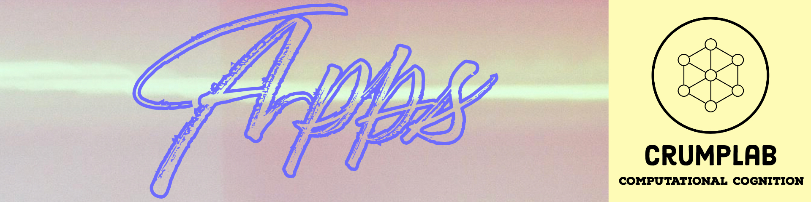

:::::: {.fp .home .people .apps}

::::: people-hero
{.hero-banner fig-alt="Apps"}

::: hero-body
[\~/crumplab/apps]{.fp-kicker}

```{=html}
<h1 class="visually-hidden">Apps</h1>
```

::: fp-lead
Shiny Apps, R packages, and various things
:::

::: {#stats}
:::
:::
:::::

::: {#apps}
:::

::::::
