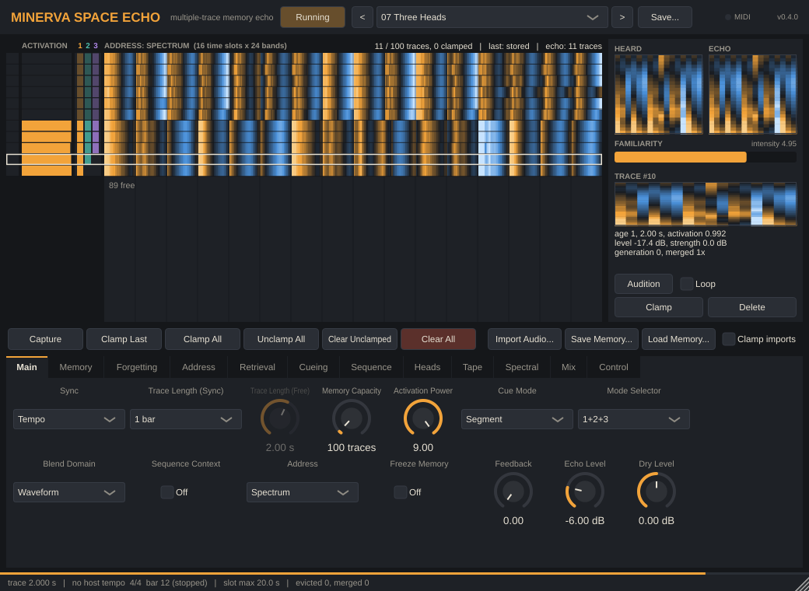
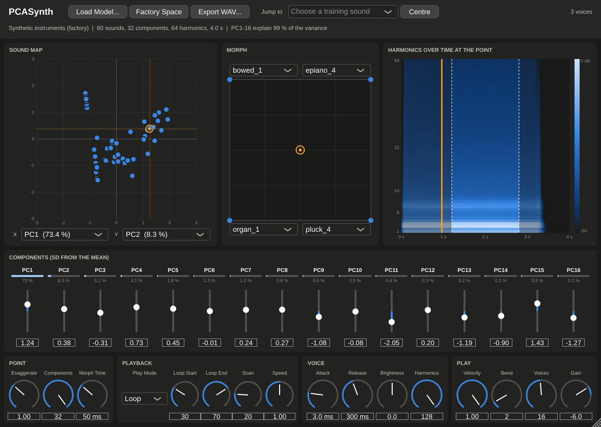
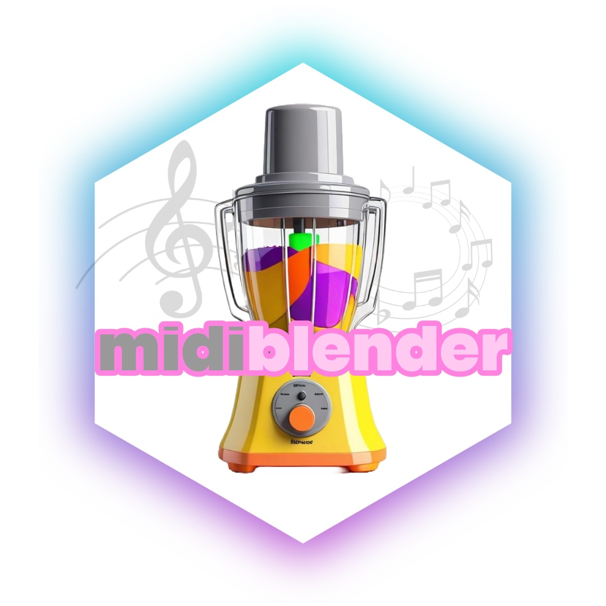
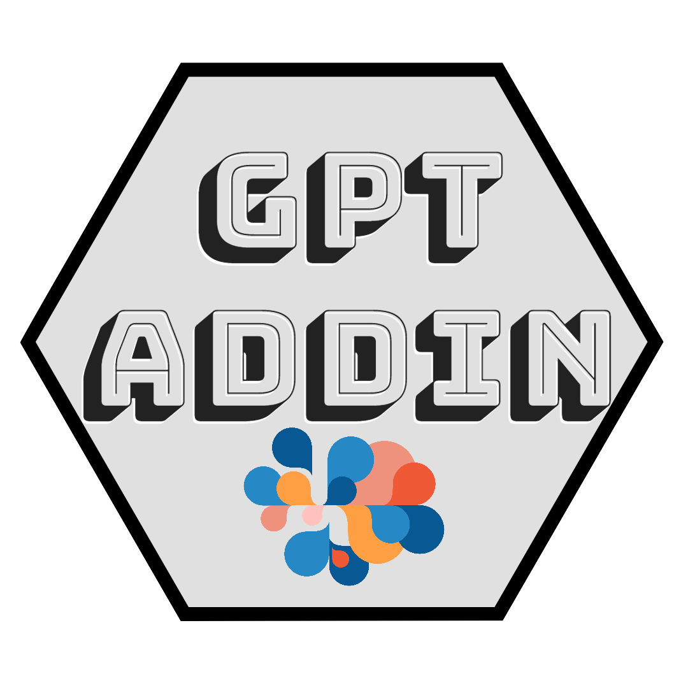
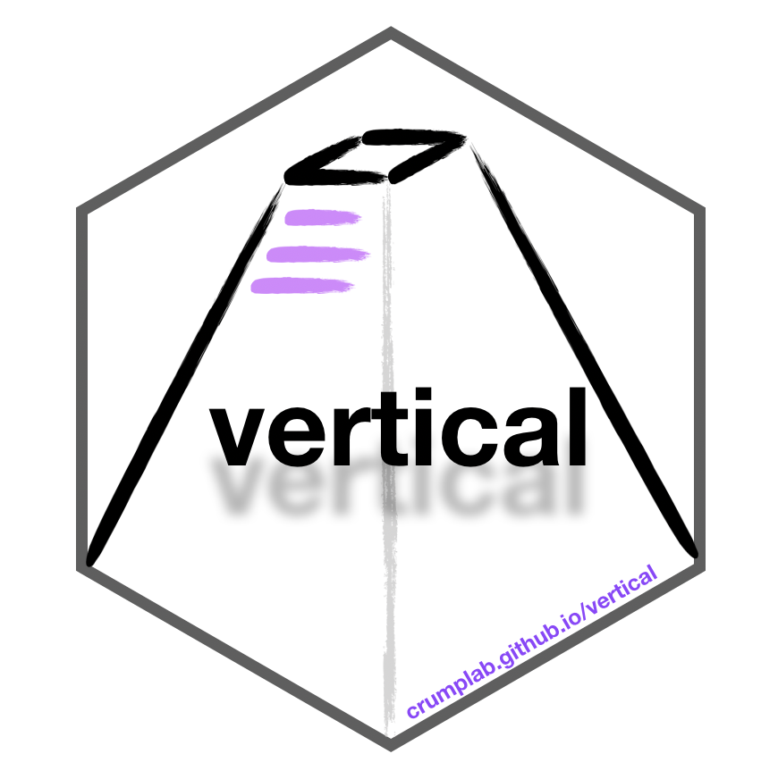
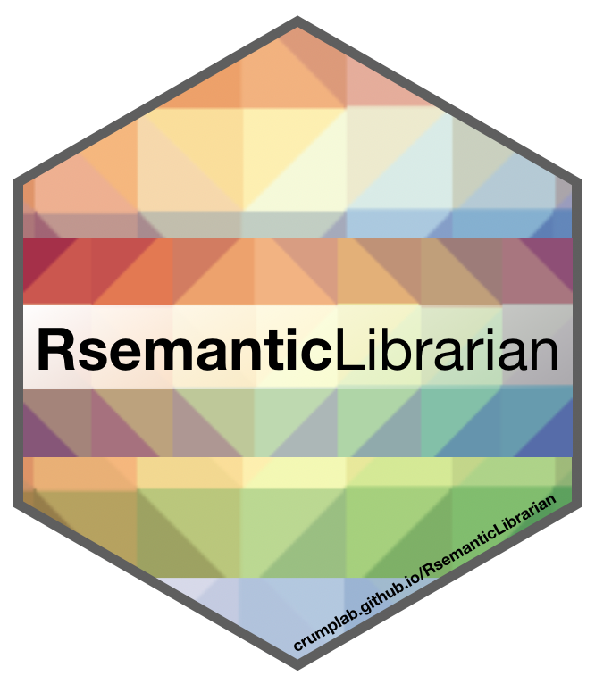
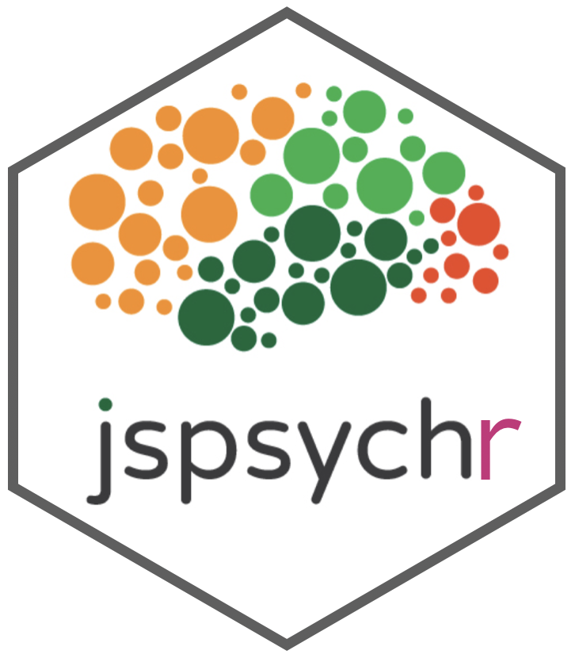
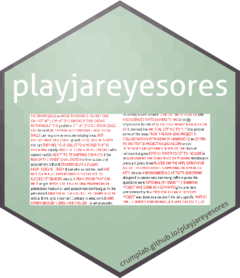
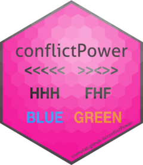

Shiny Apps, R packages, and various things

------------------------------------------------------------------------

# Audio Plugins

------------------------------------------------------------------------

::::: columns
::: {.column width="70%"}
## [MINERVA Space Echo](https://www.crumplab.com/MinervaSpaceEcho/)

An experimental audio effect (AU / VST3 for macOS) that treats Hintzman's MINERVA II multiple-trace memory model as a tape echo.

Manual: <https://www.crumplab.com/MinervaSpaceEcho/>, source code: <https://github.com/CrumpLab/MinervaSpaceEcho>
:::

::: {.column width="30%"}
{width="100px"}
:::
:::::

------------------------------------------------------------------------

::::: columns
::: {.column width="70%"}
## [PCASynth](https://github.com/CrumpLab/PCASynth)

An experimental synthesizer (VST3 for macOS) built on a principal components analysis of wav files.

Source code: <https://github.com/CrumpLab/PCASynth>
:::

::: {.column width="30%"}
{width="100px"}
:::
:::::

------------------------------------------------------------------------

# R Packages

------------------------------------------------------------------------

::::: columns
::: {.column width="70%"}
## [midiblender](https://www.crumplab.com/midiblender/)

midiblender: Experiments in genRative MIDI mangling

This is the beginnings of an #rstats package for experimental mangling of #MIDI files.
:::

::: {.column width="30%"}
{width="100px"}
:::
:::::

------------------------------------------------------------------------

::::: columns
::: {.column width="70%"}
## [gptaddin](https://crumplab.github.io/gptaddin/)

Addins and shiny app for sending text to LLMs at OpenAI. The addins are focused on writing assistance tools. The shiny app has a grammar checker. This is an experimental package for personal use that may be helpful as a reference for others to build their own similar tools.
:::

::: {.column width="30%"}
{width="100px"}
:::
:::::

------------------------------------------------------------------------

::::: columns
::: {.column width="70%"}
## [vertical](https://crumplab.github.io/vertical/)

R-studio project template and workflow for sharing psychological research projects in the form of a website.
:::

::: {.column width="30%"}
{width="100px"}
:::
:::::

------------------------------------------------------------------------

::::: columns
::: {.column width="70%"}
## [RsemanticLibrarian](https://crumplab.github.io/RsemanticLibrarian/)

R functions for creating semantic librarians, a tool for vectorizing and visualizing semantic spaces from text
:::

::: {.column width="30%"}
{width="100px"}
:::
:::::

------------------------------------------------------------------------

::::: columns
::: {.column width="70%"}
## [jspsychr](https://crumplab.github.io/jspsychr/)

Write and run jspsych experiments using R studio.
:::

::: {.column width="30%"}
{width="100px"}
:::
:::::

------------------------------------------------------------------------

::::: columns
::: {.column width="70%"}
## [playjareyesores](https://crumplab.github.io/playjareyesores/)

Functions for detecting textual overlap (e.g., possible plagiarism) between documents <https://crumplab.github.io/playjareyesores/>
:::

::: {.column width="30%"}
{width="100px"}
:::
:::::

------------------------------------------------------------------------

::::: columns
::: {.column width="70%"}
## [conflictPower](https://crumplab.github.io/conflictPower/)

Monte-carlo based power analysis for cognitive control designs. <https://crumplab.github.io/conflictPower/>
:::

::: {.column width="30%"}
{width="100px"}
:::
:::::

------------------------------------------------------------------------

## [crumplabr](https://github.com/CrumpLab/crumplabr)

A few functions used around the lab. Contains functions for the Van Selst and Jolicoeur outlier procedure. <https://github.com/CrumpLab/crumplabr>.

------------------------------------------------------------------------

# Shiny Apps

------------------------------------------------------------------------

## [semanticlibrarian.com](https://www.semanticlibrarian.com/)

A semantic search engine for the APA abstract database (most of the Experimental journals from 1890s to 2016), formerly known as ATHENA.

We (Harinder Aujla, Randy Jamieson, and Matthew Crump) use semantic vectors from BEAGLE (Jones & Mewhort, 2007) to compute the similarity between abstracts, and authors, and authors and abstracts.

- <https://crumplab.shinyapps.io/SemanticLibrarian/>
- source code: <https://github.com/CrumpLab/SemanticLibrarian>
- Open science framework project: <https://osf.io/wfcmg/>
- Publication: In press at Behavioral Research Methods.

------------------------------------------------------------------------

## [hypothesis_explorer](hypothesis_explorer)

A Shiny App for viewing annotations from the Hypothes.is database. Need to download and run locally.

<https://github.com/CrumpLab/hypothesis_explorer>

------------------------------------------------------------------------

## [indTtest](https://crumplab.shinyapps.io/indTtest/)

An independent samples t-test simulator.

<https://crumplab.shinyapps.io/indTtest/>

------------------------------------------------------------------------

## [pairedTtest](https://crumplab.shinyapps.io/pairedTtest/)

An paired samples t-test simulator.

<https://crumplab.shinyapps.io/pairedTtest/>

------------------------------------------------------------------------

## [simpleexperimentsim](https://crumplab.shinyapps.io/simpleexperimentsim/)

A simple experiment simulator with monte-carlo power analysis

<https://crumplab.shinyapps.io/simpleexperimentsim/>

------------------------------------------------------------------------

# R Markdown templates

------------------------------------------------------------------------

## [NSFrmarkdown](https://github.com/CrumpLab/NSFrmarkdown)

An R markdown template for NSF grants

<https://github.com/CrumpLab/NSFrmarkdown>

------------------------------------------------------------------------

## [LabJournalWebsite](https://github.com/CrumpLab/LabJournalWebsite)

<https://github.com/CrumpLab/LabJournalWebsite>

Simple template for an R Markdown Website

------------------------------------------------------------------------

## [rmpatternlanguage](https://github.com/CrumpLab/rmpatternlanguage)

A bookdown theme reproducing the style of "A Pattern Language".

<https://github.com/CrumpLab/rmpatternlanguage>

------------------------------------------------------------------------
