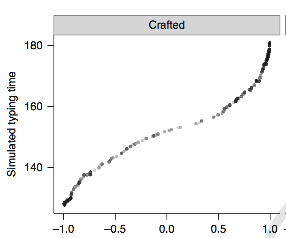

```{r setup, include=FALSE}
knitr::opts_chunk$set(message=FALSE,warning=FALSE, cache=TRUE)
```

Using this mainly as a place to make notes for myself so I don't forget what I'm doing. I own my spelling mistakes and sell them on e-bay.

--------------------------

# My experience with OER development at CUNY so far

2018-07-22, last compiled: `r Sys.Date()`

CUNY was awarded a [4 million dollar grant by New York State](http://www2.cuny.edu/libraries/open-educational-resources/) for all things OER (open-educational resources). OERs are transforming education right now because they create a zero-textbook cost course for students, saving them lots of moola. This is great, and there is a lot of fantastic, high quality OER content out there. Especially in Psych.

I've been participating in OER development at Brooklyn College of CUNY. I was awarded a small $2,000 grant from the library to create an OER for our [Research methods course](https://crumplab.github.io/ResearchMethods/), which I made last summer (2017). I created an [OER tutorial](https://crumplab.github.io/OER_bookdown/) on the process I use to make OERs using all free and open-source software. I made my [programming book for Psychologists](https://crumplab.github.io/programmingforpsych/) into an OER. And, this summer I was awarded another small grant to make an OER for statistics, creating both a [textbook](https://github.com/CrumpLab/statistics) and [lab manual](https://github.com/CrumpLab/statisticsLab). And, I've submitted a proposal to make another OER for a cognitive psychology textbook, with plans to write this year. That's a lot of OER development!

I thought I would say a few things about this experience, because I think OER development in general, and at CUNY is vitally important. It's great that CUNY is supporting this. It's a relatively new development. It's gone fairly well so far, but there is some room for improvement. Below I talk about what's gone well, and what needs improvement.

## Smooth Sailing with OERs at CUNY

CUNY is a Medusa of public universities and colleges, it's never clear who is in charge of what, at different levels. My experience is limited to working with the Librarians at Brooklyn College of CUNY.

1. The librarians I've been working with are FANTASTIC, and super helpful. They've spearheaded the task of managing the grant funds at BC, and encouraging faculty to convert to OERs. They've put on open-houses at BC, they've facilitated mini-conferences, they have excellent technical support. Nothing short of fantastic.

2. I've been given the flexibility to development OERs in the way I want, with the tools I want to use. Thank you BC @ CUNY for letting me do this. This is vitally important, because there are lots of different work flows, and there should not be a single way of doing this. I am eternally grateful I don't have to "convert" my things into some "standard" format I don't want to use.

3. There is a small bit of money for converting your course to an OER, this small bit of money is much appreciated, especially on our salaries at CUNY (considering cost of living in NYC). Most important, is that there is also a small bit of money for TAs and other instructors who adopt the materials that a lead instructor makes. This incentives the adoption of OERs that are made, and a little bit of extra money is great for adjuncts who should get paid more.

4. The library has set up websites and databases to connect your new OER with the wider universe of searchable OER databases, this is great.

5. Overall, the experience has been a no-brainer for me, because I was already doing zero-textbook cost courses, this just makes it official.

## Rough waters with OERs at CUNY

The experience of OER development is not without it's issues. Here are some of them.

1. MONEY. Money is always an issue. So what's the issue if there is 4 million dollars for OERs at CUNY? First, us OER developers are really grateful for the small bit of money we get. That's nice, thank you. I realize there isn't an infinite amount of money for doing this. However, the $2,000 dollars someone gets appears to be mainly for OER conversion. That is adopting someone else's OER for your course, then figuring out how to use, and perhaps modifying it in a minimal way. This is different from developing entire OERs.
  
  a. One nice thing about OERs is that when you development you can stand on the shoulder's of previous developers. For example, I did this with my research methods book, and re-made an existing OER that had already been versioned a couple different times. However, this took an entire summer because of the amount of development I put into it. I also wrote an entire lab manual for the course from scratch. This was not reflected in the small grant I received. 
  
  b. Right now I am writing a stats textbook. I'm borrowing some existing material here and there, but mostly re-writing everything because I have things to say. It's difficult to estimate the amount of hours I'm putting in on this (A LOT!). Almost everything else I'm doing has come to a full-stop. I won't be submitting a grant this summer. I'm committed to getting this textbook done for my students! I'm not asking for more money, I already agreed to do this in a negotiation process that went very well. In fact, this is one the nice things about OER development. I was able to negotiate a larger grant to pay 4 other collaborators on the project, and the TAs that will adopt this OER, that's fantastic. However, from the perspective of writing entire textbooks, I'm leaving loads of money of the table (assuming I could get a publishing deal and force my students to by my textbook, which would make me a horrible human being.). I suppose I'm simply saying that CUNY could distinguish grants to faculty in terms of OER conversion and OER development. This is already done somewhat informally through negotiation with the Library, who apparently have some flexibility in how the funds are spent. Clearer guidelines on this would be useful, and incentivizing the massive amount of work it takes to develop entire course (e.g., with websites, slide-decks, textbooks, lab manuals, question banks, etc.) would take OER sponsorship at CUNY to the next level. Let's go to the next level.
  
  c. The CUNY grant gave slim to none pickings of the available money to Faculty and instructors who develop and adopt OERs, and tonnes of money to the library to hire technicians to support the OERs. This is great because many faculty aren't technicians. This sucks for faculty who are technical and do all of the technical work.
  
2.  Faculty buy-in. There has been a lack-luster response by the majority of faculty at BC to OER development. They apparently just don't care. The attendance of the library sponsored OER events was abysmal. I don't know what this is about. Likely a combination of low-bandwidth on the part of very busy people to do anything more than they are already doing.
  
**Faculty credit.** This one deserves it's own little section. In my earlier twitter post I wondered out loud to our Brooklyn College President, about whether BC recognizes OER development as part of the tenure process. I don't know if it is does. It doesn't matter for me anymore because they just gave me tenure. If BC already recognizes these things for tenure, that's great, my following agitation will be needless. However, if it does not, then I this is the agitation. I've seen posts on twitter from other faculty around the world lamenting the fact that external reviewers poo pooed their stated OER development as not scholarly work. You try writing a 600 page book teaching R and stats, or something similar, to students. 

Of course research output is a super important aspect of the tenure process. I am totally and fully supportive of that aspect. In fact, I'm a little bit worried about what I am about to advocate for, because I hate seeing any opportunity to diminish the role of research. Junior Faculty are too often encouraged into teaching and service duties that massively unbalance their ability to do research, which is very important. In the ideal balancing case, the trifecta feeds into itself creating a positive feedback loop that simultaneously improves research, teaching, and service.

The obvious culprit in all of this is TIME. There is not enough of it. When I develop an entire OER, all the TIME goes into that, and none of the time goes into writing grants etc. Junior faculty can't spend all their time doing teaching, so if they do OER development, under what I presume to be the current point system for tenure, they are losing. I'm worried about this for new faculty because they will probably be the ones making the OERs. The older faculty aren't the ones doing it, they are in the very slim minority of OER developers at BC. They already have tenure, so credit for OER just pads their CVs. 

I was invited to lecture on OERs this August to the new incoming faculty at BC. What will I say to them? I can show them pictures of the things that I did (which I will), show them the tools I use (which are easy to learn, and super flexible), and then say what? Should I tell them to develop OERs? Or should I tell them to "RUN AWAY BECAUSE NO ONE WILL CARE, except your students". I want to tell them they should consider developing OERs. But, I'm not sure that I can, because I don't want to ruin their chances at tenure by suggesting they work their tail off and unbalance research and teaching.

I will finish this by saying that Faculty who develop OERs from scratch, are spending huge amounts of their time (time away from other things in their life), to produce indispensable free materials for their students. They are contributing to a global movement, where the materials are being shared and updated and improved, making them even better, while maintaining them as free resources. I suspect some of the publishing companies are getting worried, what if no one buys their textbooks because the ones we are making are so much more AWESOME. We're leaving money on the table. It would be nice to have some academic recognition from the College. And, this isn't to say hey recognize me (I did already did this without caring about that, and I suspect it wasn't part of the tenure discussion for my case, maybe I'm wrong). I'm saying let the new faculty know they will be recognized. Give them that incentive. Support MORE BETTER OER AT CUNY.

## Closing thoughts

I am really glad about everything CUNY has done so far with respect to OERs. Some of my agitations are out of ignorance, for example, I don't know that OER development is recognized in any way at Brooklyn College for Junior Faculty (or I suppose for any facult looking to go up a level). If it already is great, let's make that known. If it isn't, let's fix that.

------


  


# Making pre-prints with papaja

2018-07-24, last compiled: `r Sys.Date()`

`papaja` is a fantastic package written by Frederick Aust, for producing APA style papers by writing in R Markdown. This this is [the book on it](https://crsh.github.io/papaja_man/).

It seems this book doesn't extol the virtues of papaja beyond writing papers. papaja is also useful for making journal quality pre-prints that look like journal copy. Papaja is a wrapper for latex, and the underlying latex packages can produce lots of different styles. For example, in papaja the default setting is to compile as `man`, which produces a double-spaced APA style manuscript. However, changing the default to `jou`, typesets the document as a 2-column journal, that looks virtually identical to the JEP APA journals. 

So, for example, this morning I found out that a paper of mine was finally onlineFirst at JEP:HPP. This paper was originally written in word, and I wanted to create a nice looking pre-print that I could upload to PsyArXiv. So, I opened up a new papaja document, copied everything over (took about 25 minutes to twiddle with this) and pressed compile. It was almost voila, but not quite. There were a few little things that needed fixing, like indenting paragraphs, changing whether a figure is one-column wide or two-columns wide, and figuring out how to insert colons into yaml. These are quirks of R Markdown, and would be easy fixes in Latex, but Latex is a beast, which is why R Markdown is more speedy to get going. Plus you can usually pass most things from R Markdown to Latex either directly in the text, or using knitr code blocks. 

The only thing I couldn't figure out how to do was to get papaja to print the journal name, year etc. in jou mode. It apparently doesn't recognize `journal : "journal name"` in the yaml. Oh well, I will fight with that another day.

Bottom line, this pre-print would have been even faster to make if we had written the paper in R Markdown in the first place. Slowly migrating this to default pipeline. Nothing beats the compilation of a nice preprint in the morning, except maybe all the things that are better than that in life.

What's even more fun is that, because I set up my publications page to read from a .bib file generated by Zotero, I just need to add this new paper to Zotero, and boom, my publications will auto update. I love not having to do things.


# Get up and running with an R Markdown website, and then mess around with R

2018-07-23, last compiled: `r Sys.Date()`

I'm posting this for a couple students who will be doing some research in the lab this fall. If you have the time this summer, you can get prepared for the fall by doing these things (they are all free things)

1. Download [R](https://www.r-project.org) and [R-studio](https://www.rstudio.com) for your computer.
2. Make yourself a [github account](https://github.com), and then let me know so I can find you on github.
3. General info about making websites with R Markdown is here, but see next point for downloading an example you can use straight away. [https://rmarkdown.rstudio.com/rmarkdown_websites.htm](https://rmarkdown.rstudio.com/rmarkdown_websites.htm)
4. I just made a downloadable/forkable github repository with everything you need to get started, and it's self-explanatory in the sense that all of the materials explain themselves
    a. the repository is here [https://github.com/CrumpLab/LabJournalWebsite](https://github.com/CrumpLab/LabJournalWebsite)
    b. Follow the instructions in the read me file for how to compile the website in R-studio, and then host it on github
    c. You can see what the website will look like once you get it up and runnning here [https://crumplab.github.io/LabJournalWebsite/index.html](https://crumplab.github.io/LabJournalWebsite/index.html)
    d. Follow the instructions inside the source for the website, and by reading the website to get started this summer learning R.
    e. We'll talk more about lab research projects in the fall.


# Using R Markdown websites (and other R Markdown things) for undergraduate research projects.

2018-07-22, last compiled: `r Sys.Date()`

Every year I usually take on a few undergraduates interested in gaining some research experience. Over the years I've tried lots of different approaches. This year, I will try another one I thought of yesterday. Time will tell if it will work. 

Our department (Psychology Department @ Brooklyn College of CUNY) has a 2-year laboratory experience course. Students can take this course to get credit towards their degree while gaining some research experience. We also have 4th year courses for more advanced students (e.g., honor's thesis courses). My ideal pipeline is to have students take the 2nd year as a precursor to doing more advanced things in later years. This way I can train the requisite skills, so that some independent research can be accomplished by the students in later years. Unlike some labs, I have no busy work for students to do. Most of my research (Cognitive Psych) is now conducted online, so the only things to do are: come up with good ideas, read the literature, program the experiments, get the data, program the analysis scripts, write the paper etc. So, students to need to learn the skills in order to do anything.

**Training Goals**: I would like my new students to get some experience with some basics for data creation and and analysis. This means learning how to program a behavioral experiment from scratch to collect data, collect some data, and then learning how to analyze the data in R. For example, if a student can make a program to do something like collect reaction times in response to different stimuli, get some data, and then analyze it, they have some skills they can expand upon.

In the past, I've been more and less flexible on the kinds of projects students get involved in when they first arrive. Usually I get students involved in an ongoing project where there is a clear tangent worth having a student explore. This gives them some ownership of the unique tangent, and the tangent feeds into my ongoing research program (so it's not a tangent for me). H

However, I'm thinking about making a canonical research training project, where every new student would go through this same project in their first semester in the lab. This would save mental bandwidth for me to come up with new projects all the time (that often don't see the light of day), and potentially allow me to take on a few more students who are all working on the same thing. Ideally, this kind of project would be 1) asking a question that would remain relevant over the long term, 2) be somewhat personally interesting to the student and applicable to them, and 3) involve learning the skills I need students to learn (and that are generally super beneficial for the students to learn).

**My plan**: All new students do these things:

1. Get a github account (if they don't have one)
2. Download R and R-studio (if they don't have it)
3. Figure out how to serve there own R Markdown website in a github repository (using github pages) for the project they will work on
4. Get up to speed with some R basics (working with me, and using all of the great resources out there)
5. Use the R Markdown website a lab journal blog to record their work and progress
6. Keep doing this all semester long while they work on the canonical research training example, involving programming code to collect data, collect data, analyze data in R.


**Benefits**:

1. Canonical example gives a clear (and rich) target problem, so there is always a general goal and lots of things to keep trying...students will never run out of things to try or do by them self. IMO having a clear goal is very important for learning programming, otherwise many programming things seem totally abstract.
2. Students create a digital footprint of doing important things. Github stores their user activity, and they effectively begin building a portfolio that might be useful for them if they head in this kind of direction later in their careers.
3. I can easily evaluate and help students with their work through github when I am not around in person
4. Journaling helps with finding what you did later. When done in R Markdown, everything becomes reproducible. Doing it live in public, on a R Markdown website, would be fun and potentially more motivating.
5. Research progress is made, skills are learned. Things happen.


# I need to get my CC (creative commons) licenses in order

2018-07-23, last compiled: `r Sys.Date()`

I've been writing different kinds of open content and am revisiting the issue of licensing. So, I'm making notes about the process.


The creative commons license has a website with their licenses, you can read about them, and download scripts to put in webpages. [https://creativecommons.org/licenses/](https://creativecommons.org/licenses/)

I am hosting all of my works on github (repo and github pages to display). Github gives options for licenses when you create a repo. It used to support a basic CC license (0). Now CC licenses don't appear in the drop down menu, there's a thread requesting this feature be added

Some threads for reference:

1. Limitations about what licenses you can automatically choose on Github:  [https://github.com/github/choosealicense.com/issues/33](https://github.com/github/choosealicense.com/issues/33)

2. What should go in a license file: [https://github.com/whatwg/sg/issues/51](https://github.com/whatwg/sg/issues/51)

3. Github repo with CC licenses in html and plain text [https://github.com/creativecommons/legalcode](https://github.com/creativecommons/legalcode)

4. Putting the plain text license into the repo is supposed to add the license (and show the license in the little github display...tried that, but didn't work.

5. Github makes these kind of recommendations when the license you want is not in the dropdown menu [https://choosealicense.com](https://choosealicense.com).

6. More from Github on setting licenses for repos [https://help.github.com/articles/licensing-a-repository/](https://help.github.com/articles/licensing-a-repository/), looks like a CC 4.0 license in here...

7. I end up just searching cc-by-sa-4.0 in github looking for repos with that license that also get it to show in the top right corner of the repo. I'm assuming whatever license file is there is checkable by the ruby process which identifies the license. From, \#4 above, copying in plain text didn't work, maybe this will..

## It worked

I found a LICENSE file with a CC license that I wanted. It was not in plain text, it was a unix executable. ugh, that took way to long, and I still haven't added license to anything...update: added most of them...Things get a complicated with licenses, especially when remixing material with different kinds of licenses. Head spinner.


# Adding google analytics to R markdown websites

2018-07-22, last compiled: `r Sys.Date()`

I googled it, found this [https://stackoverflow.com/questions/41376989/how-to-include-google-analytics-in-an-rmarkdown-generated-github-page](https://stackoverflow.com/questions/41376989/how-to-include-google-analytics-in-an-rmarkdown-generated-github-page). Followed the intructions, very easy. TLDR:

1. Copy google analytics script for your site in a text editor. Save as .html file.
2. Add it to the yaml of your webpages in your site, see link for what the yaml add looks like
3. compile, host your website
4. Started working for me in real-time immediately. Neato!

# What does typing research say about improving your typing speed? The difficulty of applying basic science

2018-07-22, last compiled: `r Sys.Date()`

As far as I can tell not much. At least not much besides practice a lot. Gee thanks science. I'm writing about this topic because a colleague of mine emailed me this morning and asked what, "I want to improve my typing speed, what should I do, what's the best resource you've come across?". I thought it would be interesting to give my advice, and think out loud about the topic.

Why ask me? One of my science hobbies is to use the task of typing in the laboratory (or online using Amazon's Mechanical Turk) to study how basic cognitive processes shape skilled performance. Over the years I've published a few papers on typing [@behmer_crunching_2017; @behmer_spatial_2017; @crump_episodic_2010; @crump_hierarchical_2010; @crump_prevention_2013; @crump_warning_2010; @liu_you_2010; @logan_cognitive_2010; @logan_hierarchical_2011; @logan_left_2009; @yamaguchi_speedaccuracy_2013]. And, I've read way too many papers on typing.

I got into this research for lots of reason, I like skill learning, I like playing musical instruments, I like patterns, typing was easy to measure, it has a lot of interesting properties, it was kind of neglected as a research area since the 80s, and when I was a postdoc with Gordon Logan, he said I needed to make him famous, so I read all of Gordon's papers, found that he had done some typing research, then started talking about how instance based memory might shape typing, and the rest was several more years to the present moment where I am using typing as a tool to ask and answer lots of different questions...But, I still can't point to a paper, or to a typing training website, or program, and say, "this will be the the most optimal way to get your typing up to speed the fastest". Ugh, what is basic science in typing of all things good for, if it can't make recommendations about learning the task! 

### Papers on optimizing learning for typing to get to maximum speed the fastest

As far as I know, there aren't any good papers on this topic to form a recommendation. At least not in my fuzzy memory (which could be to blame). If you know of a paper on this topic, please let me know [`@MattCrump_`](https://twitter.com/MattCrump_), or [email me](crumpmj@gmail.com), and I'll add it here, and let my colleague know. Particularly, there isn't much about what someone who has already learned to type, and has typed for a very long time, should do to become faster (most of us).

There is some research on learning rates associated with learning to type on different keyboard layouts [@buzing2003comparing]. The take home is that it takes a huge time investment to relearn to type on a different layout, and you don't get much faster at the end of it (I can confirm, I tried to learn the DVORAK layout in the Spring by typing the book Alice and Wonderland, I typed around 100,000 words, got faster, but never got to the point of reaching my QWERTY speed. Plan is to analyze this data to ask questions about what is learned during learning, didn't manipulate how to learn faster).

There's an older paper suggesting that spacing is important during learning [@baddeley1978influence]. Typists who practiced for one hour per day, rather than two, showed better retention. But, while they were practicing, mostly everyone improved at near the same rate.

There's a more recent paper looking at differences between "standard" and "non-standard" typists [@logan2016different]. "Standard typists" claimed to have learned standard home-row touch-typing, and consistently use particular fingers for particular keys. Non standard typists just do whatever they want, perhaps inconsistently pairing fingers with keys, or using fewer fingers. There were some differences, but not so much in terms of average typing speeds. Still, standard typists were faster, perhaps learning to map fingers consistently to keys and using more fingers is a helpful thing to learn.

### Learning studies are long

It would be pretty straightforward to get data on how to optimize learning and retention of typing skill, say for the QWERTY keyboard, or any other keyboard. All, you need is lots of people to commit to a typing training program, and then assign them into lots of different groups testing different manipulations and their interactions. In general, this hasn't been done (open issue, see post about github for science below). Here are some manipulations:

1. Practice schedule, (30 minutes per day, 1 hour per day, 2 hours, per day etc.)
2. Material 
    a. natural text
    b. random letter strings
    c. text that approximates the statistical structure of the natural language (letter, bigram, trigram, etc. frequency)
    d. high frequency vs. medium frequency vs. low frequency words
3. Material optimization (\# 2 might identify what kinds of material needs to be practiced, this information could be used to tailor the material to an individual, to present them with the material they need to learn now to get better fastest)
4. Touch-typing vs. hunt-and-peck vs. nonstandard
5. Being able to see the keyboard or not see the keyboard
6. Tactile properties of the keyboard (buttons, flat screens, split keyboard)
7. Amount of practice.
8. Error feedback vs. no error feedback
9. Learning feedback in general about progress vs. no feedback
10. gamifying typing with rewards vs. not (motivation)

This list could go on, but that's already lots of IVS, and tonnes of interactions to look at. We haven't even discussed why any of these manipulations would work or not based on theories of typing (of which there are quite a few, including computational models.). Learning studies are long and hard to do. One solution would be to set up an online typing platform where anyone could log in, keep their typing data stored in their own databases, type things according to various conditions, and say get feedback from an Rshiny app that automatically pulls their data from a db, and shows it to people. On the back end, we could collect loads of typing data over a few years, and then report back. It's an applied thing to do. I haven't done it, have thought about doing it. Not sure if I will do it. Someone could do it.

### Model based insights: norms and instances

#### Norms: Type higher frequency things faster than lower frequency things

Here's one fact from a normative model of typing speed, from @behmer_crunching_2017. We asked the question, would typists benefit overall from typing higher frequency letters faster than lower frequency letters? It turns out that this is what typists do: they become sensitive to the frequency structure of the the things they type, and type higher frequency things faster than lower frequency (makes sense in terms of learning, you are faster for the things you did more). But, is this a good thing? Our modelling says, YES, it's a good thing. Here's a figure from the model:

```{r}

```

You can read the paper for more details on the simulation, but what you are looking at is are dots for different simulated typists. The y-axis shows simulated mean typing speed, and the x-axis shows how well correlated the typing speeds for each letter are with letter frequency. When there is no correlation, typing speed is in the middle. When there is a positive correlation (bad for typing), typing is much slower. This occurs when typists type low frequency letters faster than high frequency letters (don't do that, it will slow you down). Notably, tuning your typing speed for individual letters so that you type the high frequency letters faster than low frequency letters produces the fastest overall typing speeds (the negative correlations going to the left). 

So, if there is one thing you should do to type faster, it's to learn to type higher frequency things faster than lower frequency things. What can you do with this information? Who knows. Fortunately for you, your learning and memory processes already automatically do this for you, as most typists are negatively correlated (as they should be). Perhaps trying to become more negatively correlated with further improve your typing.

#### Instance: typing is highly context-specific

There is increasingly loads of evidence to support an instance-based view of typing (at least IMO, I'm totally biased about this because I'm often the one producing the evidence :) ). What does this even mean?

Here are some theoretical implications:

1. You do not learn things in general, you learn things in specific.
2. Transfer of training is limited, you mostly get better at the strings you type, small generalization window to other strings.
3. You need lots of experience with all of the contexts in which particular letters appear in particular strings to get better at typing those letters in those contexts
4. In typing, there will be no substitute for lots of practice to get experience with all of the contexts
5. Typing strings is cue driven. The strings act as the cue for how you typed them last time. Recency matters even for experts, and the recent strings that you typed can modify how you type them and similar strings in the present [@crump_episodic_2010]
6. The way you typed before will shape how you do it again. If you have bad habits, they will be a force to be reckoned with. If you have to compute the solution to where to put your fingers by looking, then you should learn to automatize that solution so you don't have to look.

The most clear prescription from the instance theory of automatization [@logan1988toward], is that lots of practice will eventually populate your memory with "fast retrieval times" for every kind of keystroke that you experience in normal typing. This will take a long time because keystroke times are influences by context (surrounding letters etc.), and there are lots of contexts. 

> So, JASON, if you are reading this. You need to sit down and copy-type the crap out of everything, over and over, and you will get faster.

### Some armchair recommendations for improving typing speed

So, we have a lot of basic science using typing to understand cognitive processes, not to understand typing in specific. This is one reason we can't say much about how to push your typing skills, beyond practice, practice, practice, which we already knew without the research (doesn't invalidate the role of practice, so practice, practice, practice).

I'll make some armchair recommendations about how to practice, and what to practice...


1. **Practice not having to look at the keyboard.** This is most important if you can't already type with your eyes closed. It's pretty easy to get a good sense of how well you can type with your eyes closed (by closing your eyes and typing, and then seeing what happens). Even touch-typists slow down when the keyboard is hidden from view. So the keyboard is an important visual cue. However, looking to find the keys (hunt-and-peck) is very slow. The goal isn't to learn to ignore the keyboard entirely, it's to not use it as a crutch. 

2. **Think words, not letters.** If you are thinking letters in your head, rather than words in your head, while you type, you need to learn to use your inner voice for words, and not for letters. We have some work in the pipeline showing this is very important. Most typists report saying words in their head, so this might not be an issue. Learn how to say and type words. Letter level typing is slow.

3. **Copy-type a book.** I've tried this before and seemed to help. Get a book, or something else with natural text to type. Put it on screen. Open a blank text editor. Then copy-type, copy-type, copy-type. When I did this, I wrote a little program in LIVECODE to keep track of my keystrokes, so I could plot my progress in terms of WPM over practice. This is just mainly a way to force yourself to be doing the practice of typing. It's not as clear to me how to choose the book.

4. **Get the feeling of automaticity**. It's actually pretty easy to get super fast at typing specific sequences. For example, if you type "Browsy night frumps vexd jack q" over and over. You will be typing all the letters of the alphabet, and you will rapidly be able to learn how to type this sequence really fast. We have another paper (rejected, sitting in file drawer), where we had people learn to type 26 letter sequences on a novel keyboard. All they did was practice the sequence 20 times (e..g, a couple minutes of practice). Many subjects were able to go from really slow on a completely unfamiliar keyboard, to almost QWERTY speeds in 5 minutes. What did this achieve? Nothing much beyond the feeling of automaticity. None of this practice transferred very much to other sequences (instances remember). Nevertheless, could be helpful to feel how fast you could go.

-----

These are the more geeky suggestions that require a bit of technical skills for analyzing yourself.

-----

5. **Practice the top 100 or 1000? high frequency words that you type**. We already know that typing the high frequency things faster than the low frequency things will speed up your overall typing speed. You probably already do this to some extent, because that's how learning works. So, if you were to make some choices on which specific words to type, it could make sense to practice the highest frequency words. These will already be nearest the floor (in terms of learning curve), but I'm sure you will find that by isolating words, say (psychology), that you can learn to type it faster. To customize this for yourself, do the following:

    a. Create a large corpus of text from your own writing. E.g., take all the papers you have written, turn them into plain text, and load them into R (tm package is good tor this)
    b. Get frequency counts for all the words
    c. Choose say, the top 1000, or top 100? most frequent words
    d. Create fake paragraphs of words sampled from these high frequency words (words don't need to be in meaningful sentences)
    e. Type those paragraphs over and over
    
6. **Practice random letter strings?**. It's not clear how helpful this would be. It's really frustrating to do. Everyone slows down a tonne when forced to type random letters strings. This goes to show both the importance of letter context, and words in typing. It really forces you to know where the letters are though.

7. **Measure your typing, then practice what you're slow at**. I would guess if you wrote some code to measure the keystroke times for everything you type, you could then analyze what you are slow at typing. Then you could practice the slow things to bring them up to speed. Especially, practice the high frequency slow things that should be fast.

Phew. I think I'm done here. Happy typing.


  


### References

It seems the auto-referencer deletes deletes author names when they are the same as the previous set of author names. (probably won't fix this here.) Also .pdf links to my article won't work (will try to fix this later, all of the .pdfs are available in my [publications page](https://crumplab.github.io/Publications.html))

<div id="refs"></div> 


# Writing a paper in public on github

2018-07-21, last compiled: `r Sys.Date()`

One of the lab's summer projects was to write a paper in public on github. It's still happening right now. This is an interim update.

[https://github.com/CrumpLab/EntropyTyping](https://github.com/CrumpLab/EntropyTyping)

[.pdf of almost finished draft](https://github.com/CrumpLab/EntropyTyping/blob/master/Entropy_typing_draft.pdf)

I'd always wanted to use the issues tab in github for academic purposes. It's such a great tool for software development, people can post bugs and feature request, and developers can respond in threads, and when problems get solved, the issues get closed. And, the closed issued threads are still searchable. 

What's the application to science? Science is collaborative, like software development, and it has a lot of open and closed issues. Ideally people are working to close open issues, or they are discovering new issues to open, or realizing that closed issues are more open than they thought they were.

The status of open and closed issues, say in Cognitive Psychology (my field), or other fields, is wildly untracked. It's mainly in the heads of people. That is sad for science. I'm sorry for the science that gets fuzzed out in my head. 

This is a huge problem for researchers entering the field. There is no location where they can go to read the threads of open and closed issues. Sure, they can read journal articles, and talk to people. In any case, I'm getting off target, I'm not trying to solve science here. 

What I was thinking was that it would be fun for the people in my lab to start a project from beginning to end on github, and use the issues thread to open and close conceptual and technical issues. It's the conceptual issues I was most interested in. 

I had a project that would be perfect. It involved a new analysis of a large dataset we had previously collected from typists on the internet (they typed paragraphs in English, and we recorded their keystroke times). The data was already on github from our previous work. We were interested in whether letter uncertainty, as measured by information theory, would explain variance in how fast people typed specific letters in every letter position (1-9), of words from length 1-9. This required another large dataset, Google n-grams, which we used to calculate Shannon's H for sets of letters occurring in all positions by word length. We had all the data, so all we had to do next was the analysis and write the paper, all of which could be done in R-studio and saved to github.

We did all of the analysis in R, and published R Markdown documents as we went along. One strategy was to have each of us (Myself, Nick Brosowsky- doctoral student, and Walter Lai-undergraduate) complete the analysis somewhat independently, as a double-check.

As we wrote code for the analysis, we talked about what we were doing by opening new threads in the issues tab. I found this very useful for both thinking about what I was doing, as well as giving instruction about things my team might not be aware of. 

More important, we started using the issues threads to talk about what the point was. How we would write the paper, what we wanted to say, what we needed to know, what kinds of models could predict our results by deduction, etc.

The identification of conceptual issues led to a breakthrough. We found out that Gordon Logan's (1988) Instance Theory of Automatization is a process model of how automatized performance is determined by entropy. In other words, it models the Hick-Hyman law. That was a cool outcome. Randy Jamieson had told me that another instance model, Hintzman's MINERVA II, behaved similarly, so the relationship was not a complete surprise. And, if you know Gordon's instance theory and information theory, and you think about how they are same, it won't take long before it seems rather obvious. Gordon is probably kicking himself that he didn't point this out in his paper.

At the same time, I began writing the paper in R-studio using the fantastic papaja package, by Frederick Aust. It's an R package that converts an Markdown document into an APA style manuscript. Because we had fleshed out all of the issues in the issues tab, I felt the writing process go fairly fluently. It was fun.

Where are we now that the summer is past the middle? Still working on it. The paper is mostly finished, just need to add some code and description for the instance model (that is already written in the analysis scripts). Not surprisingly, there hasn't been much public feedback or participation in the issues threads. That's OK, it's kind of a narrow-band topic (information theory and instance theory applied to keystroke dynamics, where are all those people?). I expect if this github model became more widely adopted, it wouldn't solve the problem of staying in your lane. But, it might broaden the highway. We did get to close a number of issues. More importantly, we opened some new issues for next time. I'm already excited to write our next paper in public.


# Building websites with RMarkdown

2018-07-21, last compiled: `r Sys.Date()`

I just built this website in R Markdown. I'm already familiar with R Markdown. How much time did it take? It took a couple minutes to download the [reproducible example from the R-studio website](https://rmarkdown.rstudio.com/lesson-13.html). The tutorial and documentation is good. You can take a deep dive into all the possibilities and syntax by using [the Definitive guide to RMarkdown](https://bookdown.org/yihui/rmarkdown/) by Yihui Xie.

Overall, it took a couple hours to get everything in order and make sure the page would load on github pages. It loaded fine, no real issues there. Then, another half-day tweaking and having fun with the possibilities. 

The big benefit of this pipeline for me is for making copy-able websites that pair with free educational resources. I've written a few OER (open-educational resources) [books previously](https://crumplab.github.io/Books.html), and this summer am working on a [Statistics book for undergraduates in Psychology](https://crumplab.github.io/statistics/), along with a [lab manual](https://crumplab.github.io/statisticsLab) teaching R, Excel, SPSS, and JAMOVI. I'm planning to use these resources, but am making them freely available so other people can use them too. 

All of the source code for editing the books, and for compiling them into a web-book using bookdown are in github repositories. The same github repos are used to host the web-books. So, anyone could copy the book and spin up a new instance on their won github repository. 

I'm excited about making websites in R Markdown because I can provide a website wrapper for the course as well. This way, instructors have a whole set of tools to run the course. A website for students to go to a read the syllabus, see links to the textbook, etc, and the book and lab manual. Even better, is that it didn't take me that long to make the website. And, it's fast to edit. Seems like a win win.


# Why is the p-distribution flat under the null? {#flatp}

2018-07-21, last compiled: `r Sys.Date()`

The $p$-distribution is flat under the null, it is made to be this way. Let's understand why. First, a simulation to show that the $p$-distribution is flat under the null. We start with the null distribution. Here, I sampled data from a normal (u=0, sd=1), ran a t-test, saved the $p$-value, repeated 1000 times, then put the $p$-values into a histogram. You can see it's mostly flat across the range 0-1. 

```{r, message=FALSE, warning=FALSE}
library(ggplot2)
save_p<-length(1000)
for(i in 1:1000){
  save_p[i] <- t.test(rnorm(20,0,1))$p.value
}
hist(save_p)
```

Roughly, this means you are just as likely to get a $p$-value between 0 and 0.05, as you are to get one between .95 and 1. This is one reason why the size of the $p$-value does not allow you to have more or less evidence for the null, because under the null, you have the same chances of getting any $p$-value. A $p$-value of 0.9 does not give more evidence for the null than a $p$-value of .5.

Ok, so the simulation shows that the $p$-distribution is flat under the null, but why is it flat? The $t$-distribution isn't flat. Aren't $t$'s around 0 the most frequently occurring values? Aren't those $t$'s associated with particular $p$-values, shouldn't those particular $p$-values occur with the same frequency as their associated $t$s? This way of thinking is a bit of a trap, it might be one reason why people would expect the $p$-distribution to go up and down.

## $p$'s are not the probability of specific $t$'s

Perhaps a common misinterpretation of $p$-values is that they represent the probability of getting a particular $t$-value. This is not what they represent. Instead, $p$'s represent ranges of t-values. Some examples:

1. When $t$ = 0, $p$ = 1. Obviously you do not have a 100% chance of getting a $t$ of 0 every time under the null. Instead, you have a 100% chance of getting a $t$ that is 0 or larger (in absolute value) than 0.

2. Under a two-tailed test, when $p$ = .95, this does not mean you have a 95% chance of getting the specific $t$ you observed. It means you have a 95% chance of getting the $t$ you observed or greater (absolute value).

3. The percentage of $t$'s associated with the $p$-range: .9 and .95 are 5% of the total $t$'s. The percentage of $t$'s associated with the $p$-range: .5-.55 are 5% of the total $t$'s. The percentage of $t$'s associated with the $p$-range: .05 - 0 are 5% of the total. It's always 5%. If you split up the $t$-distribution into regions of 5%, then there are 20 regions, each having the same proportion of t-values. These regions are the p-values, and they are why the p-distribution is flat.


Let's look at the $t$-distribution, and see how it is split up into p-values. Here's the $t$-distribution for the null (1000 simulations).

```{r, message=FALSE, warning=FALSE, cache=TRUE}
save_t<-length(1000)
for(i in 1:1000){
  save_t[i] <- t.test(rnorm(20,0,1))$statistic
}

qplot(save_t)+
  geom_histogram( aes(bins=50), color="white")+
  theme_classic()
```

The $t$-distribution is certainly not flat. Most $t$'s are around 0, and larger or smaller $t$'s happen with increasingly smaller frequency.

The whole point of the $t$-distribution is to show the behavior of $t$ under the null. Once we obtain the distribution, we then apply decision boundaries to the distribution (at least under some philosophies). The $p$-distribution is defined by how the decision rules are applied. And, the way we apply the rules makes the $p$-distribution flat. 

For example, let's say we want to only have two decisions boundaries, A and B. It would look like this:

```{r,  message=FALSE, warning=FALSE,}
qplot(save_t)+
  geom_histogram( aes(bins=50), color="white")+
  geom_vline(xintercept=0, color="red", size=2)+
  annotate("text", x=-2.5, y=100, label="A (50%)")+
  annotate("text", x=2.5, y=100, label="B (50%")+
  theme_classic()
```

Under the null, you would make Decision A half of the time, and Decision B half of the time. If you simulated this a bunch of times, got a t-value, then saved your decision (A or B), and then made a bar plot of the number of times you said A or B, it would be roughly flat.

Let's do the above, but instead of splitting into two equal regions of 50%. We split the t-distribution into equal regions of 5%. This creates 20 regions. In the figure, the white space between each red line shows where 5% of $t$'s will be found.

```{r,  message=FALSE, warning=FALSE}
ordered_t<-sort(save_t)
spacing<-ordered_t[seq(0,1000,50)]
spacing[1]<--4
spacing[20]<-4

qplot(save_t)+
  geom_histogram( aes(bins=50), color="white")+
  geom_vline(xintercept=spacing, color="red", size=1)+
  annotate("text", x=-2.5, y=100, label="5%")+
  annotate("text", x=2.5, y=100, label="5%")+
  theme_classic()
```

If you used these decision regions, you would find $t$'s inside each band 5% of the time. The bands have different widths to accommodate the fact that $t$'s have different probabilities across the range. 

This top graph is a little deceiving with respect to two-tailed t-testing. We could see things a little more clearly if we plotted the absolute value of $t$'s. This will make a right skewed histogram, with t starting at 0 and getting bigger. We can apply the same 20 regions.

```{r,  message=FALSE, warning=FALSE,}
ordered_t<-sort(abs(save_t))
spacing<-ordered_t[seq(0,1000,50)]
spacing[1]<-0
spacing[20]<-4

qplot(abs(save_t))+
  geom_histogram( aes(bins=50), color="white")+
  geom_vline(xintercept=spacing, color="red", size=1)+
  annotate("text", x=3, y=100, label="5%: this bin is  \n p<=.05")+
  annotate("text", x=1.9, y=100, label="5%")+
  annotate("text", x=1.65, y=100, label="5%")+
  annotate("text", x=1.45, y=100, label="...")+
  theme_classic()
```


# Make a free Introductory Cognitive Psych textbook with online experiments

2018-07-21, last compiled: `r Sys.Date()`

I recently wrote this proposal, plan is to do it during fall 2018-Spring 2019.

From my email correspondence (note to self to edit this later):

1. Create a new OER intro textbook for Cognitive Psychology, essentially from scratch. As I mentioned earlier, I have scoured the web for suitable existing OER material to build off of, but this area is lacking in OER content. So, I (and or a group of collaborators) would have to write the content for the proposed textbook. I would imagine the writing process would take 6-8 months. The book would be delivered in the same web-book format I have been using for other OERs, using the bookdown package

2. Create online interactive experiments and embed them into the web-book.
	a. Teaching students about the field of Cognitive Psychology primarily involves explaining how researchers use experiments to test theories of cognitive processes (how people learn, remember, pay attention, perceive, make decisions, etc.). Foundational concepts usually come in the unit of an experimental finding. To understand the concept, students must understand the question the experiment was asking, the method used to conduct the experiment, the result obtained from the experiment, and the inference made from the result about the original question.
	b. Standard print textbooks can describe some of the above to students, but they can't give students the experience of what it is like to be a participant in a particular experiment. And, when students lack concrete understanding about what happened in an experiment, they often fail to grasp how to interpret the results. Some textbooks come with a pay-to-use online experiment platform. We'll make a free one.
	c. Fortunately, many important experiments in Cognitive Psychology that are taught in intro classes can be programmed and implemented in web-browsers (and, I have expertise in this area because my lab has pioneered the use of web-browsers for running cognitive psychology experiments). This means that when a foundational experiment is introduced in the textbook, as a part of learning about the experiment, a student would participate in the experiment themselves via their web-browser. Using Shiny we would also be able to present student-generated experimental results alongside the classic findings. 

To summarize, I would plan to write a textbook and write interactive online experiments for each chapter

[let's see if that happens]


# How do I use R to list my publications on this webpage?

2018-07-21, last compiled: `r Sys.Date()`

Maybe get them to auto print from a .bib file. That way I can update everything in Zotero, output a .bib file, then automatically list everything... hmm...

How about testing this here and seeing what happens. 

1. Get .bib file from Zotero library of my papers, put it in this folder.

2. try install.packages("bib2df") to convert bib to a data.frame, then write something to do what I want to spit out everything nicely, maybe in a kable table, or something.

```{r, warning=FALSE,message=F}
library(bib2df)
bib_df<-bib2df(file="Crump.bib")
```

That seemed to work nice. Needed to add a few missing years to the .bib file. Ok, just need to write a loop...need to remove special characters in bibfile...Cool, basically got it working. Need to update bib file to check for errors. Need to add a catch for papers that aren't articles... Going to move this code over to the publications page and modify from there.

```{r, results='asis', warning=FALSE,message=FALSE}
library(stringi)

bib_df$TITLE<-stri_replace_all_regex(bib_df$TITLE, "[\\{\\}]", "")
bib_df$JOURNAL<-stri_replace_all_regex(bib_df$JOURNAL, "[\\{\\}]", "")

# sort bib_df by year
bib_df<-bib_df[order(bib_df$YEAR, decreasing=T),]

dims<-dim(bib_df)

for(i in 1:dims[1]){
  a<-bib_df$FILE[i]
  split_a<-unlist(strsplit(a,":"))
  file_path<-paste0("https://github.com/CrumpLab/CrumpLab.github.io/raw/master/",split_a[2])
  cat(c("####",bib_df[i,]$TITLE)) #title
  cat(c("\n"))
  cat(c(cat(bib_df[i,]$AUTHOR[[1]],sep=", "), " (",
        bib_df[i,]$YEAR, "). ",
        bib_df[i,]$TITLE, ". *",
        bib_df[i,]$JOURNAL, ", ",
        bib_df[i,]$VOLUME, "*, ",
        bib_df[i,]$PAGES, "."), sep="")
  if(is.na(a)==FALSE){
    cat(c(" ", "[pdf](",file_path,")"), sep="")
  }
  
  cat(c("\n"))
  cat(c("\n"))
  
}

```

