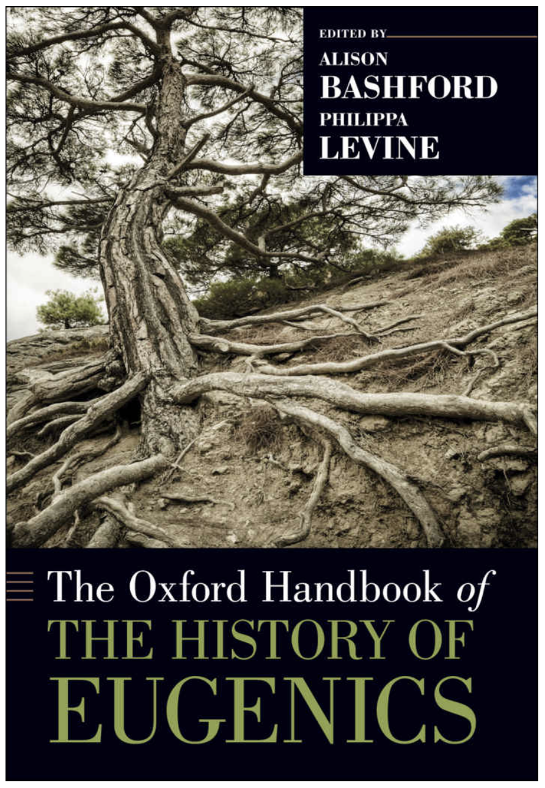
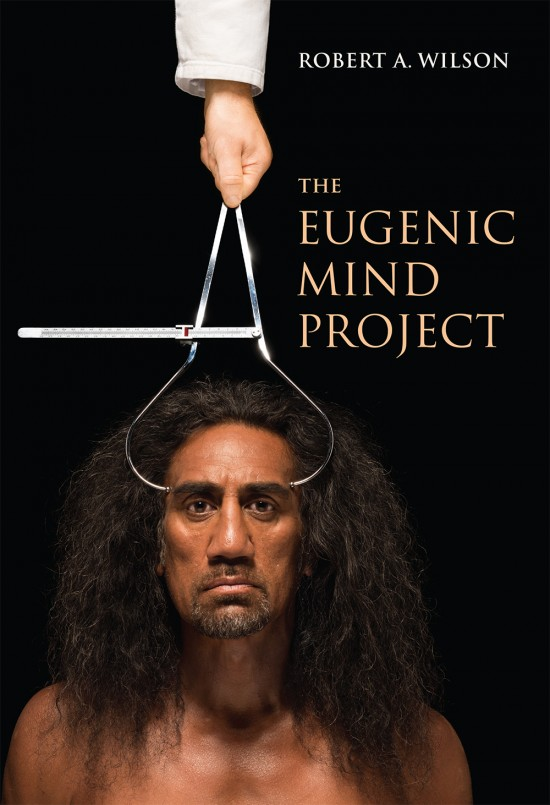

<style>
    .toc-content {
        padding-left: 0%;
        padding-right: 10%;
    }
</style>


```{r setup, include=FALSE}
knitr::opts_chunk$set(message=FALSE,warning=FALSE, cache=FALSE)

# Create header.html
CON <- file("header_blog.html")

writeLines('<meta name="twitter:title" content="Human Cognition and Performance Lab ">
<meta name="twitter:description" content=" Lab web page Blog - Matt Crump - Brooklyn College of CUNY">
<meta name="twitter:image" content=" https://crumplab.github.io/images/logo.png">
<meta name="twitter:card" content="summary">',CON)

close(CON)
```


This blog is a public-facing expression of me working through various ideas and methods, mostly around cognitive psychology and how it sits within a scientific and social context. When I'm not working on these words, they sit here, and when I am working on them, they change. I'm attempting to use my writing process to evaluate and compose perspectives, some of which may be my own... it's confusing because I use writing to know if I think something, but I keep changing the words as I learn what I think.

---

<div class="row">
<div class="col-sm-4">
```{r, echo=F, out.width="50%"}
knitr::include_graphics("blogposts/7_28_20_OC/img/OC.png")
```
</div>
<div class="col-sm-8">

# [Learning to code for Ornament and Crime Hemisphere suite](https://crumplab.github.io/blogposts/7_28_20_OC/7_28_20_OC.html)

July 28, 2020

Some notes on learning how to program applets in the hemisphere suite for the open source euro-rack module Ornament and Crime

</div>
</div>

---

<div class="row">
<div class="col-sm-4">
```{r, echo=F, out.width="50%"}
knitr::include_graphics("blogposts/7_20_20_versioncontrol/img/git.png")
```
</div>
<div class="col-sm-8">

# [Version control, public discourse, and epistemic access](https://crumplab.github.io/blogposts/7_20_20_versioncontrol/7_20_20_versioncontrol.html)

July 20, 2020

Some thoughts on using version control systems as a process for public discourse

</div>
</div>


---

<div class="row">
<div class="col-sm-4">
```{r, echo=F, out.width="50%"}
knitr::include_graphics("blogposts/7_13_20_PsychEugenics/img/eugenics.jpg")
```
</div>
<div class="col-sm-8">

# [Psychology and Eugenics connections](https://crumplab.github.io/blogposts/7_13_20_PsychEugenics/7_13_20_PsychEugenics.html)

July 13, 2020

Making notes and connecting dots about the pervasiveness of eugenics ideology among psychologists. 

</div>
</div>

---

<div class="row">
<div class="col-sm-4">
```{r, echo=F, out.width="50%"}
knitr::include_graphics("blogposts/7_9_20_KaminIQ/img/IQ.png")
```
</div>
<div class="col-sm-8">

# [The Science and Politics of IQ](https://crumplab.github.io/blogposts/7_9_20_KaminIQ/7_9_20_KaminIQ.html)

July 9, 2020

Reading through Leo Kamin's The Science and Politics of IQ (1972), and taking notes here

</div>
</div>

---

<div class="row">
<div class="col-sm-4">
```{r, echo=F, out.width="50%"}

```
</div>
<div class="col-sm-8">

# [The Oxford Handbook of the History of Eugenics](https://crumplab.github.io/blogposts/7_8_20_HistoryEugenics/7_8_20_HistoryEugenics.html)

July 8, 2020

I'm reading through the Oxford Handbook of the History of Eugenics and collecting my notes here.

</div>
</div>

---

<div class="row">
<div class="col-sm-4">
```{r, echo=F, out.width="50%"}

```
</div>
<div class="col-sm-8">

# [The Eugenic Mind Project](https://crumplab.github.io/blogposts/7_7_20_EugenicMind/7_7_20_EugenicMind.html)

July 7, 2020

I'm reading the Eugenic Mind Project by R. A. Wilson, and writing about it here.

</div>
</div>

----

<div class="row">
<div class="col-sm-4">
```{r, echo=F}
knitr::include_graphics("blogposts/7_2_20_JBP/JBP.png")
```
</div>
<div class="col-sm-8">

# [Reading the Journal of Black Psychology](https://crumplab.github.io/blogposts/7_2_20_JBP/7_2_20_JBP.html)

July 2, 2020

I'm reading the Journal of Black Psychology from the beginning, and making notes here.

</div>
</div>

----

<div class="row">
<div class="col-sm-4">
```{r, echo=F}
knitr::include_graphics("blogposts/7_1_20_hiring/hiring.png")
```
</div>
<div class="col-sm-8">

# [Advocating to hire in black psychology in my department](https://crumplab.github.io/blogposts/7_1_20_hiring/7_1_20_hiring.html)

July 1, 2020

Some reflections on hiring and notes on what I can do to advocate for hiring a black psychologist in my department. More work in progress.

</div>
</div>

----

<div class="row">
<div class="col-sm-4">
```{r, echo=F}
knitr::include_graphics("blogposts/sabbaticalp1/sabbatical.png")
```
</div>
<div class="col-sm-8">

# [Mea Culpa: My Sabbatical Part I](https://crumplab.github.io/blogposts/sabbaticalp1/sabbatical1.html)

June 30, 2020

Some personal reflections on sabbatical and responsibility. Work in progress.

</div>
</div>

----

<div class="row">
<div class="col-sm-4">
```{r, echo=F}

```
</div>
<div class="col-sm-8">

# [New Layout style](https://crumplab.github.io/blogposts/7_1_20_twittercard/7_1_20_twittercard.html)

Just more testing out how I want this blog to look right now
</div>
</div>

----

# Upping my twitter card game?

July 1, 2020

<blockquote class="twitter-tweet"><p lang="en" dir="ltr">Upping my twitter card game? just a test <a href="https://t.co/wvvXOGhela">https://t.co/wvvXOGhela</a></p>&mdash; Matt Crump (@MattCrump_) <a href="https://twitter.com/MattCrump_/status/1278344229459197953?ref_src=twsrc%5Etfw">July 1, 2020</a></blockquote> <script async src="https://platform.twitter.com/widgets.js" charset="utf-8"></script>

# Resources for learning and using R

I thought I would start making a list of resources for beginners looking to learn R (for general progamming and datat analysis). Here it is:

[https://crumplab.github.io/blogposts/LearningR/LearningR.html](https://crumplab.github.io/blogposts/LearningR/LearningR.html)

---

# Psychology of learning to computer program

I'd like to get up to speed on what we know about the psychology of learning to computer program. Time for another literature review. Let's see what I can accomplish on this front today. I'll keep track of everything here:

[https://crumplab.github.io/blogposts/PsychProgramming/PsychProgramming.html](https://crumplab.github.io/blogposts/PsychProgramming/PsychProgramming.html)

--------------------------

# A Hodge-Podge Theory of Method (HP-TOM)

I'm smoking a pork shoulder today, so naturally I felt compelled to produce a hodge-podge theory of method to express my cluttered views on science before I head out to buy potato buns.

[My half-smoked HP-TOM is right here](https://crumplab.github.io/blogposts/hodgepodge/hodgepodge.html). And, again for the record. I have been smoking a pork shoulder.

--------------------------

# playjareyesores | an R package for detecting  plagiarism

2019-06-20, last compiled: `r Sys.Date()`

Plagiarism, it happens. I've run into it on more than one occasion, from students and faculty! Needless to say, it really urks me.

My university provides access to plagiarism detection services like Turnitin and Safeassign, however these tools can be cumbersome to use. For example, if you have 100 students turn in 100 papers, then you might hope the scores from these programs would help you identify the papers that were the same. They do and they don't. For example, you might get a paper that says 90% the same, but when you check it, you see that two students copied the assignment instructions into their paper, making the documents similar. Or you might get 5% the same, but when you check it, you see that although most of the paper doesn't appear to be copied, there is this one whole paragraph that's identical... 

To solve particular comparison problems I have also sometimes resorted to using R for plagiarism detection. So, I thought I would begin to put some of my code into a package I'm calling `playjareyesores`:

 - package website: [https://crumplab.github.io/playjareyesores/](https://crumplab.github.io/playjareyesores/)
 - github repo: [https://github.com/CrumpLab/playjareyesores](https://github.com/CrumpLab/playjareyesores) 

What will this code do? Well, I'm reviewing a paper right now. It's very similar to another paper I've read by the same author. Whole chunks are copied from one previous paper to another, and it's not just the methods section. When things like this happen, I usually don't have time to thoroughly check which parts are the same. It would be nice to have some R functions for that.

I made this little chart to start thinking about what I'm going to add to the package.

```{r, echo= FALSE}
#direction: right
nomnoml::nomnoml(
"[paper 1 | get into R] -> [clean]
[paper 2 | get into R] -> [clean]
[clean | keep parts you want] -> [compare]
[compare | lots of methods to try] -> [Report | Stuff you want to learn]",
height = 150, width=400)
```

Much later...

Ok, did some googling and tried out a bunch of things. I found some great packages that already exist, so am going to play around with them a bit. These packages include `textreuse` ([https://docs.ropensci.org/textreuse/](https://docs.ropensci.org/textreuse/)), and `tabulizer` (https://github.com/ropensci/tabulizer, which unfortunately depends on Java, but allows for importing pdfs with 2 columns, useful for scientific papers). Finally, there is the `cheatr` package [https://github.com/mattansb/cheatR](https://github.com/mattansb/cheatR), that comes with a shiny app, and a nice [story about how their package came to be.](https://mattansb.blogspot.com/2018/07/cheatr-r-package-for-catching-cheaters.html)

Time to get back to playjareyesores...I've made some progress and am slowly identifying what I'm looking for. The textreuse package is simply awesome, it's a heavyweight document comparator. It's got a really cool function called `align_local`, which attempts to find the best alignment between two documents. This works really well, and if you are in a pinch and want to see if there is substantial overlap between two texts, then go with align local. The cheatr package is also pretty snazzy. They use n-gram methods, which are great, and similar to what I was doing before. The n-gram method splits the documents into phrases of a set lenght, and then looks for overlap at the phrase level.

However, I still found myself wanting something more specific. I wrote a handful of functions (wrappers mostly) to read and clean various kinds of text into R. I added my version of n-gram comparison, and now I'm about to focus on the reporting aspect. For example, I'd like to generate a nice, comprehensive report of the similarities between two documents. What should it include? Not sure yet...Maybe I should brainstorm with nomnoml.

```{r report, echo= FALSE}

nomnoml::nomnoml(
"#direction: down
[Report|one function|pops out html or pdf? |does these things] -> [ngram metrics| ngram proportion overlap | across multiple levels | expected overlap?]
[Report] -> [the ngrams | print out the 
ones that overlap]
[Report] -> [The documents | Side by side? | overlap highlights]",
height = 400, width=400)
```


# Blogging about the Semantic Librarian

I've been collaborating with [Randall Jamieson](https://umcognitivesciencelaboratory.weebly.com) and Matt Cook (University of Manitoba), and [Harinder Aujla](http://ion.uwinnipeg.ca/~haujla/) (University of Winnipeg) on a really cool project (IMO). We created a search engine for select experimental journals from the APA database, using semantic vector representations. This allows us to compare abstracts and search terms, and even authors, in terms of their semantic similarity (associative knowledge about word co-occurence in the abstract texts.). Our work was recently accepted at Behavior research methods. You can read the pre-print here [https://psyarxiv.com/svmtd/](https://psyarxiv.com/svmtd/); and, you can try out the search engine here [https://crumplab.shinyapps.io/SemanticLibrarian](https://crumplab.shinyapps.io/SemanticLibrarian).

This approach also allows us to ask questions about the semantic structure of the APA database. I'm going to be using this tool to examine some of those questions, and blog about what I find here [https://crumplab.github.io/SemanticLibrarian](https://crumplab.github.io/SemanticLibrarian). Check it out.

2019-05-30, last compiled: `r Sys.Date()`

# Using an R package to share research

2019-05-07, last compiled: `r Sys.Date()`

There's so many ways to share research these days. Sure, get your paper through the review process and put it in a journal, and you're done right? But, there's preprint archives (for psych, [https://psyarxiv.com](https://psyarxiv.com)), and open science framework ([https://osf.io/](https://osf.io/)) where you can share the materials you used (say experimental files, data, and analysis scripts), or just put everything in a github repository (and then share that on OSF to get a DOI). And, that's just a few good options for sharing. 

Today I realized that R packages could be a good option for sharing research. To see how this could work I messed around with combining [papaja](https://crsh.github.io/papaja_man/), a package for writing APA papers in R Markdown, and [pkgdown](https://pkgdown.r-lib.org), a package for creating website for R packages. What I came up with is small minimal reproducible example [https://crumplab.github.io/papajadown/](https://crumplab.github.io/papajadown/).

Briefly, all I did was create a new R project folder in RStudio, choosing the new package option. This creates a default template for making a basic R package. I installed `pkgdown`, `roxygen2` (for documenting R functions), and `papaja`. Then, I made a `vignettes` folder, and added a papaja template .Rmd file. The next step is just to run `pkgdown::build_site()` in the console. This generates a website, which would typically be for an R package, that displays information about the functions, and any vignettes (short articles) about how to use the functions in the package. What's neat to me, is that the same tools could be useful for sharing research products, in the form of an R package. 

Why do this? For one, there are some nice bells and whistles. You get a snappy website to host your paper, an online version of the paper, and some relatively straightforward ways to provide documentation around the project. For example, any data that you might use and want to share can be saved in a data folder, and documentation for the data can be created using `roxygen2`. Similarly, if you use custom functions for data-analysis in the paper, it's easy to include them in the package (after all these are the tools for building R packages).

Here's a few more reasons. It's easy to share R packages that are on github (e.g., `devtools::install_github("package_name")`). So, if someone wanted to "get the data" and all the other stuff, they could do that by installing the package. I've found alternatives like OSF sometimes very confusing in terms getting access to open data. For one thing, there are no clear data formatting standards for OSF, and many times some pre-processing needs to be done in order to get the data into R. By putting everything into an R package, all of the stuff is already in R. 

R packages are already set up to share articles (e.g., vignettes about how to use R packages). I guess it's just slowly dawning on me that these same tools are useful and convenient for packaging research too. Now, back to documenting my data frames so other people have a chance at understanding what I put in those columns.

