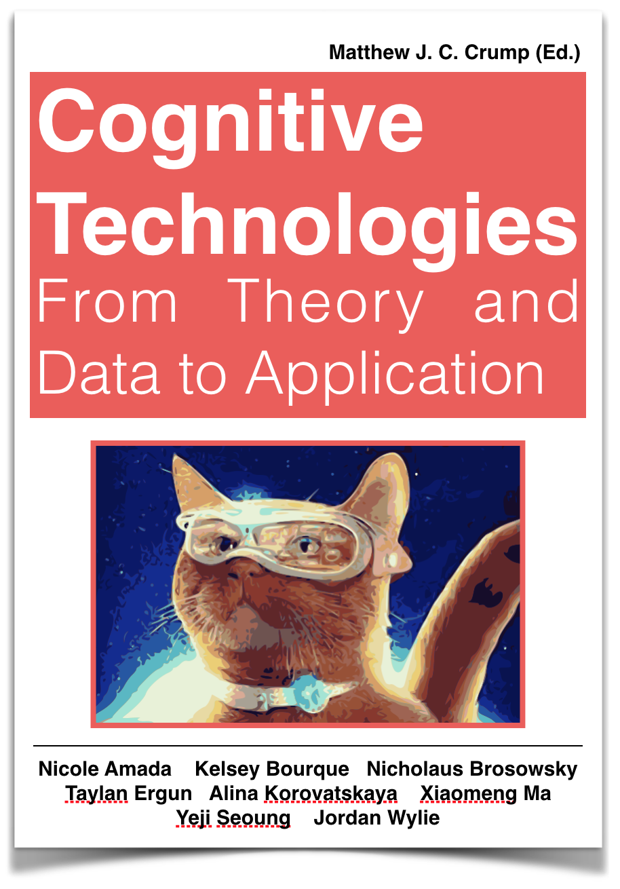

These books  were made using R Markdown and compiled in Bookdown. They are all free, open-source, and licensed on creative commons.

---

<div class="row">
<div class="col-sm-6">

#### [Reproducible statistics for psychologists with R: Lab Tutorials](https://crumplab.github.io/rstatsforpsych/)

**Description**: This is a series of labs/tutorials currently under development (2020-2021) for a two-semester graduate-level statistics sequence in Psychology @ Brooklyn College of CUNY. The first set of 13 labs roughly tracks "Thinking with Data" (Vokey & Allen, 2018) and "Answering questions with data" (Crump et al., 2018); the second set of labs (to be written on a weekly basis during the Spring 2021 semester) will roughly track "Experimental Design and Analysis for Psychology" (Abdi et al., 2009). 

Written in Rmarkdown, and compiled with the bookdown package. The source code is located in this github repository <https://github.com/CrumpLab/rstatsforpsych>

[](https://creativecommons.org/licenses/by-sa/4.0/)

**Citation:** Crump, M. J. C. (2020, December 10). Reproducible statistics for psychologists with R: Lab Tutorials. https://doi.org/10.17605/OSF.IO/KBHGA

</div>
<div class="col-sm-6">

<a href="https://crumplab.github.io/rstatsforpsych/">
```{r rstatsTextbook, out.width=200, echo=F}
knitr::include_graphics("images/RstatsCover.png")
```
</a>

</div>
</div>


---

<div class="row">
<div class="col-sm-6">

#### [Using R for Reproducible Research: Student contributed tutorials](https://crumplab.github.io/psyc7709_2019/book/docs/index.html)

**Description**: These chapters were written by students in [PSYC 7709: Using R for Reproducible research](https://crumplab.github.io/psyc7709_2019/), Spring 2019 @ Brooklyn College of CUNY, as a part of their final project to write a tutorial about an R package. 

Written in Rmarkdown, and compiled with the bookdown package. The source code is located in this github repository <https://github.com/CrumpLab/psyc7709_2019>

[](https://creativecommons.org/licenses/by-sa/4.0/)

**Citation:** Abdelrahman, K., Contreras, A., Degtyarev, Z., Deng, J., Foster, J., Franz, A., Funderburk, T., Horger, M., Kravitz, J., Lakshin A., Manigat, M., Trois, R., Vasquez, A., Vo, A., Wilson, N., and Yeremenko, M. (2019). *Using R for Reproducible Research: Student Contributed Tutorials.* (M. J. C. Crump, Ed.).

</div>
<div class="col-sm-6">

<a href="https://crumplab.github.io/psyc7709_2019/book/docs/index.html">
```{r rstudentbook, out.width=200, echo=F}
knitr::include_graphics("images/ReproStudentBook.png")
```
</a>

</div>
</div>


---

<div class="row">
<div class="col-sm-6">

#### [Answering Questions with Data: Introductory Statistics for Psychology Students](https://crumplab.github.io/statistics/)

**Authors**: Matthew Crump; Chapters 2 and 4 adapted from Navarro, D.; Videos: Jeffrey Suzuki

**Description**: This is a free introductory statistics textbook for undergraduates in Psychology. It is being developed as an Open Educational Resource @ Brooklyn College. It is pitched at the concepts behind statistics, and often uses simulation in R to convey foundational ideas. The writing style is sometimes a bit unconventional, and informal. It is for students who don't want to like statistics. 

Written in Rmarkdown, and compiled with the bookdown package. The source code is located in this github repository [https://github.com/CrumpLab/statistics](https://github.com/CrumpLab/statistics)

[](https://creativecommons.org/licenses/by-sa/4.0/)

**Citation:** Crump, M. J. C., Navarro, D., & Suzuki, J. (2019, June 5). Answering Questions with Data (Textbook): Introductory Statistics for Psychology Students. https://doi.org/10.17605/OSF.IO/JZE52

</div>
<div class="col-sm-6">
<div data-badge-popover="right" data-badge-type="donut" data-doi="10.17605/OSF.IO/JZE52" data-hide-no-mentions="true" class="altmetric-embed"></div>
<a href="https://crumplab.github.io/statistics/">
```{r statsTextbook, out.width=200, echo=F}
knitr::include_graphics("images/TextbookCover.png")
```
</a>
</div>
</div>

----

<div class="row">
<div class="col-sm-6">

#### [Answering Questions with Data: The Lab Manual](https://crumplab.github.io/statisticsLab/) 

Lab activities using R, Excel, SPSS, and JAMOVI

**Authors**: Matthew Crump (R); Stephen Volz (Excel); Alla Chavarga (SPSS); Anjali Krishnan (JAMOVI)

**Description**: This is the companion lab manual to our free stats book. It contains lab activities for learning how to conduct statistical tests in R, Excel, SPSS, and JAMOVI. We use open data, often from psychology papers, and show step-by-step how to solve data-analysis problems in each software package. 

Some of the labs are adapated from [Open Stats Lab](https://sites.trinity.edu/osl), another great resource.

**Source code**: Written in Rmarkdown, and compiled with the bookdown package. The source code is located in this github repository [https://github.com/CrumpLab/statisticsLab](https://github.com/CrumpLab/statisticsLab).

[](https://creativecommons.org/licenses/by-sa/4.0/)

**Citation**: Crump, M. J. C., Krishnan, A., Volz, S., & Chavarga, A. (2019, June 5). Answering Questions with Data: The Lab Manual for R, Excel, SPSS and Jamovi. https://doi.org/10.17605/OSF.IO/M2NPJ 

</div>
<div class="col-sm-6">
<div data-badge-popover="right" data-badge-type="donut" data-doi="10.17605/OSF.IO/M2NPJ" data-hide-no-mentions="true" class="altmetric-embed"></div>
<a href="https://crumplab.github.io/statisticsLab/">
```{r StatsLab, out.width=200, echo=F}
knitr::include_graphics("images/LabmanualCover.png")
```
</a>
</div>
</div>

----


<div class="row">
<div class="col-sm-6">

#### [Answering Questions with Data: The Course Website](https://crumplab.github.io/psyc3400/)

A copiable course website for introductory statistics

**Authors**: Matthew Crump

**Description**: This website was created in R Markdown. It contains most of the course materials I use when teaching undergraduate statistics for psychology. IT includes slide decks for presentations.

**Source code**: Written in Rmarkdown, and compiled with the bookdown package. The source code is located in this github repository [https://github.com/CrumpLab/psyc3400](https://github.com/CrumpLab/psyc3400).

[](https://creativecommons.org/licenses/by-sa/4.0/)

**Citation** : Crump, M. J. C. (2019, June 5). Answering Questions with Data: Course Website. https://doi.org/10.17605/OSF.IO/AWXU9

</div>
<div class="col-sm-6">
<div data-badge-popover="right" data-badge-type="donut" data-doi="10.17605/OSF.IO/AWXU9" data-hide-no-mentions="true" class="altmetric-embed"></div>
<a href="https://crumplab.github.io/psyc3400/">
```{r StatsWeb, out.width=200, echo=F}

```
</a>
</div>
</div>

----

<div class="row">
<div class="col-sm-6">

#### [Research Methods for Psychology](https://crumplab.github.io/ResearchMethods/)

**Description**:A free Research methods textbook for undergraduates in Psychology, creative commons license, remix, reuse, edit, contribute.

**Authors**: Matthew J. C. Crump, Paul C. Price, Rajiv Jhangiani, I-Chant A. Chiang, Dana C. Leighton

**Source code**: Written in Rmarkdown, and compiled with the bookdown package. The source code is located in this github repository [https://github.com/CrumpLab/ResearchMethods](https://github.com/CrumpLab/ResearchMethods).

[](https://creativecommons.org/licenses/by-nc-sa/4.0/)

</div>
<div class="col-sm-6">
<a href="https://crumplab.github.io/ResearchMethods/">
```{r ResearchMethods, out.width=200, echo=F}
knitr::include_graphics("images/ResearchMethods.png")
```
</a>
</div>
</div>


----

<div class="row">
<div class="col-sm-6">

#### [Cognitive Technologies: From Theory and Data to Application](https://crumplab.github.io/cognitivetechnologies/book/)

**Description**: [A series of chapters on cognitive technologies](https://crumplab.github.io/cognitivetechnologies/book/) written by doctoral students who took my course on Cognitive Technologies in Spring 2018. They wrote it, I compiled it using bookdown.

**Editor**: Crump, M. J. C

**Authors**: Crump, M. J. C.; Amada, N.; Bourque, K; Brosowsky, N.; Ergun, T.; Korovatskaya, A.; Ma, X.; Seoung, Y.; Wylie, J.

</div>
<div class="col-sm-6">
<a href="https://crumplab.github.io/cognitivetechnologies/book/">
```{r CogTech, out.width=200, echo=F}

```
</a>
</div>
</div>


-----

<div class="row">
<div class="col-sm-6">

#### [Open tools for writing open interactive textbooks (and more)](https://crumplab.github.io/OER_bookdown/)

**Description**: tutorial overview of the process I use to write books using R, R-studio, R-markdown, and compile them in bookdown. I've used this process for all of these books. Some other brief tidbits on using hypothes.is, and R-Shiny apps, also Zotero and hosting on github pages (where this website is hosted)

**Author**: Matthew J. C. Crump

Note this is a meta-book. The tutorial above is for you to read so you can download the source code, then compile it yourself, then edit it to make your own.

**Source code**: Written in Rmarkdown, and compiled with the bookdown package. The source code is located in this github repository [https://github.com/CrumpLab/OER_bookdown](https://github.com/CrumpLab/OER_bookdown).

[](https://creativecommons.org/licenses/by-sa/4.0/)

</div>
<div class="col-sm-6">
<a href="https://crumplab.github.io/OER_bookdown/">
```{r OERs, out.width=200, echo=F}
knitr::include_graphics("images/OER.png")
```
</a>
</div>
</div>


-----

<div class="row">
<div class="col-sm-6">

#### [Programming for Psychologists: Data Creation and Analysis](https://crumplab.github.io/programmingforpsych/)

**Description**: Some notes that got big enough to make a book. Beginner introduction to coding in R, Livecode, and some web-programming, for the purposes of making data with computers (programming experiments), and analyzing it in R.

**Author**: Matthew J. C. Crump

**Source code**: Written in Rmarkdown, and compiled with the bookdown package. The source code is located in this github repository [https://github.com/CrumpLab/programmingforpsych](https://github.com/CrumpLab/programmingforpsych).

[](https://creativecommons.org/licenses/by-sa/4.0/)

</div>

<div class="col-sm-6">
<a href="https://crumplab.github.io/programmingforpsych/">
```{r Programming, out.width=200, echo=F}
knitr::include_graphics("images/Programming.png")
```
</a>
</div>
</div>


-----


