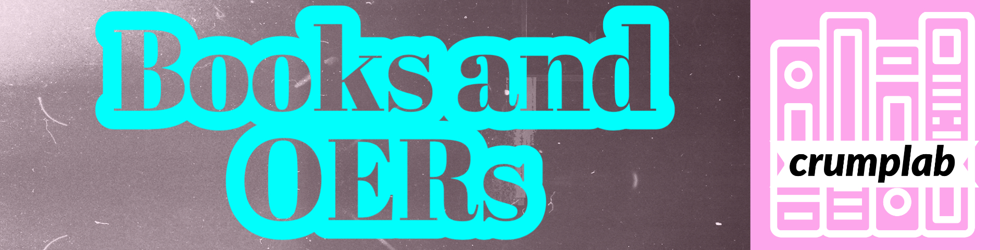

:::::: {.fp .home .people .books}

::::: people-hero
{.hero-banner fig-alt="Books and OERs"}

::: hero-body
[\~/crumplab/books]{.fp-kicker}

```{=html}
<h1 class="visually-hidden">Books</h1>
```

::: fp-lead
These books were made using Quarto, or R Markdown and Bookdown. They are all free, open-source, and licensed on creative commons.
:::

::: {#stats}
:::
:::
:::::

::: {#books}
:::

::::::
