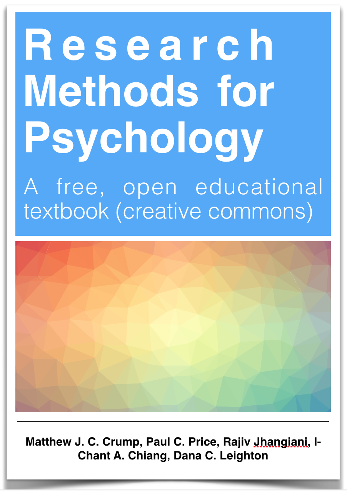

List of current and previous courses taught at Brooklyn College of CUNY and the Graduate Center of CUNY.

---

### Current (Fall 2018)

-----

<div class="row" style="padding-top: 30px;">
<div class="col-sm-6">

#### Psyc 3400: Statistical Methods in Psychological Research

THIS COURSE IS PRESENTLY BEING BUILT FOR FALL 2018, STILL IN DRAFT

All materials are totally free and open, including [textbook](https://crumplab.github.io/statistics/), and [lab manual](https://crumplab.github.io/statisticsLab/) which can be found on the [course Website](https://crumplab.github.io/psyc3400/)

</div>
<div class="col-sm-6">

<a href="https://crumplab.github.io/statistics/">
```{r statsTextbook, out.width=100, echo=F}
knitr::include_graphics("images/TextbookCover.png")
```
</a>

</div>
</div>

-------------------

#### Psyc 73800 - Cognitive Psychology

Fall 2018 (2017) @ Graduate Center of CUNY

Bi-weekly modules taught by different faculty.

...................................
-----

### Previous courses

Some of these courses have open materials, older courses may not.

-----

<div class="row" style="padding-top: 30px;">
<div class="col-sm-6">

#### Psyc 80103: Cognitive Technologies: From theory and data to application

Spring 2018 @ Graduate Center of CUNY

A doctoral seminar course (special topics) covering emerging and old cognitive technologies. Check out the [course website](https://crumplab.github.io/cognitivetechnologies), or [read the book](https://crumplab.github.io/cognitivetechnologies/book/) my students (wrote the chapters) and I (put them together) wrote for the end of the semester.


</div>
<div class="col-sm-6">

<a href="https://crumplab.github.io/cognitivetechnologies/book/">
```{r cogTech, out.width=100, echo=F}
knitr::include_graphics("images/CogTech.png")
```
</a>

</div>
</div>

----------------

<div class="row" style="padding-top: 30px;">
<div class="col-sm-6">

#### Psyc 3450: Experimental Psychology

Fall 2017 (2016, 2015, 2013, 2012, 2011) @ Brooklyn College

An undergraduate course on research methods, using a free OER textbook! Written by myself and many others. Check out the [textbook here](https://crumplab.github.io/ResearchMethods/). Check out the [course website here](https://crumplab.github.io/psyc3450/).


</div>

<div class="col-sm-6">

<a href="https://crumplab.github.io/ResearchMethods/">
```{r researchmeth, out.width=100, echo=F}

```
</a>
</div>
</div>


-------------------

<div class="row" style="padding-top: 30px;">
<div class="col-sm-6">


#### Psyc 80103: Computer Programming for Psychologists

@ Brooklyn College

I put my lecture notes into a [book](https://crumplab.github.io/programmingforpsych/) (covers R, Livecode and a bit of web programming.)

</div>

<div class="col-sm-6">

<a href="https://crumplab.github.io/programmingforpsych/">
```{r programming, out.width=100, echo=F}
knitr::include_graphics("images/Programming.png")
```
</a>
</div>
</div>

-----

#### Psyc 3530 : Introduction to Cognitive Psychology

@ Brooklyn College

---------

#### Psyc 80103 : Special Topics Seminar: Learning & Attention

Special topics doctoral course @ GC 
Co-taught with Andrew Delamater

------------

#### Psyc 80103 : Special Topics: Memory: Foundations & Current Issues

Special topics doctoral course @ GC 
Co-taught with Elizabeth Chua

--------------


#### Psyc 80103 : Career Development

Doctoral course @ GC 
Co-taught with Elizabeth Chua


