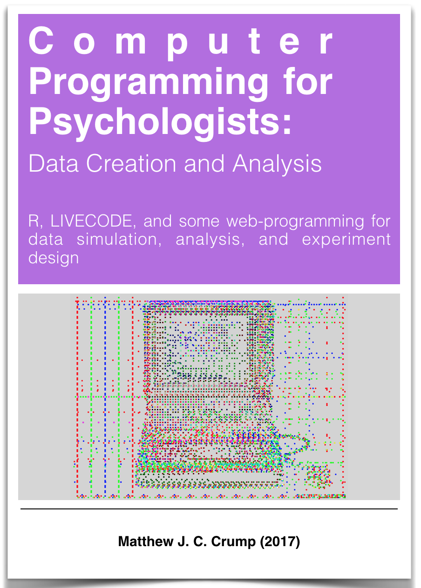

List of current and previous courses taught at Brooklyn College of CUNY and the Graduate Center of CUNY. 

## Spring 2022

<div class="row">
<div class="col-sm-6">

#### Psyc 2530 Introduction to Cognitive Psychology (Asynchronous online)

Brooklyn College of CUNY, Undergraduate, Psychology, Asynchronous online

The [course website](https://crumplab.github.io/cognition/) contains syllabus, textbook, slide decks and more.

</div>
<div class="col-sm-6">

<a href="https://crumplab.github.io/cognition/">
```{r 2530_2022, out.width=150, echo=F}
knitr::include_graphics("images/2530_image.jpg")
```
</a>

</div>
</div>

-----

## Fall 2021

<div class="row">
<div class="col-sm-6">

#### Psyc 2530 Introduction to Cognitive Psychology

Brooklyn College of CUNY, Undergraduate, Psychology

The [course website](https://crumplab.github.io/cognition/) contains syllabus and readings.

</div>
<div class="col-sm-6">

<a href="https://crumplab.github.io/cognition/">
```{r 2530, out.width=150, echo=F}
knitr::include_graphics("images/2530_image.jpg")
```
</a>

</div>
</div>

-----

<div class="row">
<div class="col-sm-6">

#### Psyc 7765/66G - Statistical Methods Applications I

Brooklyn College of CUNY, Master's, Experimental Psychology

The [course website](https://crumplab.github.io/rstatsmethods/) contains syllabus and readings.

</div>
<div class="col-sm-6">

<a href="https://crumplab.github.io/rstatsmethods/">
```{r stats7765, out.width=150, echo=F}
knitr::include_graphics("images/psyc7765.png")
```
</a>

</div>
</div>

-----

<div class="row">
<div class="col-sm-6">

#### Psyc 73800 - Cognitive Psychology

Graduate Center of CUNY, Doctoral, Cognitive and Comparative Psychology Training (CCP) area

Bi-weekly modules taught by different faculty. The [course website](https://crumplab.github.io/psyc73800/) contains syllabus and readings.

</div>
<div class="col-sm-6">

<a href="https://crumplab.github.io/psyc73800/">
```{r cogsci2021, out.width=200, echo=F}
knitr::include_graphics("images/cognitive_science.png")
```
</a>

</div>
</div>

-----

## Recent courses

Some of these courses have open materials, older courses may not.

---


<div class="row">
<div class="col-sm-6">

#### Psyc 7709G - Statistical Methods Practicum II

Brooklyn College of CUNY

The [course website](https://crumplab.github.io/psyc7709Lab/) contains syllabus and readings.

</div>
<div class="col-sm-6">

<a href="https://crumplab.github.io/psyc7709Lab/">
```{r statsLab2, out.width=150, echo=F}
knitr::include_graphics("images/logo2statsII.png")
```
</a>

</div>
</div>


---

<div class="row">
<div class="col-sm-6">

#### Psyc 73800 - Cognitive Psychology

Graduate Center of CUNY

Bi-weekly modules taught by different faculty. The [course website](https://crumplab.github.io/psyc73800/) contains syllabus and readings.

</div>
<div class="col-sm-6">

<a href="https://crumplab.github.io/psyc73800/">
```{r cogsci2020, out.width=200, echo=F}
knitr::include_graphics("images/cognitive_science.png")
```
</a>

</div>
</div>

-----

<div class="row">
<div class="col-sm-6">

#### Psyc 7709G - Statistical Methods Practicum I

Brooklyn College of CUNY

The [course website](https://crumplab.github.io/psyc7709Lab/) contains syllabus and readings.

</div>
<div class="col-sm-6">

<a href="https://crumplab.github.io/psyc7709Lab/">
```{r statsLab, out.width=150, echo=F}
knitr::include_graphics("images/Psyc7709G.png")
```
</a>

</div>
</div>

----

<div class="row">
<div class="col-sm-6">

#### Psyc 7709: Using R for reproducible research

This is a special topics course for the Experimental Psychology Master's program. The course website is <https://crumplab.github.io/psyc7709_2019/>

</div>
<div class="col-sm-6">

<a href="https://crumplab.github.io/psyc7709_2019/">
```{r rcourse, out.width=150, echo=F}
knitr::include_graphics("images/Rstudio.png")
```
</a>

</div>
</div>

-----

<div class="row">
<div class="col-sm-6">

#### Psyc 3400: Statistical Methods in Psychological Research

All materials are totally free and open, including the [course Website](https://crumplab.github.io/psyc3400/),  [textbook](https://crumplab.github.io/statistics/), and [lab manual](https://crumplab.github.io/statisticsLab/).

</div>
<div class="col-sm-6">

<a href="https://crumplab.github.io/psyc3400/">
```{r statsTextbook, out.width=150, echo=F}
knitr::include_graphics("images/TextbookCover.png")
```
</a>

</div>
</div>

-----

<div class="row">
<div class="col-sm-6">

#### Psyc 73800 - Cognitive Psychology

Fall 2018 (2017) @ Graduate Center of CUNY

Bi-weekly modules taught by different faculty. The [course website](https://crumplab.github.io/psyc73800/) contains syllabus and readings.

</div>
<div class="col-sm-6">

<a href="https://crumplab.github.io/psyc73800/">
```{r cogsci, out.width=200, echo=F}
knitr::include_graphics("images/cognitive_science.png")
```
</a>

</div>
</div>

-----


<div class="row">
<div class="col-sm-6">

#### Psyc 80103: Cognitive Technologies: From theory and data to application

Spring 2018 @ Graduate Center of CUNY

A doctoral seminar course (special topics) covering emerging and old cognitive technologies. Check out the [course website](https://crumplab.github.io/cognitivetechnologies), or [read the book](https://crumplab.github.io/cognitivetechnologies/book/) we wrote on the topic (students in the course wrote the chapters).


</div>
<div class="col-sm-6">

<a href="https://crumplab.github.io/cognitivetechnologies/book/">
```{r cogTech, out.width=150, echo=F}
knitr::include_graphics("images/CogTech.png")
```
</a>

</div>
</div>

----------------

<div class="row">
<div class="col-sm-6">

#### Psyc 3450: Experimental Psychology

Fall 2017 (2016, 2015, 2013, 2012, 2011) @ Brooklyn College

An undergraduate course on research methods, using a free OER textbook! Written by myself and many others. Check out the [textbook here](https://crumplab.github.io/ResearchMethods/). Check out the [course website here](https://crumplab.github.io/psyc3450/).


</div>

<div class="col-sm-6">

<a href="https://crumplab.github.io/ResearchMethods/">
```{r researchmeth, out.width=150, echo=F}
knitr::include_graphics("images/ResearchMethods.png")
```
</a>
</div>
</div>


-------------------

<div class="row">
<div class="col-sm-6">


#### Psyc 80103: Computer Programming for Psychologists

@ Brooklyn College

I put my lecture notes into a [book](https://crumplab.github.io/programmingforpsych/) (covers R, Livecode and a bit of web programming.)

</div>

<div class="col-sm-6">

<a href="https://crumplab.github.io/programmingforpsych/">
```{r programming, out.width=150, echo=F}

```
</a>
</div>
</div>

-----

#### Psyc 3530 : Introduction to Cognitive Psychology

@ Brooklyn College

---------

#### Psyc 80103 : Special Topics Seminar: Learning & Attention

Special topics doctoral course @ GC 
Co-taught with Andrew Delamater

------------

#### Psyc 80103 : Special Topics: Memory: Foundations & Current Issues

Special topics doctoral course @ GC 
Co-taught with Elizabeth Chua

--------------


#### Psyc 80103 : Career Development

Doctoral course @ GC 
Co-taught with Elizabeth Chua


