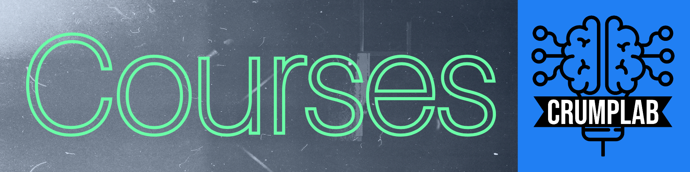

:::::: {.fp .home .people .courses}

::::: people-hero
{.hero-banner fig-alt="Courses"}

::: hero-body
[\~/crumplab/courses]{.fp-kicker}

```{=html}
<h1 class="visually-hidden">Courses</h1>
```

::: fp-lead
List of current and previous courses taught at Brooklyn College of CUNY and the Graduate Center of CUNY.
:::

::: {#stats}
:::
:::
:::::

::: {#courses}
:::

::::::
