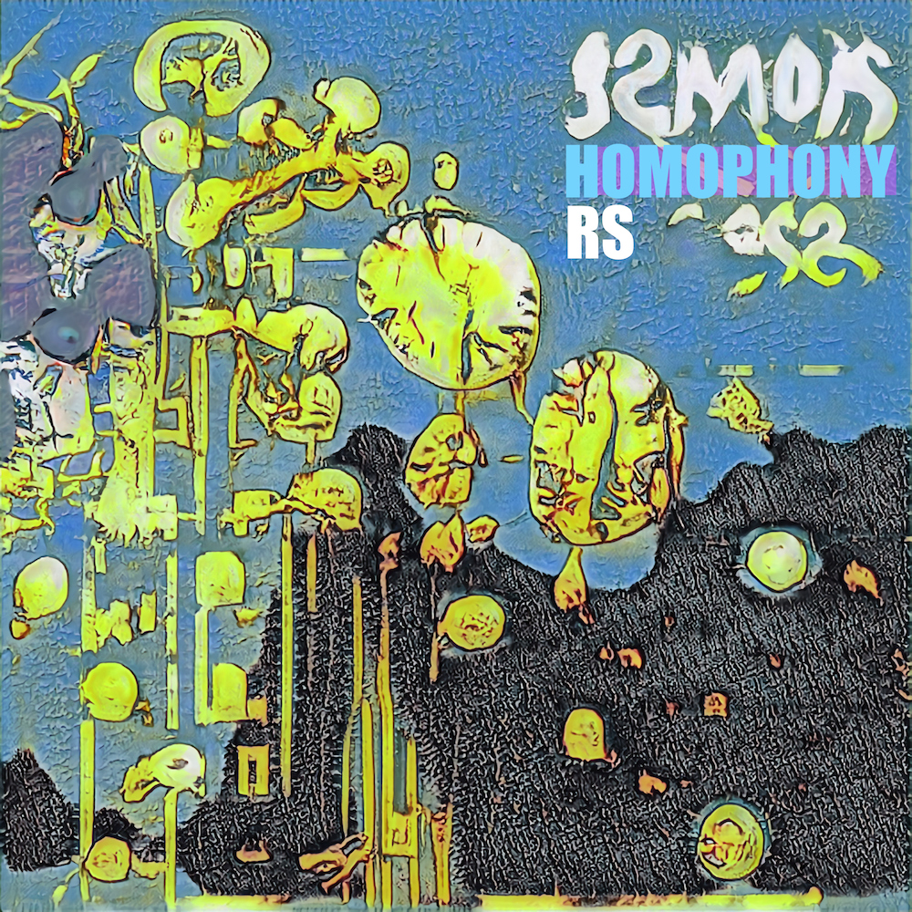
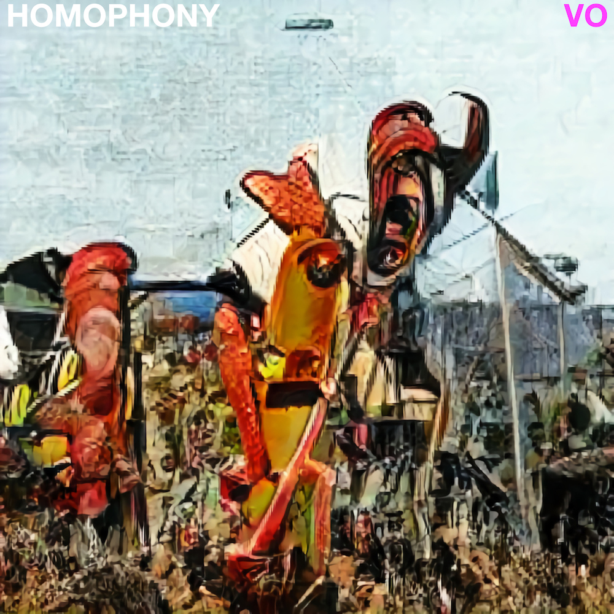

```{r setup, include=FALSE}
knitr::opts_chunk$set(message=FALSE,warning=FALSE, cache=TRUE)
```


## Music

----

<div class="row">
<div class="col-sm-8">

### [RS](https://distrokid.com/hyperfollow/homophony/rs)

Released in Fall 2020, available on most major music streaming services <https://distrokid.com/hyperfollow/homophony/rs>. 

Cover art generated by an AI. 

More synthpop, less vocoder


</div>
<div class="col-sm-4">
```{r rs, out.width='100%', echo=F}

```
</div>
</div>

----

<div class="row">
<div class="col-sm-8">

### [VO](https://distrokid.com/hyperfollow/homophony/vo)

Released in Fall 2020, available on most major music streaming services <https://distrokid.com/hyperfollow/homophony/vo>. 

Cover art generated by an AI. 

Synthpop, lots of vocoder.


</div>
<div class="col-sm-4">
```{r vo, out.width='100%', echo=F}

```
</div>
</div>

----

## Painting

----

<div class="row">
<div class="col-sm-8">

### [things](https://crumplab.github.io/things/)

When I find to make visual things I take pictures of them, and post them here <https://crumplab.github.io/things/>

</div>
<div class="col-sm-4">
```{r things, out.width='100%', echo=F}

```
</div>
</div>


