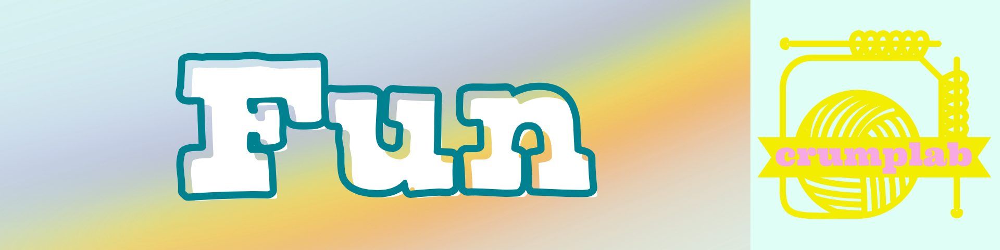

:::::: {.fp .home .people .fun}

::::: people-hero
{.hero-banner fig-alt="Fun"}

::: hero-body
[\~/crumplab/fun]{.fp-kicker}

```{=html}
<h1 class="visually-hidden">Fun</h1>
```

::: fp-lead
Some links to extra-curricular fun stuff like music and visual creations.
:::
:::
:::::

::: {#fun}
:::

::::::
