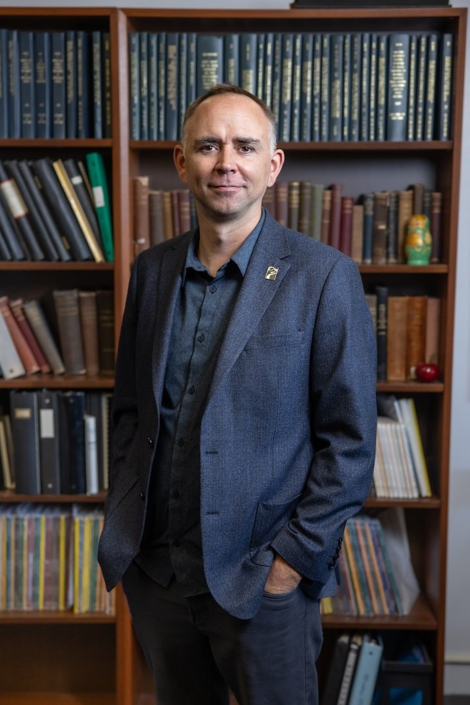

::::::::::::::::: {.fp .home .people}
::::: people-hero
{.hero-banner fig-alt="People"}

:::: hero-body
[\~/crumplab/people]{.fp-kicker}

```{=html}
<h1 class="visually-hidden">People</h1>
```

::: fp-lead
The lab is run by Dr. Matthew Crump and student research assistants from undergraduates to doctoral students.
:::
::::
:::::

::::::::::: bento
::::::: {#pi .card .span-7 .c-pink}
::: card-head
[┌─ principal investigator]{.card-label} [full profile →](people/matt_crump.qmd){.fp-more}
:::

::::: pi
{fig-alt="Portrait of Matthew Crump"}

:::: pi-text
## Matthew Crump

[Professor · Department of Psychology · Brooklyn College of CUNY]{.pi-role}

Matt Crump is a cognitive psychologist with research interests in learning, memory, attention, skill learning, semantics, and computational modeling. He runs the computational cognition lab at Brooklyn College of CUNY.

::: link-chips
[GitHub](https://github.com/CrumpLab){.chip} [Google Scholar](https://scholar.google.com/citations?user=49EVuVcAAAAJ&hl=en){.chip} [YouTube](https://www.youtube.com/c/CrumpsComputationalCognitionLab){.chip} [Brooklyn College](https://www.brooklyn.edu/faculty-staff/matthew-crump/){.chip} [The Graduate Center, CUNY](https://www.gc.cuny.edu/psychology/training-areas/cognitive-and-comparative-psychology){.chip}
:::
::::
:::::
:::::::

::::: {#current .card .span-5 .c-blue}
::: card-head
[┌─ lab members]{.card-label} [about joining →](Opportunities.qmd){.fp-more}
:::

::: {#members}
:::

Dr. Crump has mentored students interested in cognition at all levels, including undergraduate, master's, doctoral, and postdoctoral researchers. There will be limited opportunities for students to gain research experience in the lab for the 2024-2027 period, as Dr. Crump is serving a three year term as Department Chair.
:::::
:::::::::::

::: section-title
## Former lab members
:::

::: {#alumni}
:::
:::::::::::::::::
