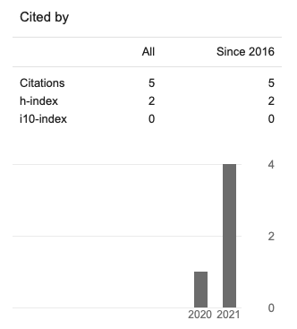

<style>
    .toc-content {
        padding-left: 10%;
        padding-right: 10%;
    }
</style>

**Copyright Notice:** Some of the documents listed below are available for downloading. These have been provided as a means to ensure timely dissemination of scholarly and technical work on a noncommercial basis. Copyright and all rights therein are maintained by the authors or by other copyright holders, notwithstanding that they have offered their works here electronically. It is understood that all persons copying this information will adhere to the terms and constraints invoked by each author's copyright. These works may not be re-posted without the explicit permission of the copyright holder.

**[Google Scholar Citations](https://scholar.google.com/citations?user=Umy26vIAAAAJ&hl=en)**

```{r logo, out.width="50%", echo=FALSE, fig.align="left", out.extra="id=logo"}

```

## In progress

Wang. Y, **Cao. YF**, Wang. B, Wang. Y (2021) How Negative Emotions Influence the Conflict Adaptation Effect: The Roles of Research Paradigm and Emotional Stimulus Task-Relevance. _Under Review_

Tang. C, **Cao. YF**, Huang. T, Huang. JP (2021) Various types of cognitive training improves activity of human multiple demand region: an ALE meta-analysis on fMRI studies. _In Prep_

## Published

**Cao. YF**, Huang. T, Huang. JP, Xie. XC, Wang. Y (2020) Effects and moderators of computer-based training on children's executive functions: a systematic review and meta-analysis. _Frontiers in Psychology_. <https://www.frontiersin.org/articles/10.3389/fpsyg.2020.580329/full>

Wang. Y,Li. K, Gai. XS, **Cao. YF** (2020) Training and Transfer Effects of Response Inhibition Training with on-line Feedback on Adolescents’ and Adults’ Executive Function. _Acta Psychologica Sinica_. 
<http://journal.psych.ac.cn/xlxb/CN/10.3724/SP.J.1041.2020.01212>
