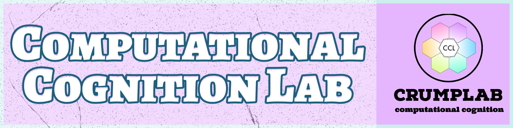

<!-- README.md is generated from README.Rmd. Please edit that file -->

```{r, include = FALSE}
knitr::opts_chunk$set(
  collapse = TRUE,
  echo= FALSE,
  comment = "#>",
  fig.path = "man/figures/README-",
  out.width = "100%"
)
```


<style type="text/css">
.headericons {
  width: 100%;
}
</style>

<br>

::: {.container}
::: {.row .headericons}

:::: {.col}

```{r}
image_link <- function(image,url,...){
  htmltools::a(
    href=url,
    htmltools::img(src=image,...)
    )
}

image_link("man/figures/front/people-logos_black.png","https://www.crumplab.com/articles/People.html", class = "hovericon")
```

::::

:::: {.col}

```{r}
image_link("man/figures/front/publications-logos_black.png","https://www.crumplab.com/articles/Publications.html", class = "hovericon")
```


::::

:::: {.col}

```{r}
image_link("man/figures/front/books.png","https://www.crumplab.com/articles/Books.html", class = "hovericon")
```

::::

:::: {.col}

```{r}
image_link("man/figures/front/courses.png","https://www.crumplab.com/articles/Courses.html", class = "hovericon")
```

::::
:::

::: {.row}
:::: {.col}


```{r}
image_link("man/figures/front/apps.png","https://www.crumplab.com/articles/Apps.html", class = "hovericon")
```

::::

:::: {.col}

```{r}
image_link("man/figures/front/join.png","https://www.crumplab.com/articles/Opportunities.html", class = "hovericon")
```

::::

:::: {.col}

```{r}
image_link("man/figures/front/contact-logos_black.png","https://www.crumplab.com/index.html#contact", class = "hovericon")
```

::::

:::: {.col}

```{r}
image_link("man/figures/front/youtube.png","https://www.youtube.com/c/CrumpsComputationalCognitionLab?sub_confirmation=1", class = "hovericon")
```

::::
:::
:::

## About

The Computational Cognition Lab at Brooklyn College of CUNY investigates learning, memory, attention, performance, and semantic cognition. We ask questions like how do people learn new skills such as playing an instrument or typing on a keyboard? How does memory work? How do people learn the meaning of words? How do people learn patterns and regularities in their environment? These kinds of questions are investigated using behavioral experiments and computational modeling of cognitive processes. The lab also uses a variety of computational methods and tools to conduct and communicate research. 

[Current and previous lab members](https://crumplab.github.io/People.html) include undergraduate, master's , doctoral, and postdoctoral researcher associates. If you are interested in human cognition and using computational techniques for theorizing, running experiments, analyzing data, and developing new technologies [then you may be interested in joining the team](https://crumplab.github.io/Opportunities.html).

The lab is located in the [Department of Psychology](http://www.brooklyn.cuny.edu/web/academics/schools/naturalsciences/undergraduate/psychology.php) at [Brooklyn College of CUNY](http://www.brooklyn.cuny.edu/), and affiliated with the [Cognitive and Comparative Psychology Training area](https://ccp-cuny.github.io) of the [Psychology Doctoral program at the Graduate Center of CUNY](https://www.gc.cuny.edu/Page-Elements/Academics-Research-Centers-Initiatives/Doctoral-Programs/Psychology/Training-Areas/Cognitive-and-Comparative-Psychology).

## Contact 

Matthew Crump
Associate Professor
[Department of Psychology](http://www.brooklyn.cuny.edu/web/academics/schools/naturalsciences/undergraduate/psychology.php)
[Brooklyn College of CUNY](http://www.brooklyn.cuny.edu/)
2900 Bedford Avenue, Brooklyn, NY 11210
Office: 4401 James Hall
Phone: 718-951-5000 x. 6068
email: mcrump@brooklyn.cuny.edu 
Lab: 4303 James Hall


