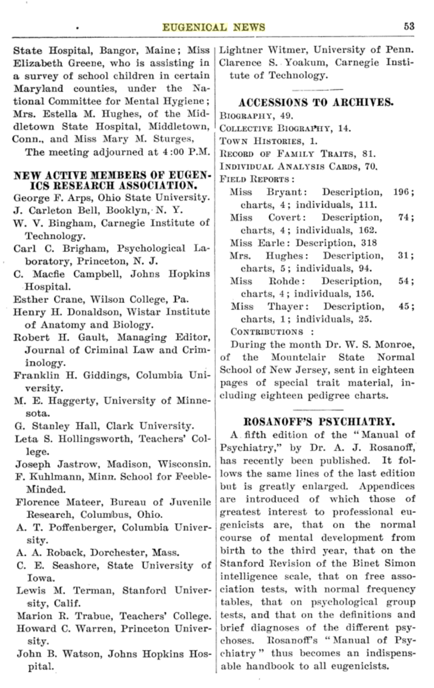
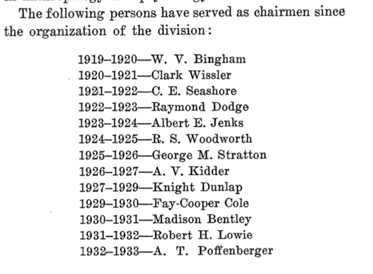

```{r setup, include=FALSE}
knitr::opts_chunk$set(echo = FALSE, message = FALSE, warning = FALSE)
```

---

I'm working through the task of learning about influences of eugenics on psychology and society. As a part of this, I'm documenting the eugenics views held by many psychologists, as well as connections between psychologists and eugenics. I will keep updating this page as I document the connections. There are many connections, it will take some time. So far, this is an emerging disorganized collection of factoids.

A major overarching goal of compiling and documenting connections between psychology and eugenics is to better understand how strucutural eugenics and racism in the discipline of Psychology has shaped and continues to shape the field, both in terms of the questions it asks, and who gets to ask them.

## Sir Francis Galton

  - Inventor of eugenics
  - effectively initiates individual differences psychology, for the purposes of eugenics
  - Obviously much more can be said about Galton...
  
## Karl Pearson

  - Eminent Statistician. Inventor of many common statistics (e.g., Pearson's R)
  - Galton appointed Pearson as the first Director of his Eugenics Laboratory at University College London, this is still in use today
  - The depths of Pearson's eugenics are apparent in his length effort to measure jewish children like animals, and apply his statistical tools to eliminating "bad" jews from immigrated to the UK [@pearsonProblemAlienImmigration1925]. This reference is part I of III, and continues for several hundred pages. To my mind, this work is obviously used as a blueprint by the Nazi's.
  
## Ronald Fisher

 - fill in refs 
  
## Alexander Graham Bell & Bell Labs

  - Notable figure who was a prominent eugenicist
  - Bell labs became central to the development of many communication technologies, and numerous important figures in the emerging discipline of cognitive science worked at Bell Labs. 
  - I need to look more into the culture of eugenics at Bell labs, but perhaps not surprisingly there appears to be one, e.g.,  [https://en.wikipedia.org/wiki/William_Shockley](https://en.wikipedia.org/wiki/William_Shockley)
    
    
## Membership lists

I haven't found too many membership lists yet about affiliations with eugenics societies. So, just a few screenshots for now:

```{r, echo=FALSE}
knitr::include_graphics("img/EugenicsCommittee.png")
```

```{r, echo=FALSE}

```


## American Psychological Presidents (first 50)
 
 - @yakushkoEugenicsItsEvolution2019 writes that 31 APA presidents between 1892 -1947 were affiliated with or leaders in eugenics movements. Need to fill this list out (also it extends past 1947 as we will see)
 
### 1892 Granville Stanley Hall 
 
 - Noted as joining as new active member of the Eugenics Record Office in the Eugenical News
 - Founded the "Journal of Race Development", see @blattBringOutBest2004
 - on the point of view toward primitive races @hallPointViewPrimitive1910
   
### 1893 George Trumball Ladd
 
 - his presidential address is published in the first issue and volume of Psychological Review. He does not use the word eugenics, but appears to dogwhistle to the eugenicists in the room in his closing paragraphs about improving society. Also, many of the authors in the first issue of Psyc Review, were eugenicists
 - contributing editor and author at Journal of Race Development
   
### 1895 James McKeen Cattell

  - [wikipedia page](https://en.wikipedia.org/wiki/James_McKeen_Cattell)
  - Founded Psychological Review, as journal of APA
  - bought Science, editor for 50 years
  - APA president 1895
  - Eugenicist, attempted to development intelligence tests that didn't quite work out, presumably for the purposes of eugenics. This is a nice example of efforts that pre-date Binet's IQ test to develop "scientific" mental tests for the purposes of eugenics.
  - CATTELL, J. M . Families of American Men of Science. Pop. Sci. Mo., 1915, 86, 504-515.
  - APS has been a giving a yearly Cattell award for contributions to science since 1992 <https://en.wikipedia.org/wiki/James_McKeen_Cattell_Fellow_Award>

### 1897 James Mark Baldwin

 - The mental development in the child and race: methods ands processes [@baldwinMentalDevelopmentChild1900]

### 1898 Hugo Munsterberg

 - Is written up in the eugenical news as a fine speciman, "Sensorium of a Psychologist", Eugenical News, Vol VII, No. 10, October 1922
    
### 1899 John Dewey

 - Keeps coming up in the context of eugenics and education...need to learn more
 - @yakushkoEugenicsItsEvolution2019 points out that Dewey & Gordon Allport were anti-eugenics.
 - Dewey, J. (1917). Internal social reorganization after the war. J. Race Dev., 8, 385.
    
### 1900 Joseph Jastrow

  - Had an interest in psychic phenomena
  - [@jonesHistoryOverviewPsychometrics2006], describe how Jastrow was a proponent of Galton in the US, established a lab in Chicago alongside Franz Boas (an anthropologist who advocated against eugenics, @boasEugenics1916). 
  - Wrote on the science of "human quality" [@jastrowCharacterTemperament1921]
  - listed in eugenical news as an active researcher
    
### 1901 Josiah Royce

  - Philosopher (American Idealism)
  - At harvard, apparently convinced Robert Yerkes to combine his interests and do psychology
  - Gets written up in the eugenical news at least once
  - haven't spent time to look into his writing (or lack thereof on eugenics)

### 1902 Edmund Clark Sanford

 - Supervised Lewis Terman, who created Stanford-Binet IQ test
 - Acknowledged as helping out with a dissertation on "The Psychology of Superior Children" [@richards-nashPsychologySuperiorChildren1924]

### 1903 William Lowe Bryan

  - did some work on aquiring telegraph skill, touched all the bases of modern work on transcription skill.
  - President of the Indiana Society for Mental Hygiene (elected 1919)

### 1904 William James

  - doesn't appear to discuss eugenics?
    
### 1905 Mary Whiton Calkins

  - First Female APA president!
  - Student of William James
  - has some writing on ethics, espouses progressive views [@calkinsGoodManGood1918]

### 1906  James Rowland Angell

  - Also eventual president of Yale and eugenics proponent
  - Supervisor of J. B. Watson
  - See @doyleMeasuringProblemsHuman2014 on eugenics in Psychology at Yale
  - Did early mental chronometry research
  - Expressed some of his racialized views of intelligence in @angellEvolutionIntelligence1922

### 1907  Henry Rutgers Marshall

  - interested in aesthetics

### 1908  George Malcolm Stratton

  - From wikipedia, Stratton served in the Army during World War I, developing psychological tests to select airmen for Army aviation
  - Did prism experiments (upside-down looking)
  - published lots of different esoteric things, on feats of memory, to anger in cattle, to how cattle get excited by blood
  - Some discussion of Stratton's role in driving research effort into African Americans [@yudellRaceUnmaskedBiology2014].

### 1909  Charles Hubbard Judd

  -  educational psychologist

### 1910  Walter Bowers Pillsbury

  - from [http://www.cyberus.ca/~pballan/Pillfina.htm](http://www.cyberus.ca/~pballan/Pillfina.htm): This personal brush with political prejudice did not change Pillsbury's official scientific stance on race and mental degeneracy. His Education as the Psychologist Sees It (1920), for instance, was part of a successful nationwide postwar marketing campaign advocating the use of new group "mental testing" techniques in American schools. Here, Pillsbury uncritically combined past eugenic twin-studies with the new "Army Alpha and Beta" intelligence testing data. Surprisingly, his personal conclusion after thirty-three years of teaching is "that one can never produce intelligence by education, that one must begin much farther back in actually insuring the birth of intelligent people" (p. 46). [p. 525] At this time, however, Pillsbury was just one of many psychologists who accepted such notions (e.g., R. M. Yerkes, Psychological Examination in the United States Army [1921]; W. S. Hunter, General Psychology [1919]; R. S. Woodworth, Psychology [1921]).

### 1911  Carl Emil Seashore

  - Seashore, music and eugenics: [http://www.brooklyn.cuny.edu/web/academics/centers/hitchcock/publications/amr/v48-2/devaney.php](http://www.brooklyn.cuny.edu/web/academics/centers/hitchcock/publications/amr/v48-2/devaney.php)
  - Seashore wrote extensively on eugenics and euthenics
  - Member of Advisory Council: International commission on eugenics, Eugenics committee of the United States of America

### 1912 Edward Lee Thorndike

  - wrote extensively on eugenics
    - @thorndikeHumanNatureSocial1940
    - @thorndikeEugenicsSpecialReference1913
  - Member of Advisory Council: International commission on eugenics, Eugenics committee of the United States of America
  - "the human nature club"

### 1913 Howard Crosby Warren

  - SEP society gives the HC Warren medal every year
  - Listed as a new active member of Eugenics Research Association in Eugenical News

### 1914 Robert Sessions Woodworth

  - obit appears in the Eugenics Review [@welfordCurrentPsychologicalIssues1961]
  - see discussion on Woodworth's eugenics at Columbia [@rupertRaceScienceColumbia2019]
  - Member of Advisory Council: International commission on eugenics, Eugenics committee of the United States of America
  
### 1915 John Broadus Watson

 - The famous behaviorist
 - Listed as a eugenics researchers in the Eugenical News
 - Angell was his advisor
 - John B. Watson (1914, 1919), a behaviorist and a eugenicist, experimented on many orphans, frequently in sadistic ways, to promote the social engineering of people to become happy and efficient (from yakushko)
   - Watson, J. B. (1914). Behavior: An introduction to comparative psychology. New York, NY: H. Holt.
   - Watson, J. B. (1919). Psychology: From the standpoint of a behaviorist. Philadelphia, PA: Lippincott.
   - Read yakushko's chapter on Watson in Scientific Pollyanaism
 
### 1916 Raymond Dodge

 - From Doyle, "Dodge was also pleased that his research in human variability and psycho- psychology was so valued by the prospective Institute. While Dodge never publicly identified as a eugenicist, he applauded the National Origins Act of 1924 and was a proponent of applying psychological research to public discourse on selective immigration.93"
 - did some IQ testing in the war
 
 
### 1917  Robert Mearns Yerkes

  - Implemented the Alpha and Beta IQ tests on the Army (1.5 - 2 million army men tested).
  - Pretty clear from his report [@yerkesEugenicBearingMeasurements1923], that he wanted the tests to validate whites becoming officers, and "morons" and immigrants and blacks to be fodder for the front line, or otherwise eliminated
  - Member of Advisory Council: International commission on eugenics, Eugenics committee of the United States of America
  - Yerkes, R. M. (1918). Psychology in relation to the war. Psychological Review, 25(2), 85–115.
  
### 1918 John Wallace Baird

  - Canadian psychologist, connection to eugenics? 

### 1919 Walter Dill Scott

  - intelligence tester, early IO psychology, e.g., applying scientific selection to salesmen @scottScientificSelectionSalesmen1915
  - wikipedia suggests Scott followed in the Galton eugenics tradition, maintained similar elitist views
  
### 1920 Shepard Ivory Franz

  - went to school with Thorndike, studied under Cattell
  - wrote "Psychology as life work" with Thorndike and others, @dodgePsychologyLifeWork1923
  - Haven't found specific eugenic writings from Franz
  - From Yakushko, "For example, S. Franz (APA president in 1920) and J. Dashiell (APA president in 1938), while not listed as eugenic leaders, published numerous positive reviews of eugenic works with titles such as “The Field of Eugenic Reform”. "
  
### 1921 Margaret Floy Washburn
  
  - first woman to get a Ph.D. in Pysch
  - studied under Cattell & Titchener, did comparative cognitive
  - from Yakushko, "M. Washburn, APA president in 1921, one of few female APA presidents, not only published positive reviews of eugenic books but also produced studies on supposed differences in national character showing the “striking national difference” apparently found between Jewish participants' lack of empathy in contrast to their non‐Jewish counterparts (Washburn, 1923, p. 429)."

### 1922 Knight Dunlap

  - Author of "Personal Beauty and Racial Betterment" @dunlapPersonalBeautyRacial1920
  - Member of Advisory Council: International commission on eugenics, Eugenics committee of the United States of America
  
### 1923 Lewis Terman

 - APA president 1923
 - Adapts Alfred Binet's IQ test to English at Stanford, creating the Standford-Binet IQ test.
 - See his eugenic views on feeble-mindedness in school children in California [@terman1917feeble]
 - Member of Advisory Council: International commission on eugenics, Eugenics committee of the United States of America
 - TERMAN, L. M . Research in Mental Deviation Among Children. Research Lab. Buckel Foundation, Stanford Univ., 1915, 2, 1-15.
 
### 1924 Granville Stanley Hall (2nd time)

 - see above
 
### 1925 Madison Bentley

 - author of Mental Inheritance (1909) [https://en.wikisource.org/wiki/Popular_Science_Monthly/Volume_75/November_1909/Mental_Inheritance](https://en.wikisource.org/wiki/Popular_Science_Monthly/Volume_75/November_1909/Mental_Inheritance)
 
### 1926  Harvey A. Carr

 - Carr, H. A., & Kingsbury, F. A. (1938). The concept of traits. Psychological Review, 45(6), @497–524. https://doi.org/10.1037/h0063048
 - Carr, H. A., & Kingsbury, F. A. (1938). The concept of ability. Psychological Review, 45(5), 354–376. https://doi.org/10.1037/h0055419
 - Haven't found specific eugenic writing
 
### 1927 Harry Levi Hollingworth

 -  advocates for eugenics in the book "Vocational Psychology" @hollingworthVocationalPsychologyIts1916
 
### 1928  Edwin Garrigues Boring

 - credited with founding the history of psychology discipline
 - worked with Yerkes doing IQ testing in the military
 - Eugenics views unclear, seems to not discuss the topic so much when he writes his histories
 
### 1929 Karl Lashley

 - detailed analysis of Lashley's racism and hereditarianism @weidmanConstructingScientificPsychology1999
 
### 1930 Herbert Sidney Langfeld

 - writes on eugenics related issues here @langfeldIIHeredityExperience1949, but focuses more on the nature/nuture debate, and seems to take a neutral side on eugenics, which references in terms of "political" takes on the issues. 
 
### 1931 Walther Samuel Hunter

 - From wikipedia, this is a perfect description of accidental eugenics, "Hunter served in the military for sixteen months during World War I. He was the chief psychological examiner in three army camps.[2] During that time he compiled bar graphs with E.S. Jones that showed the predictive value of group psychological tests.[3] His work persuaded government officials to continue the testing program, which ultimately led military officials to order the recording of data on the national origins of the troops tested.[3] The data collected was used in a way that Hunter did not approve; combining the psychological test scores with the location of where the individual grew up supported the notion of Nordic superiority, which was not his intention.[3]"
 - Might be worth reading Hunter's delayed reaction research in animals and children [@hunterDelayedReactionChild1917]. On the hand, it seems that Yerkes advocated that tests of delayed reaction ability could distinguish humans from infra-humans. And, on the other hand, the results were used in the context of debate about mental representations.
 
### 1932  Walter Richard Miles
 - hired by Terman at Stanford, trained by Carl Seashore, married a psychologist who studied gifted children.
 - A funny story about not getting to meet Pearson on a lab visit [https://thepsychologist.bps.org.uk/volume-25/edition-8/looking-back-walter-miles-and-his-grand-tour](https://thepsychologist.bps.org.uk/volume-25/edition-8/looking-back-walter-miles-and-his-grand-tour)
 - wrote a biography of RM Yerkes. Miles, W. R. (1946). Robert Mearns Yerkes. American Psychologist, 1(6), 175–178. This biography leaves out Yerkes' eugenics. Although it show a painting of Yerkes set in front of a tree, which seemse obviously connected to his eugenics.
 - did a bunch of intelligence testing work
 - @milesTRAININGPRACTICEMENTAL1935 talks around eugenics issues and human superiority in terms of longevity, calls for more developmental research in the tradition of Cattell's individual difference work.
 
### 1933 Leon Luis Thurstone

  - famous for his statistical approaches to intelligence testing. 
  - So far haven't read Thurstone closely and haven't found clear indications of his views on eugenics. However, it is interesting to read comments on his work by eugenicists (e.g., @thomsonTRENDNATIONALINTELLIGENCE1946). So, how does Thurstone explain his work knowing that eugenicists are highly interested in it for the purposes of eugenics?
  - consider Thurstone in the context of racist ideologies of the time @samelsonRacePsychologyStudies1978
  
### 1934 Joseph Peterson

 - Peterson, J., & Lanier, L. H. (1929). Studies in the comparative abilities of whites and negroes. Mental Measurement Monographs.
    - where they conclude whites are superior.
 
### 1935  Albert Theodore Poffenberger

 - Relation to Thomas Poffenberger? of Poffenberger, T. (1963). Two thousand voluntary vasectomies performed in California: background factors and comments. Marriage and Family Living, 25(4), 469-474.
 - Generally an advocate for appling testing everywhere to make sure everyone goes into their pre-ordained slot in life.
 - Some work on testing and predicting success in life from school grades. Poffenberger, A.T. (1925). School achievement and success in life. Journal of Applied Psychology, 9(1), 22–28.
 - Poffenberger, A. T., & Carpenter, F. L. (1924). Character Traits in School Success. Journal of Experimental Psychology, 7(1), 67–74. This paper is a good example of value-free science. There is an effort to expand testing in schools beyond IQ tests to include other tests measuring traits that also predict performance...e.g., fill in the gaps that IQ misses in terms of variance explained. However, very little is said about what how these tests would be used in society, even though it is clear from the authors own collegial associations that "better" tests would certainly be put to use for eugenics purposes.
 - @poffenbergerMeasuresIntelligenceCharacter1922 This paper is basically full on eugenics without using the word. Poffenberger describes how IQ tests can be used to slot people into professions that they are "suitable" for given their IQ. It is an argument to keep "low IQ workers" in their place as laborers, and given the best jobs to people with high IQ, and to worry about how the economy may collapse if people aren't slotted in based on their IQ.
 
 - @poffenbergerDevelopmentMenScience1930 carries on in the tradition of Galton & Cattell to ask what factors make men of science great. Maintains a thin veneer with respect to avoiding commentary on eugenics.
 - Highly relevant account of the activities of the national research council 1919-1933 (division of anthropology & Psychology), wherein it obvious just how many activities were eugenic in nature. @poffenbergerVIIIDIVISIONANTHROPOLOGY1933
   - consider also the previous chairmen of the committee:
   
```{r, echo=FALSE}

```

- W.V. Bingham is registered as an active researcher int he Eugenical NEws
- Clark Wissler is on the Eugenics commitee of the USA
- C. E. Seashore is on the Eugenics commitee of the USA
- Raymond Dodge, see above
- Albert E. Jenks wrote “Some Aspects of the Negro Problem,” Science 35 (April 26, 1912): 667.
- R.S. Woodworth is on the Eugenics commitee of the USA
- George M Stratton see above
- AV Kidder, noted as having extended correspondence with Charles Davenport (director of the Eugenics record office) @societyNewGuideCollections1987
- Knight Dunlap is on the Eugenics commitee of the USA
- Fay-cooper cole, discussing the role of anthropology in eugenics here @RecentTrendsAnthropology2020, 
    - see also his role in the Scopes trial (need to clarify what the role was) @pavukAmericanAssociationAdvancement2018
- Madison Bentley see above, author of "mental inheritance"
- Robert H Lowie anthropologist, criticizes aspects of Galton and eugenics here @lowieFatherEugenics1920, wonders what to about equality in society given the reality of individual differences
- Poffenberger, see above


List of correspondence between C Davenport (director of eugenics record office) and other folks, from @societyNewGuideCollections1987

```{r, echo=FALSE}

```

### 1936  Clark Leonard Hull
  
  - from wikipedia, early on did some aptitude testing, enjoyed debating Lashley on his views of inherited intelligence
  - Hull worked within a theoretical context of Pavlov, Watson, & Thorndike, all of whom were proponents of eugenics
  - Read this to begin to grasp Hull's eugenics @morawskiOrganizingKnowledgeBehavior1986
  - Read Hull's idea books "Idea Book, 1927-1930,' Clark L. Hull Papers, Sterling Library, Yale University.
  
```{r, echo=FALSE}

```

```{r, echo=FALSE}

```
  
### 1937 Edward Chace Tolman

  - 1950s U of C oath 
  - did some mental testing
     - Tolman, E. C. (1918). Performance Norms for Thirteen Tests.
     - Tolman, E. C. (1918). Mental Examination.
  - E.C. Tolman The inheritance of maze-running abiliity in rats, J. Comp. Psychol., 4 (1924), pp. 1-18
     - So this is where Tolman actually attempts to breed rats to see if they improve in their intelligence at running a maze, seemed to have abandoned this line of work after basically finding nothing.@wahlstenGeneticExperimentsAnimal1972
     
### 1938  John Frederick Dashiell

  - advised by John Dewey
  - from Yakushko, ...J. Dashiell (APA president in 1938), while not listed as eugenic leaders, published numerous positive reviews of eugenic works with titles such as “The Field of Eugenic Reform”. 
  
### 1939 Gordon Willard Allport

  - An advocate against eugenics (from Tucker, W. H. (1996). The science and politics of racial research. Urbana‐Champaign, IL: University of Illinois Press.)
  - personality psychologist
  - Interested to learn more about how Allport was anti-eugenics while also continuing to do research of interest to eugenicists. Allport, G. W. (1921). Personality and character. Psychological Bulletin, 18(9), 441–455.
  - Allport's prejudice scale, research into the racism and prejudice as components for explaining the Holocaust.
  
### 1940 Leonard Carmichael

  - wrote a bio on Yerkes. Carmichael, L. (1957). Robert Mearns Yerkes 1876-1956. Psychological Review, 64(1), 1–7
  - Carmichael, L. (1934, September). The psychology of genius. In National Forum (Vol. 14, No. 3, p. 149). Honor Society of Phi Kappa Phi.
  - Carmichael, L. (1925). Heredity and environment: Are they antithetical? Journal of Abnormal and Social Psychology,
20, 245–260.
  - connection to W. McDougall @roseWILLIAMMCDOUGALLAMERICAN2016
  
### 1941 Herbert Woodrow

  - first cousin of Woodrow Wilson
  - From wikipedia, In 1919, Woodrow wrote Brightness and Dullness in Children. A review in The Journal of Education said, "Dr. Herbert Woodrow has made a distinct and remarkable contribution to progress in his emphasis of the distinction between 'Dullness and Brightness in Children.' It is a work that simply must be carefully read by every one who desires to demonstrate intelligence in the study of intelligence.
  - Lowell, F., & Woodrow, H. (1922). Some data on anatomical age and its relation to intelligence. The Pedagogical Seminary, 29(1), 1-15.
  - Woodrow, H. (1917). Practice and transference in normal and feeble-minded children. Journal of Educational Psychology, 8(2), 85.
  - Woodrow, H. (1945). Intelligence and improvement in school subjects. Journal of Educational Psychology, 36(3), 155.
  - Woodrow, H. (1921). Intelligence and its measurement: A symposium--XI. Journal of Educational Psychology, 12(4), 207.
  - scary...Arthur, G., & Woodrow, H. (1919). An absolute intelligence scale: A study in method. Journal of Applied Psychology, 3(2), 118.
  
### 1942 Calvin Perry Stone

 - worked with Yerkes and Lashley
 - Stone, C. P. (1932). Wildness and savageness in rats of different strains.
 - Stone, C. P. (1947). Losses and gains in cognitive functions as related to electro-convulsive shocks. The Journal of Abnormal and Social Psychology, 42(2), 206.
 - Stone, C. P., & Barker, R. S. (1937). Aspects of personality and intelligence in postmenarcheal and premenarcheal girls of the same chronological age. Journal of Comparative Psychology, 23(3), 439.
 - Stone, C. P. (1943). Multiply, vary, let the strongest live and the weakest die—Charles Darwin. Psychological Bulletin, 40(1), 1–24.
 - Eriksen, C. W., Porter, P. B., & Stone, C. P. (1948). Learning ability in rats given electroconvulsive shocks in late infancy. Part I. Journal of comparative and physiological psychology, 41(2), 144.
 - Stone, C. P., & Wechsler, D. (1945). Wechsler Memory Scale Form II. Psychological Corporation.
 - Burlingame, M., & Stone, C. P. (1928). Family resemblance in maze-learning ability in white rats. Publ. School Publishing Company.
 - Commins, W. D., & Stone, C. P. (1932). Effects of castration on the behavior of mammals. Psychological Bulletin, 29(7), 493.
 - Stone, C. P. (1921). Comparative Study of the Intelligence of 399 Inmates of the Indiana Reformatory and 653 Men of the United States Army. J. Am. Inst. Crim. L. & Criminology, 12, 238.
 
## First 50 notes

I need to pause for a bit. I've been quickly trying to sketch out some connections between APA presidents and eugenics. Mostly this involves googling their name and eugenics, and pulling the string.

My main aim in making these connections is to draw attention to the larger pattern of institutional eugenics within the discipline of Psychology. I am less interested about whether or not specific individuals were "card-carrying" eugenicists, or really truly held eugenics views in their "soul" or not. I think it is enough to establish the pattern and spread of eugenic ideology to consider how eugenics shaped the discipline. For example, I suspect that rampant eugenics had a part to play in systemically limiting the diversity of faculty in Psychology. I suspect it also guided the questions we ask, and continue to ask.

So, as a part of reflecting on what I am doing, I drew up a quick spreadsheet of the APP presidents. For the first 50, I gave them each a eugenics score from 0 to 1, with some intermediate scores representing eugenics adjacent work. These are just some rough personal qualitative estimates, to put a number on things. My rough numberization adds up to 34.75 of 50 APA presidents were into eugenics or eugenics adjacent research. Very few were ever explicitly anti-eugenics.

Consider a sentence like, "It is overwhelming the case that the first 50 years of American Psychology as measured by APA presidents research interests and leadership demonstrate that the discpline of psychology was primarily constructed as arm of the national eugenics movement in the USA". I just wrote that sentence, and I'm starting to think that I'm not exaggerating.

---
 
## More APA presidents from 1943
 
### 1943 John Edward Anderson

  - The modern baby book, similar to Galton. From Smith in @schwartzNineteenthcenturyVisualCulture2004
  
```{r, echo= FALSE}
knitr::include_graphics("img/JEAnderson.png")
```

### 1944 Gardner Murphy

  - psi, worked with W McDougall
  - His correspondence in a Eugenics Society is preserved [https://www.kshs.org/index.php?url=archives/297369](https://www.kshs.org/index.php?url=archives/297369)
  - <https://slowlorisblog.files.wordpress.com/2014/03/2013-history-of-science-society-these-hindering-forces.pdf>
  - Gardner Murphy, A research Program for Qualitative Eugenics, Eugenics Quarterly, 1, 1954, 209-12.
  
### 1945 Edwin R. Guthrie

  - involved in testing with military, mainly a learning psychologist in the behaviorist tradition?
  - Guthrie, E. R. (1950). The status of systematic psychology. American Psychologist, 5(4), 97.
  - Guthrie, E. R. (1927). Measuring introversion and extroversion. The Journal of Abnormal and Social Psychology, 22(1), 82.
  - Guthrie, E. R. (1924). Purpose and mechanism in psychology. The Journal of Philosophy, 21(25), 673-681.
  - Guthrie, E. R. (1938). The Psychology of Human Conflict; Harper and Brothers.
  - Maybe get a sense of what he thought about Hull's aptitude testing book in this review: Guthrie, E. R. (1929). Review of Aptitude Testing [Review of the book Aptitude testing, by C. L. Hull]. Journal of Educational Psychology, 20(3), 236–237. Basically an  uncritical take.
  
### 1946 Henry E. Garrett

  - his wikipedia entry is enough to establish Garrett's racist and eugenics views <https://en.wikipedia.org/wiki/Henry_Garrett_(psychologist)>
  - Supported Carleton Putnam's pamphlet titled Race and Reason—A Yankee View.
  
### 1947 Carl R. Rogers

  - a humanist psychologist (hopefully not like Maslow's version of eugenical humanism?)
  - relation to genetics counseling? @restaEugenicsNondirectivenessGenetic
  - nondirectional counselling, seems to be doing something different than genetic counseling, perhaps not into eugenics, or at least doing something in response to eugenics in the clinical domain
  
### 1948 Donald G. Marquis

  - worked with Terman and Woodworth
  - Marquis, D. G. (1948). Research planning at the frontiers of science. American Psychologist, 3(10), 430.
  - Wolfle, D., Likert, R., Marquis, D. G., & Sears, R. R. (1949). Standards for appraising psychological research. American Psychologist, 4(8), 320.
  - Marquis, D. G. (1930). The criterion of innate behavior. Psychological Review, 37(4), 334.
  - Marquis, D. G. (1944). The mobilization of psychologists for war service. Psychological Bulletin, 41(7), 469.
  - Marquis, Donald G. "Social psychologists in national war agencies." Psychological Bulletin 41, no. 2 (1944): 115.
  - Marquis, D. G. (1944). Research program on psychomotor tests in the army air forces. Psychological Bulletin, 41, 307-321.
  - Marquis, D. G. (1947). Psychology of social change. The Annals of the American Academy of Political and Social Science, 249(1), 75-80.
  - Marquis, D. G. (1950). Report of the social science division of the study committee. New York: Ford Foundation Archives.
  - racial categories in the Woodworth and Marquis (1947) edition of his text, from "Winston, A. S., Butzer, B., & Ferris, M. D. (2004). Constructing difference: Heredity, intelligence, and race in textbooks, 1930-1970. In A. S. Winston (Ed.), Defining difference: Race and racism in the history of psychology (p. 199–229). American Psychological Association."
  
### 1949 Ernest R. Hilgard

  - did hypnosis, learning
  - wrote a bio on yerkes, Hilgard, Earnest R. 1965. Biographical Memoir of Robert Mearns Yerkes, 1876–1956. Vol. 38,
National Academy of Sciences Biographical Memoirs. Washington, DC: National Academy of
Sciences, 1877–2014.
  - Hilgard, E. R. (1987). Psychology in America: A historical survey. Harcourt Brace Jovanovich.
  - Hilgard, E. R. (1949). Human motives and the concept of the self. American Psychologist, 4(9), 374.
  - Hilgard, E. R. (1974). Ernest Ropiequet Hilgard. In G. Lindzey (Ed.), Century psychology series. A history of psychology in autobiography, Vol. 6 (p. 131–160).
  - Morgan, A. H., Hilgard, E. R., & Davert, E. C. (1970). The heritability of hypnotic susceptibility of twins: A preliminary report. Behavior Genetics, 1(3-4), 213-224.
  - Hilgard, E. R., Weitzenhoffer, A. M., Landes, J., & Moore, R. K. (1961). The distribution of susceptibility to hypnosis in a student population: A study using the Stanford Hypnotic Susceptibility Scale. Psychological Monographs: General and Applied, 75(8), 1.
  - Hilgard, E. R., Leary, D. E., & McGuire, G. R. (1991). The history of psychology: A survey and critical assessment. Annual Review of Psychology, 42(1), 79-107.
  - Hilgard, E. R. (1978). American psychology in historical perspective: Addresses of the presidents of the American Psychological Association, 1892–1977. American Psychological Association.
  
### 1950  Joy Paul Guilford

  - intelligence tester, titchener student
  - Guilford, J. P. (1967). The nature of human intelligence.
  - Guilford, J. P. (1956). The structure of intellect. Psychological bulletin, 53(4), 267.
  - Guilford, J. P. (1957). Creative abilities in the arts. Psychological review, 64(2), 110.
  - Guilford, J. P. (1982). Cognitive psychology's ambiguities: Some suggested remedies. Psychological review, 89(1), 48.
  - Guilford, J. P., & Guilford, R. B. (1936). Personality factors S, E, and M, and their measurement. The journal of Psychology, 2(1), 109-127.
  - How does Guilford address eugenics?
  - Guilford, J. P. (1968). Intelligence Has Three Facets: There are numerous intellectual abilities, but they fall neatly into a rational system. Science, 160(3828), 615-620.
  - Guilford, J. P. (1939). A study in psychodynamics. Psychometrika, 4(1), 1-23.
  
### 1951  Robert R. Sears

  - https://psychology.wikia.org/wiki/Genetic_Studies_of_Genius
  - Sears, R. R. (1977). Sources of life satisfactions of the Terman gifted men. American Psychologist, 32(2), 119.
  - Sears, R. R. (1950). Ordinal position in the family as a psychological variable. American Sociological Review, 15(3), 397-401.
  - Farber, M. L., Lewin, K., & Sears, R. R. (1944). Suffering and time perspective of the prisoner. University of Iowa Press.
  - Davalos, L. M., Sears, R. R., Raygorodetsky, G., Simmons, B. L., Cross, H., Grant, T., ... & Porzecanski, A. L. (2003). Regulating access to genetic resources under the Convention on Biological Diversity: an analysis of selected case studies. Biodiversity & Conservation, 12(7), 1511-1524.
  - Sears, R. R., & Feldman, S. S. (Eds.). (1973). The seven ages of man. W. Kaufmann.
  - Sears, R. R. (1951). Symposium on genetic psychology: 3. Effects of frustration and anxiety on fantasy aggression. American Journal of Orthopsychiatry, 21(3), 498.
  - Sears, R. R. (1947). Child psychology.
  
### 1952 JMV HUNT

  - Hunt, J. M. (1969). Has compensatory education failed? Has it been attempted?. Harvard Educational Review, 39(2), 278-300.  Argues against Jensen.
  - Hunt, J. M. (1961). Intelligence and experience.
  - Hunt, J. M. (1969). challenge of incompetence and poverty.
  - Hunt, J. M. (1970). Attentional preference and experience: I. Introduction. The Journal of Genetic Psychology, 117(1), 99-107.
  - Hunt, J. M. (1966). The psychological basis for using preschool enrichment as an antidote for cultural deprivation. In Experience Structure & Adaptability (pp. 235-276). Springer, Berlin, Heidelberg.
  - Hunt, J. M. (1982). Toward equalizing the developmental opportunities of infants and preschool children. Journal of Social Issues, 38(4), 163-191.
  - Hunt, J. M. (1981). A Critical Look at Intelligence Testing.
  - Some pushback from Hunt
  
### 1953 Laurance F. Shaffer

  - Mental hygiene promoter
  - Shaffer, L. F., & Shoben, E. J. (1936). The psychology of adjustment: An objective approach to mental hygiene (Vol. 487). Houghton Mifflin.
  - Why does that sound so similar to racial hygiene?
  
### 1954 O. H. Mowrer

  - involved in the Harvard Department of Social Relations, apparently a response to the Yale Institute of Human Relations
  - interesting stuff on the wikipedia page <https://en.wikipedia.org/wiki/Orval_Hobart_Mowrer>... you are your secrets
  - "Hobart Mowrer was an advocate of the idea that mental illness has a substantial biological and genetic basis. He held this conviction in spite of his equally strong belief in the importance of the "pathogenic secret." Mowrer accepted the importance of biological factors at a time when many people did not, and was in this respect ahead of his time. He regarded his own affliction as in some sense a "gift," the driving force behind his innovative ideas, but also the great misery of his life."
  - Page, C. (2017). Preserving guilt in the “age of psychology”: The curious career of O. Hobart Mowrer. History of Psychology, 20(1), 1.
  - Mowrer, O. H. (1979). Is Much Psychotherapy Still Misdirected or Misapplied?. Canadian Journal of Counselling and Psychotherapy, 13(3).
  - Fiordo, R. (1981). Integrity training: A moral code and method for moral education. The Journal of Educational Thought (JET)/Revue de la Pensée Educative, 47-60.
  - Weiss, R. P. (2006). The American Culture of Torture: A Review Essay.
  
### 1955 E. Lowell Kelly

  - worked with Terman
  - marital compatibility Kelly, E. L., & Conley, J. J. (1987). Personality and compatibility: A prospective analysis of marital stability and marital satisfaction. Journal of personality and social psychology, 52(1), 27.
  - Kelly, E. L. (1955). Consistency of the adult personality. American Psychologist, 10(11), 659.
  - Westoff, C. F., Mishler, E. G., & Kelly, E. L. (1957). Preferences in size of family and eventual fertility twenty years after. American Journal of Sociology, 62(5), 491-497.
  - Seems like eugenics adjacent work...e.g., how to get good people to have marriages that allow good people to breed? Maybe I'm reading to much into it
  
### 1956 Theodore M. Newcomb

  - worked with several other psychologists interested in eugenics <https://en.wikipedia.org/wiki/Theodore_Newcomb>
  - Newcomb, T. M. (1956). The prediction of interpersonal attraction. American psychologist, 11(11), 575.
  - need to follow up more here, maybe @smithAmericanPsychologicalAssociation1992
  
### 1957 Lee J. Cronbach

  - central in testing and validity theory
  - discusses mental testing here @cronbachFiveDecadesPublic, basically says that science must go on unimpeded, regardless of the smell.
  - participated as a child in terman studies of children, wow. <https://en.wikipedia.org/wiki/Lee_Cronbach>
  
### 1958 H. F. Harlow

  - Advised by Terman (public eugenicist)
  - Abraham Maslow was his student (private eugenicist)
  - social deprivation monkeys guy
  - Woolsey, C. N., & Harlow, H. F. (Eds.). (1958). Biological and biochemical bases of behavior. University of Wisconsin Press.
  - breadcrumbs about harlow with respect to scientific racism @shockleyDebateChallengeGeneticity1972
  - Harlow, H. F. (1936). The neuro-physiological correlates of learning and intelligence. Psychological Bulletin, 33(7), 479.
  - Farber, I. E., Harlow, H. F., & West, L. J. (1957). Brainwashing, conditioning, and DDD (debility, dependency, and dread). Sociometry, 20(4), 271-285.
  - SUOMI, S. J., & HARLOW, H. F. (1977). Genetics, environment and intelligence, edited by A. Oliverio© Elsevier/North-Holland Biomedical Press, 1977. Genetics, Environment, and Intelligence, 197.
  - Harlow, H. F. (1977). Intelligence in Ape and Man.
  - Harlow, H. F., Harlow, M. K., Schiltz, K. A., & Mohr, D. J. (1971). The effect of early adverse and enriched environments on the learning ability of Rhesus monkeys. In Cognitive processes of nonhuman primates (pp. 121-148). Academic Press.
  
### 1959 Wolfgang Köhler

  - gestalt psychology
  - Henle, M. (1978). One man against the Nazis: Wolfgang Köhler. American Psychologist, 33(10), 939.
  - Lewin, K. (1986). “Everything within me rebels”: A letter from Kurt Lewin to Wolfgang Köhler, 1933. Journal of Social Issues, 42(4), 39-47.
  - Köhler, W., & Guillaume, P. (1928). L'intelligence des singes supérieurs.
  - Arnheim, R. (1998). Wolfgang Köhler and gestalt theory: An English translation of Köhler's introduction to Die physischen Gestalten for philosophers and biologists. History of Psychology, 1(1), 21.
  - Köhler, W. (1925). An aspect of Gestalt psychology. The Pedagogical Seminary and Journal of Genetic Psychology, 32(4), 691-723.
  - Köhler, W. (1926). Intelligence of apes. In Powell Lecture in Psychological Theory, Apr, 1925, Clark University, Worcester, MA, US; Portions of this research were presented at the Powell Lecture in Psychological Theory at Clark University, April 30, 1925.. Clark University Press.
  - Köhler, W. (1937). Psychological remarks on some questions of anthropology. The American journal of psychology, 50(1/4), 271-288.
  
### 1960 Donald O. Hebb

  - Did some intelligence testing early on, been around the block, applied to work with Yerkes, ended up working with Lashley.
  - https://ahrp.org/1951-cias-psychological-torture-is-rooted-in-experiments-at-dachau-project-artichoke-mk-ultra/
  - http://www.ferris-pages.org/ISAR/archives2/mental.htm Steven A. Gelb, Garland E. Allen, Andrew Futterman and Barry A. Mehler, "Rewriting Mental Testing History: The View from the American Psychologist," originally published in Sage Race Relations Abstracts 11 #2 (May 1986) pp. 18-31.
  - Obviously there are some issues with Hebb. See also Zubek at U of Manitoba.
  
### 1961 Neal E. Miller
 
 - spent time at IHR at Yale
 - look at Miller's Neurotree...worked with Hull
 - Dollard, J., Miller, N. E., Doob, L. W., Mowrer, O. H., & Sears, R. R. (1939). Frustration and aggression.
 - Miller, N. E., & Dollard, J. (1941). Social learning and imitation.
 - Miller, N. E. (1951). Learnable drives and rewards.
 - Delgado, J. M., Roberts, W. W., & Miller, N. E. (1954). Learning motivated by electrical stimulation of the brain. American Journal of Physiology-Legacy Content, 179(3), 587-593.
 - Miller, N. E. (1948). Theory and experiment relating psychoanalytic displacement to stimulus-response generalization. The Journal of Abnormal and Social Psychology, 43(2), 155.
 - Bower, G. H., & Miller, N. E. (1958). Rewarding and punishing effects from stimulating the same place in the rat's brain. Journal of Comparative and Physiological Psychology, 51(6), 669.
 - Miller, N. E., & Bugelski, R. (1948). Minor studies of aggression: II. The influence of frustrations imposed by the in-group on attitudes expressed toward out-groups. The Journal of psychology, 25(2), 437-442.
 - Miller, N. E. (1957). Graphic communication and the crisis in education. Audio Visual Communication Review, 1-120.
  
### 1962 Paul E. Meehl  

 - signatory of https://en.wikipedia.org/wiki/Mainstream_Science_on_Intelligence
 - @meehlTheoreticalRisksTabular1978 notably does not mention eugenics here..
 - Accepted the APS Cattell award
 - Meehl, P. E., & Hathaway, S. R. (1946). The K factor as a suppressor variable in the Minnesota Multiphasic Personality Inventory. Journal of Applied Psychology, 30(5), 525.
 - Meehl, P. E. (1986). Causes and effects of my disturbing little book. Journal of personality assessment, 50(3), 370-375.
 - Meehl, P. E. (1956). Wanted—a good cook-book. American Psychologist, 11(6), 263.
 - Livermore, J. M., Malmquist, C. P., & Meehl, P. E. (1968). On the justifications for civil commitment. U. Pa. L. Rev., 117, 75.
 - Meehl, P. E. (1954). Clinical vs. statistical prediction. University of Minnesota Press.
 - Meehl, P. E. (1950). On the circularity of the law of effect. Psychological Bulletin, 47(1), 52.
 - Meehl, P. E. (1945). The dynamics of" structured" personality tests. Journal of Clinical Psychology.
 - Gough, H. G., McClosky, H., & Meehl, P. E. (1952). A personality scale for social responsibility. The Journal of Abnormal and Social Psychology, 47(1), 73.
 - Gough, H. G., McClosky, H., & Meehl, P. E. (1951). A personality scale for dominance. The Journal of Abnormal and Social Psychology, 46(3), 360.
 - Meehl, P. E. (1972). Specific genetic etiology, psychodynamics, and therapeutic nihilism. International Journal of Mental Health, 1(1-2), 10-27.
 - Gottesman, I. I. (1962). Differential inheritance of the psychoneuroses. Eugenics quarterly, 9(4), 223-227....why is Meehl's work being cited in Eugenics journals?
 - @meehlPSYCHOLOGYSCIENTISTLXXVIII1998, briefly mentions eugenics and notes he is writing paper about Utopi... Also the paper is about the difficulty of giving asshole scientists awards. gives an object lesson in eugenics and organizations using siamese cats..argues it is inevitable that one will be tainted, just accept it...is he defending Jensen here?
 - personal communications about g permeating everything in @webbNatureIntelligence2000
 - Peterson, D. R. (2005) Twelve years of correspondence with Paul Meehl: Tough notes from a gentle genius. Erlbaum. [This book may be ordered from Routledge]
 
### 1963 Charles E. Osgood

 - Notable for his peace psychology, Osgood, C. E. (1964). The psychologist in international affairs. American Psychologist, 19(2), 111.
 - Yale, worked with Sears and Hull
 - Osgood, C. E., & Suci, G. J. (1952). A measure of relation determined by both mean difference and profile information. Psychological Bulletin, 49(3), 251.
 - Osborn, F., Fuller, J. L., & Scott, J. P. (1954). Genetic factors affecting intelligence: Symposium. Eugenics Quarterly, 1(1), 28–43. doi:10.1080/19485565.1954.9987161  cite using Osgood's above method
 - Osgood, C. E., Suci, G. J., & Tannenbaum, P. H. (1957). The measurement of meaning (No. 47). University of Illinois press.
 - Shank, D. B. (2010). Trusting technological actors: A foundation in structure and cultural sentiments. In Trust and Technology in a Ubiquitous Modern Environment: Theoretical and Methodological Perspectives (pp. 35-54). IGI Global.
 - Ervins, S. M., & Osgood, C. E. (1954). Second language learning and bilingualism. Journal of Abnormal and Social Psychology, 49, 139-145.
 - Osgood, C. E., Sebeok, T. A., Gardner, J. W., Carroll, J. B., Newmark, L. D., Ervin, S. M., ... & Wilson, K. (1954). Psycholinguistics: a survey of theory and research problems. The Journal of Abnormal and Social Psychology, 49(4p2), i.
 - Osgood, C. E., & Luria, Z. (1954). A blind analysis of a case of multiple personality using the semantic differential. The Journal of Abnormal and Social Psychology, 49(4p1), 579.
 - Osgood, C. E. (1966). Dimensionality of the semantic space for communication via facial expressions. Scandinavian journal of psychology, 7(1), 1-30.
 - Osgood, C. E. (1969). On the whys and wherefores of E, P, and A. Journal of personality and social psychology, 12(3), 194.
 - Cook, S., Gibson, J. J., MacFarlane, J. W., Newman, E. B., & Osgood, C. E. (1958). Reports on a Case of Conditions of Employment. American Psychologist, 13(11), 633.
 - Triandis, H. C., & Osgood, C. E. (1958). A comparative factorial analysis of semantic structures in monolingual Greek and American college students. The Journal of Abnormal and Social Psychology, 57(2), 187.
 - Fiedler, F. E., Osgood, C. E., Stolurow, L. M., & Triandis, H. C. (1963). A Contingency Model for the Prediction of Leader ship Effectiveness (No. TR-10). ILLINOIS UIV AT URBANA GROUP EFFECTIVENESS RESEARCH LAB.
 - Finfgeld, T. E., DeVito, J. A., Murphy, R., & Osgood, C. E. (1966). The ability to select words to convey intended meaning. Quarterly Journal of Speech, 52(3), 255-258.
 
### 1964 Quinn McNemar

 - IQ tester, studied under Terman
 - See Catharine Cox Miles, “Psychological Study of a Young Adult Male Pseudohermaphrodite Reared as a Female’ Studies in Personality, Contributed in Honor of Lewis M. Terman, ed. Quinn McNemar and Maud Merrill. New York: McGraw Hill. 1942
 - Quinn McNemar and Lewis M Terman. "Sex Differences in Variational Tendency." Genetic Psychology Monographs 18.1 (1936): 1-66
 - McNemar, Q. (1964). Lost: our intelligence? why?. American Psychologist, 19(12), 871.
 - McNemar, Q. (1960). At random: Sense and nonsense. American Psychologist, 15(5), 295.
 - McNemar, Q. (1940). A critical examination of the University of Iowa studies of environmental influences upon the IQ. Psychological Bulletin, 37(2), 63.
 - McNemar, Q. (1975). On so-called test bias. American Psychologist, 30(8), 848.
 - McNemar, Q. U. I. N. N. (1938). Special review: Newman, Freeman, and Holzinger's Twins: a study of heredity and environment. Psychological Bulletin, 35(4), 237.
 - BUGENTAL, J., CLARK, K., EBERHART, J., ERICKSEN, S., HARPER, R., HUMPHREYS, L., ... & ROGERS, C. (1965). COMMITTEE ON THE SCIENTIFIC AND PROFESSIONAL AIMS OF PSYCHOLOGY-PRELIMINARY-REPORT.
 - McNemar, Q. (1945). Note on Wellman's re-analysis of IQ changes of orphanage preschool children. The Pedagogical Seminary and Journal of Genetic Psychology, 67(2), 215-219.
 - from Kuhl
   - "Student-led protests, sometimes violent in nature, against public appearances by Jensen, Eysenck, and Shockley produced a situation wherein they perceived a dichotomy between politically blinded critics and “pure” scholars, who were subject to psychoterror, attempts at intimidation, and death threats.123 Eysenck, Jensen, and Herrnstein, in conjunction with ten other American and British academics, suc- ceeded in initiating a resolution defending them against “personal and professional disparagement.”124 Here they placed the criticism that they received for their theory of inheritance in the same tradition as the persecution of “well-known scientist victims, includ[ing],Galileo, in orthodox Italy; Darwin, in Victorian England; Einstein, in Hitler’s Germany; and Mendelian biologists, in Stalin’s Russia.”125 Many of the attacks against the heredity researchers were seen to be made by “non- scientists” or “outspoken enemies of a scientific attitude.” Attacks were also deemed to come from “academics who had determined that any explanation of differences among humans could be traced to the environmental theory.” In the light of the widespread “environment oriented orthodoxy,” there was practically a “witch hunt” against those who held ideas based on heredity or a wish to develop further research work in the area of the biological bases of behavior.
   - Notes from 124, "The ten other scholars were Jack A. Adams, Raymond B. Cattell, Francis H. Crick, C. D. Darlington, Charles W. Eriksen, Eric F. Gardner, Quinn McNemar, Eliot Slater, Robert L. Thorndike, Frederick C. Thorne, and Philip E. Vernon; cf. JBA Oxford, G. 14. The activity was at first coordinated by the psychologist Ellis B. Page of the University of Connecticut; cf. Jensen to Dobzhansky, 9/2/1972, THA Philadelphia: Jensen, Arthur R."
 


  
## Henry Goddard

 - Goddard argued for classifying “feeble-minded” people into classes by IQ, e.g., idiots ~ 20, Imbeciles ~ 40, Morons ~ 70, see Goddard’s “Who is a Moron?” [@goddardWhoMoron1927]. 
 - The fear was that morons are basically normal competent people who are able to hide in society, but they will also destroy the human race if they are allowed to breed. The only way to discover morons was to IQ test them, and then employ eugenics polices to prevent morons from breeding.
 - Member of Advisory Council: International commission on eugenics, Eugenics committee of the United States of America
 - GODDARD,H.H. TheAdaptation Board asaMeasureof
Intelligence. TrainingSchoolBull.,1915,11,182–188.
 - Terman, L. M., Lyman, G., Ordahl, G., Ordahl, L., Galbreath, N., & Talbert, W. (1915). The Stanford revision of the Binet-Simon scale and some results from its application to 1000 non-selected children. Journal of Educational Psychology, 6(9), 551.
 
 
## Claude Shannon

 - completed his masters thesis at Cold Springs Harbor Laboratory (Eugenics Record Office) [https://liorpachter.wordpress.com/2013/11/05/claude-shannon-population-geneticist/](https://liorpachter.wordpress.com/2013/11/05/claude-shannon-population-geneticist/)
 - switched to invent information theory aftwerward

## George A. Miller
 
 - wrote on eugenics in Daedalus, @millerPsychologicalPerspectivesYear1967

## Abraham Maslow

 - Posthumous journal notes suggest his humanism was rooted in eugenics
 - @maslowJournalsAbrahamMaslow1982


## Eugenics Publications

- Eugenical News
- The Eugenics Review
- Psychological Index had some eugenics sections
- The Journal of Race development

## Institutional considerations

Part of the impetus for all of this research is to characterize the widespread acceptance of eugenics in terms of institutions. So far my perspective is that psychology as a discipline has a problem with instutional forms of eugenics and racism. Institutional eugenics is term that could carry broad meaning from literal institutions (e.g., such as the APA), to widely adopted policies in society inspired and propagated by eugenics leaders (e.g., IQ testing).

Some American Institutions to consider in terms of Psychology & Eugenics

- Individual Psychology departments
- APA leadership (See presidents list above)
- SEP membership (honorary societies in psychology)
- AAAS 
- Federal government research councils and chairs

## even more unorganized notes

<https://readingroom.law.gsu.edu/buckvbell/>

<https://en.wikipedia.org/wiki/International_Federation_of_Eugenics_Organizations>

Snippets from Kuhl:

Look up Psychologists of the IFEO psychology committee, like [W. Stephenson](https://en.wikipedia.org/wiki/William_Stephenson_(psychologist))

The American eugeni-
cists continued their research and publication activity unhindered, and in August 1915,
55 the National Conference for Race Betterment met for the second time

the antiracist reinterpretation of the American army intelligence tests in the First World War by the New York anthropologist Otto Klineberg

The second committee, which included the British eugenicists and psychologists Charles Spearman and W. R. S. Stephenson as well as the American researcher on race Morris Steggerda was tasked with making uniform the intelligence tests developed in Europe and America and revising these tests in a way that they could be used for the “psychological examination” of “non- European and primitive peoples.”67 In that way, not only could a direct evaluation of each individual be made possible, but the presumably intellectual abilities and characteristics of the races could be shown quantitatively.

The IFEO Commission for Race Psychiatry that was set up in 1930 was assigned the task of bringing out these differences in the mental and psychological constitu- tion of races.

Test to see why html is not updating on github

Albett, R. S. (1969). Genius: Present-day status of the concept and its implications for the study of creativity and giftedness. American Psychologist, 24(8), 743.

https://en.wikipedia.org/wiki/International_Association_for_the_Advancement_of_Ethnology_and_Eugenics

https://en.wikipedia.org/wiki/Frank_C._J._McGurk

https://www.nytimes.com/1973/02/08/archives/dr-clairette-p-armstrong-research-psychologist-86.html

 The psychologist Clariette Armstrong, a former member of the Eugenics Research Association, testi- fied to the court for the IAAEE how great a hardship it would be for the Negro child to be in school with brighter, younger Whites, leading to greater delinquency, and so on.59 The IAAEE published and distributed arguments by Henry E. Garrett and Ernest van den Haag for racial segregation in the United States.60
 
 https://en.wikipedia.org/wiki/Audrey_M._Shuey
 
pg 171 in kuhl
Arthur Jensen,

Hans J. Eysenck

Richard Herrnstein, a psychologist at Harvard University, picked up on Jensen’s and Eysenck’s hypotheses.

J. Philippe Rushton, a Canadian professor of psychology, not only received exten- sive support from the Pioneer Fund but after the turn of the century also took over leadership of the fund.

Eysenck, Jensen, and Herrnstein, in conjunction with ten other American and British academics, suc- ceeded in initiating a resolution defending them against “personal and professional disparagement.”124

For many years a large part of the project funds of the Pioneer Fund went for a research project on twins at the University of Minnesota, but the fund has also been involved in almost every piece of research that is intended to determine the psy- chological differences between the races.144 Arthur Jensen alone between 1971 and 1992 received over a million dollars. J. Phillippe Rushton in the same period was able to receive over $770,000 in grant funds from Pioneer. William Shockley, who promoted breeding of the highly gifted and to this end made his own sperm avail- able, received about $200,000 for his various activities in the area of race research. Other race researchers as well, such as the professor of education and psychologist R. Travis Osborne, the psychologist Richard Lynn, the sociologist and professor of education Linda Gottfredson, the sociologist Robert Gordon, and the philosopher Michael Levin, received generous amounts from the Pioneer Fund.145

Mankind Quarterly, he attempted to reinforce international visibility in particular by taking European and American scientists onto the editorial board. He made sure that the eugenic orienta- tion of the journal stayed true by expanding the editorial board with such persons as the Italian anthropologist Bruno Chiarelli, the psychologist Raymond B. Catell,

https://en.wikipedia.org/wiki/Carl_Brigham

Chapman, Paul Davis. Schools as Sorters: Lewis M. Terman, Applied Psychology and ....the American Testing Movement, 1890-1930. New York University Press, 1990. ....(Reprint edition.)

Raymond Cattell (1987), & beyondism

 
 
 


## References


