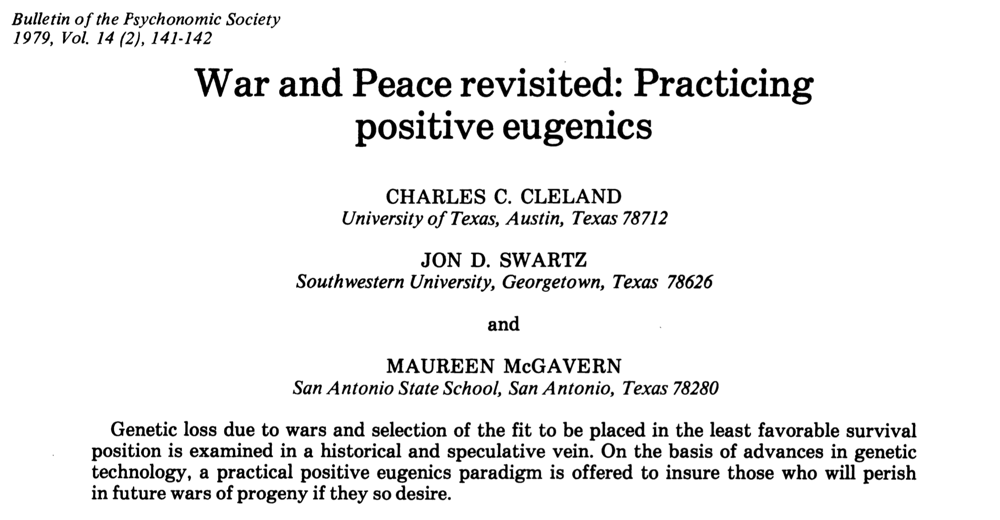
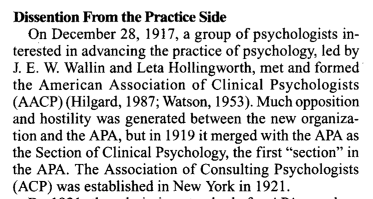
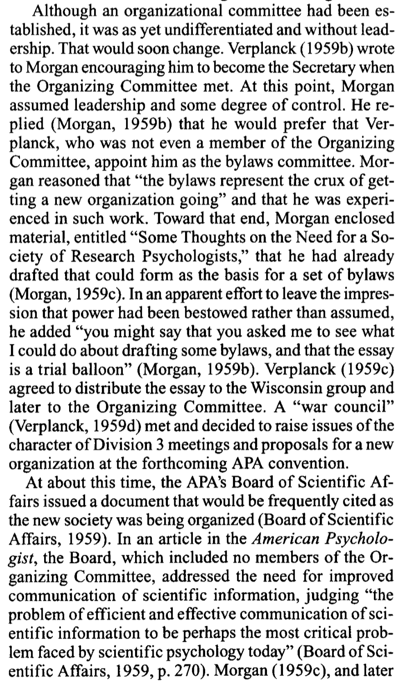
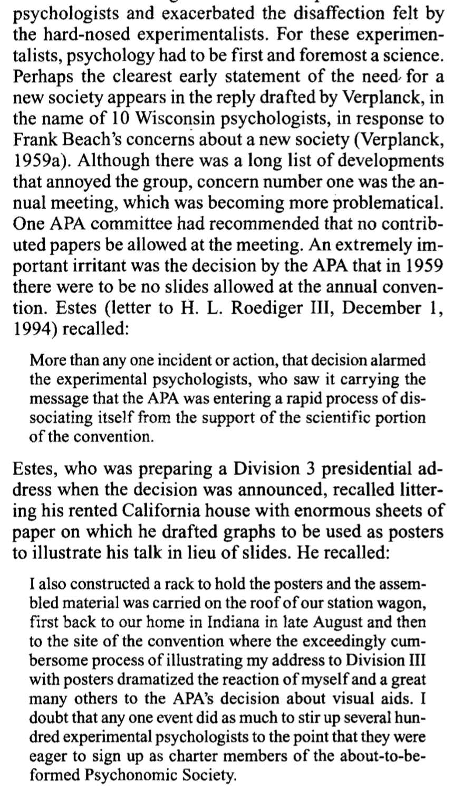
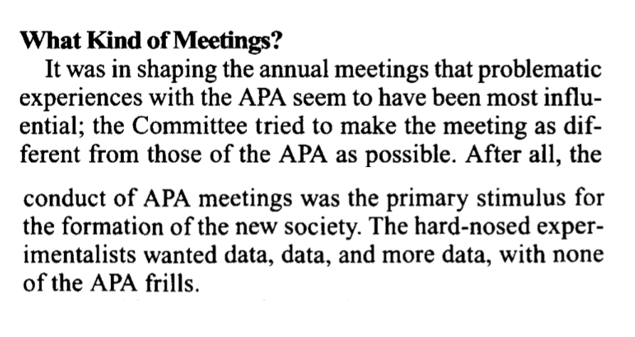

```{r setup, include=FALSE}
knitr::opts_chunk$set(echo = FALSE, message = FALSE, warning = FALSE)
```

---

I'm working through the task of learning about influences of eugenics on psychology and society. As a part of this, I'm documenting the eugenics views held by many psychologists, as well as connections between psychologists and eugenics. 

Currently my research is highly disorganized and provisional, and unfolding across various blog posts. In this post I am interested in possible connections between eugenics and the Psychonomics Society, of which I am a member and fellow. I've been attending Psychonomics since the mid 2000s. I never really looked into the history and formation of Psychonomics. Let's do that with an eye out for eugenics. 

Before jumping in I will say a few things. First, I'm a 40 year old recently Cognitive Psychologist at Brooklyn College of CUNY. I've been around the cognition block in Canada and the US. It never occured to me, and I was never taught, that there were extraordinarily deep connections between eugenics and psychology in the US and Canada. In learning about these connection now, I am very dissappointed, and I am still learning. For a quick primer on some of the connections one could read @yakushkoEugenicsItsEvolution2019. Although, here one might get the sense that the "pre-history" of psychology (e.g., before 1950s) was heavily influenced by eugenics, and "didn't that just die away?".

I've been slowly tracing eugenics and psychology connections leading up to the cognitive revolution, and am about to continue forward past the 1950s. So, a good place to start is in my own backyard, in other words, does the Psychonomics Society have any eugenics connections? As a member I'd like to know.

@yakushkoEugenicsItsEvolution2019 had mentioned that 31 APA presidents from 1892 - 1947 were involved in eugenics in explicit ways (wrote on eugenics, members of eugenics societies, etc.). I found this shocking, and have started noting connections between [APA presidents and eugenics here](https://crumplab.github.io/blogposts/7_13_20_PsychEugenics/7_13_20_PsychEugenics.html). My assessment so far is that there are way more than 31 APA presidents who were deeply into eugenics.

Some books I have found useful in describing the vast ways with which eugenics permeated society and psychology are the following. @kuhlBettermentRaceRise2013 presents an astounding history of the international organization of eugenics movements, including some discussion of the organization of eugenics within the discipline of psychology. If you thought eugenics was just a minor historical detail, this book may change your mind. An important point here is to better understand the organized ways in which eugenicists were involved in leadership positions within societies and governments. These actions by eugenicists created deep structures of eugenics within society which continue to influence society today. @yakushkoScientificPollyannaismInquisition2019 presents a critical look at some aspects of scientific psychology, especially those rooted in eugenics and positive psychology. If you want a primer on some of atrocities committed by well-known psychologists, this is an eye-opener. It may also challenge some of your notions about the role of psychology as a science in society. Last, @pressEugenicMindProject discusses eugenics in the context of western Canada (I'm an Alberta boy), where the eugenics policy of forced sterilization was legalized; and he develops a "standpoint theory" of eugenics, which attempts to discuss eugenics from a survivor perspective, as well as advocate for modern society to understand hallmarks of eugenic thinking so as to guard against modern versions of eugenics campaigns. Wilson was also the project director for the wonderful website <http://eugenicsarchive.ca>.

I found one story in from Wilson very inspiring. It turns out the first chair of the Philosophy/Psychology Department at the University of Alberta was the same man who sat on the eugenics board and authorized forced sterilizations until the law was repealed. That department has an instituational legacy of eugenics. That department formed a sub committe in 1998 to assess its own legacy of eugenics, and do something in response for the purposes of restorative justice. I commend them for doing that. More Departments need to do this. More societies need to do this. Does Psychonomics need to do this? I don't know, maybe so...let's see.

A last word on labelling and offending people. As I am about to go into my own academic backyard and start asking whether my own colleagues have a history of espousing racist and eugenics ideology, I'm assuming some feathers may be ruffled.
My intention is to be constructive in learning about these issues and eventually portraying them back to the society (if there is anything to reflect on...haven't yet started the research). Certainly, some of the terminology may sound offensive, perjorative, and disparaging. However, labels such as "white racist-eugenicist-psychologist" are appopriate for psychologists, who explicitly in their own writing, identify themselves in those terms. For example, white racist-eugenicist-psychologists advocate for the supremacy of the "Nordic races" through positive eugenic policies, and advocate for the oppression,segregation and/or elimination of non-white races through negative eugenics policies.

I'm still thinking through how to discuss connections between eugenics and individual psychologists. For example, some psychologists may justify a label of racist-eugenicist because of their explicit self-identification under those terms, wherease, other psychologists may not because of a lack of explicit evidence. Nevertheless, I'll entertain the concept of adjacency in considering connections between eugenics and psychology. For example, many psychologists were trained by white racist eugenicists, or worked on topic areas that are of high interest to eugenicists. These psychologists are adjacent to eugenics in some important ways, and may or may not espouse eugenics ideology. In any case, I guess what I am saying is that I will attempt to use labels in a way that elucidates eugenics connections in psychology, for the purposes of understanding potential structural and systemic issues in our discipline that may be fundamentally related to eugenics. 

One question I have often wondered when I have attended Psychonomics is "Why is Psychonomics so white?". Given my newfound interest in eugenics, I am interested in determining whether structural eugenics in Psychology, including Psychonomics could possibly explain some of the overwhelming lack of diversity.

The above prelude is a work in progress where I am attempting to explain/discover my motivations for doing this work.

## History of Psychonomics

I must confess, I am newbie when it comes to the history of Psychology, and specifically the history of its organizational structure in Canada and in the US. I've learned a couple things so far. E. G. Boring (1928 APA president) is often credited with starting the History of Psychology. When I read Boring, I find he doesn't do a good job of contextualizing the history of Psychology in terms of eugenics. I wonder why (I have my suspicions), he certainly worked with and new a whole bunch of eugenicist psychologists, and it is incredible to believe that he didn't know about the ideologies of his colleagues. Maybe he thought the eugenics part was so obvious it went without saying...or maybe not.

As I write this I'm aware that I haven't read all of the History of Psych journals, so i don't know whether or how they reconstruct the history of Psychology from the lens of eugenics. Need to read more about this for myself.

There is a tradition in American Psychology of breaking away from the APA (American Psychological Association). The more I learn about the APA, the more I understand why. Psychonomics broke away from the APA, and before looking at that, I wanted to juxtapose the formation of Psychonomics with the formation of another society, [The Association of Black Psychology](http://www.abpsi.org) who has been publishing the [Journal of Black Psychology](https://journals.sagepub.com/home/jbp) since 1974. The ABPsi broke from the APA and in the last half-century have constructed an entire new field in Psychology, that is notable for several reasons, including the pursuit of restorative justice for the actions of white racist and eugenicist psychologists against the Black Community. So, I wonder if Psychonomics broke away from the APA for any related reasons...(hint not really).

## Plan for connecting dots

I went to the Psychonomics website <https://www.psychonomic.org/page/about>, and found that I could read four papers on the history of Psychomomics. Cool! Thanks Psychomonics. Let's start with the first paper.

Oops, I got interrupted. FYI, I'm going to write this like a detective novel, so it will be contemporaneous with my discoveries, and sometimes tangential. I admit, I already read the first paper, which is why I am going to talk more about it here. At the end of the paper there was some discussion about the word psychonomics, and around that discussion there was some word usage common among eugenic texts. So, I ended up doing the thing I always do, but should have done from the beginning, and that is, google "psychonomics and eugenics". I did that and I straightaway I found a paper @clelandWarPeaceRevisited1979 published by the Psychonomic Society:

```{r}

```

This is an indiciation to me that the society at one point condoned aspects of eugenics, and also that some eugenics directed archeology of Psychonomics is necessary. Edit, I recently learned that at this time (1979) members could publish in this venue effectively without scrutiny, so this paper could easily reflect more on the authors than on the society.

## The founding of Psychonomic Society

OK, back to the first paper on the history of Psychomics. This one is titled, "The founding of the psychonomics society" [@dewsburyFoundingPsychonomicSociety1995]. Before I go through it, it's worth reminding myself (I used to be a history major) what I learned about "history" in undergrad. There is opinion and perspective in historical retellings. What lens is used here to discuss the beginnings of Psychonomics? Historical retellings often use the same kinds of tricks. For example, @pressEugenicMindProject refers to Ebbinghaus's quip that "psychology has a long past, but only a short history". Wilson uses this quip to point out a common narrative structure in historical retelling. In histories of psychology as a science we see the "long" pointers back to the early greek philosophers. It is often the case that "long" pointing is a way of using juxtaposition to connect some current issue with the significance or value of "well-accepted" historical figures. E.g., psychology is continues in the supremely wonderful and great tradition of the righteous and true great traditions of the past...That kind of thing. I'll have an eye out for the "long" pointers as I "read between the lines" of the "The founding of Psychonomics". Let's go.

Here's the first bit of the paper:

```{r}
knitr::include_graphics("img/psycho1.png")
```

TLDR, the Psychonomics origin story begins with a bunch of white dudes at a bar. I can totally relate to that, because that is pretty much what my experience is like when I go to Psychonomics.

We learn that this meet-up was at a AAAS meeting (American Association for the Advancemet of Science). Now, far be it from me to criticize the AAAS. And, I have not looked to closely at this organization yet. Suffice it to say, let me connect the AAAS with an important person in its history, James McKeen Cattell. Cattell is a notable eugenicist, as well he was an APA president, and he founded Psychological Review, and he bought Science and edited it for 50 years. I haven't read this paper yet, but it apparently covers some of the eugenic aspects of AAAS [@farberScientistsRoleEugenics2008].

OK, so some AAAS affiliated Psychologists go to a bar...and two years later Psychonomics was born. Some of those psychologists were "Clarence Graham of Columbia University, Clifford T. Morgan of Johns Hopkins, S. S. Stevens of Harvard, and William S. Verplanck of Hunter College." At some point I'll look into these individuals much in the same way I have looked at the APA presidents. I guess I need to start making a list though. And to be honest, I'd like a more structured database about individuals and their eugenics connections. I'd want to work in excel, but it might be fast...I could try YAML, do I dare do that? Excel it is for now. I'll probably attempt connections between individuals after going through the paper, and for now make notes about the major players are.

So, after the origin story, the founding of psychonomics is set in context of the tradition of splintering off from APA, which many other groups do for various reasons.

```{r}
knitr::include_graphics("img/psycho2.png")
```

We are pulled back to into the living of G. Stanley Hall in 1892, at the dawn of the APA. I would say that Hall was deeply into eugenics, [for some connections see](https://crumplab.github.io/blogposts/7_13_20_PsychEugenics/7_13_20_PsychEugenics.html#1892_granville_stanley_hall). I think it is also fair to say that the first presidential address published in the first issue of Psych Review in 1894 by George Trumball Ladd (2nd APA president, also frequent contributor to the Journal of Race Development...) was about establishing the place of psychology in Science. From the very beginning the eugenicists involved in Psychology were very eager to establish and maintain the scientific purity of Psychology. This a theme that sometimes is used to give psychologists cover to conduct "science" in a "value-free", "objectively neutral" way (see @yakushkoScientificPollyannaismInquisition2019 on scientism). FYI, I also think that Ladd was dogwhistling to the eugenicists in the crowd in his final thoughts about using psychology for the betterment of society. It is also highly interesting to inspect the first issue of Psyc Review for known eugenicists (e.g., Francis Galton, founder of eugenics, publishes on his ability to arirthmetic by smell).

Next, we learn about some previous splits within the APA. 

```{r}

```

Would you be surprised if Leta Hollingworth was a racist and eugnicist? See here [wikipedia page](https://en.wikipedia.org/wiki/Leta_Stetter_Hollingworth). She was also married to another eugenicist psychologist Harry Levi Hollingworth, who was president of the APA in 1927. You could read Wallin's eugenics here [@wallinHygieneEugenicGeneration1914]. This split didn't last long and the APA recouped the AACP, and established the first "section" in the APA. Neato, I didn't know that.

```{r}
knitr::include_graphics("img/psycho4.png")
```

There is an acknoweldgement of the role that WW II played in the discipline of psychology. There are many connections between psychologists and war efforts in the US, and without going into that history, let me point out a primary theme is eugenics, and many of the psyhcologists involved were also members of eugenics societies. We see some mention of some other societies, like SEP (Society of Experimental Psychologists)...notably this exclusive honor club of psychologists still gives the Howard Crosby Warren medal every year as its primary honor award. HC Warren was another APA president (1913), and he is listed in the Eugenical News as an active researcher. But, the main point of this paragraph is the italicized two words "and practice", whereby the new bylaws of the APA included "
practice" alongside science, as a way into the APA. It seems like the scientists didn't like this very much.

We are then treated to a context of previous attempts to make scientific clubs of psychologists, where psychologists could just finally hang out and be scientists with each other.

```{r}
knitr::include_graphics("img/p5.png")
```

The experimentalists were notable mysogynists, and they grew into the SEP, which maintained its mysogonistic roots. I won't go into the membership of SEP, because this about Psychonomics, and SEP is another day.

```{r}
knitr::include_graphics("img/p6.png")
```

Part of the point in this history could be to establish the "long" roots of Psychonomics by tying it to preceding exclusive honor societies. There is much cross-fertilization between the societies, as noted throughout this paper (and even today).

Next, we learn about earlier efforts by Titchener's group to create scientific space within APA conferences of the 20s.

```{r}
knitr::include_graphics("img/p7.png")
```

I haven't found Titchener connect himself with eugenics in his writing, but Boring is certainly eugenics adjacent (having with worked with Yerkes in the army IQ testing effort). Dallenbach and Fernberger I don't know much about. Dallenbach was on an NRC committee with several other known eugenics proponents. Fernberger wrote a biography for HC Warren, wrote on "the problem of mental disorders", and seems eugenics adjacent at first glance. J. E. Anderson was APA president in 1943, and wrote "The Modern baby Book and Child Development Record", which follows in the footsteps of Galtons eugenics approach. Raymond Dodge was APA president in 1916, did some IQ testing during the war, and supported some eugenics policies, but doesn't appear to be a major public advocate of eugenics. Haven't looked into Robinson, but he writes about the great need to apply science to "the problem of public intelligence". Shepard like many his contemporaries worked in testing of the military during the war. 

It seems that this effort of organization didn't really work, and the group fizzled.

```{r}
knitr::include_graphics("img/p8.png")
```

But, it's interesting that very notable people ("stalwarts") were in attendance: Harvey Carr, Clark Hull, Joseph Jastrow, H. C. Warren, and Robert S. Woodworth. T. All of these men are notably deeply into eugenics, and they are also all one-time presidents of the APA [see some notes on each here](https://crumplab.github.io/blogposts/7_13_20_PsychEugenics/7_13_20_PsychEugenics.html).

Huh, next we learn about another fascinating society in Psychology, the psychological round table, or PRT...If you followed my twitter account last summer, you would know that I tweeted a bunch about them. They are "well-kept-secret" honor society that still exists today. They have a smelly history of mysogyny. The keep their member list close to their chests. Who knows what their members think about eugenics? It's just one of those questions that has to be asked in a blog post using the lens of eugenics to explore this paper.

```{r}
knitr::include_graphics("img/p9.png")
```


```{r}
knitr::include_graphics("img/p10.png")
```

I think the TLDR here is that Psychonomics should be proud that among its founders were esteemed members of PRT. Hurray, give yourself a pat on the back.

PRT had GUV as a sister "secret society", so ya. Hi GUV friends, wave.

```{r}
knitr::include_graphics("img/p11.png")
```


Again we have a list of names of well known psychologists. I'll point to one small puzzle. I know C. W. Erikson because he invented the flanker task. I've been asking myself, what does that have to do eugenics? After all, I have used that task on numerous occasions. Well, the puzzle is not about the flanker task. Nope, it is why does C. W. Eriksen appear in a footnote in @kuhlBettermentRaceRise2013 book on eugenics? It's because Eriksen was among several other psychologists (who have deep eugenics connections) who signed a letter supporting [Arthur Jensen](https://en.wikipedia.org/wiki/Arthur_Jensen), who has often been characterized as a racist psychologist.

from Kuhl:
"The ten other scholars were Jack A. Adams, Raymond B. Cattell, Francis H. Crick,
C. D. Darlington, Charles W. Eriksen, Eric F. Gardner, Quinn McNemar, Eliot Slater, Robert L. Thorndike, Frederick C. Thorne, and Philip E. Vernon; cf. JBA Oxford, G. 14. The activity was at first coordinated by the psychologist Ellis B. Page of the University of Connecticut; cf. Jensen to Dobzhansky, 9/2/1972, THA Philadelphia: Jensen, Arthur R."

Anyway, let's continue with the paper. 

```{r}
knitr::include_graphics("img/p12.png")
```

Huh, I did not know that there was a failed attempt to remove division 3 (exp psyc) from APA in 1948. But, I certainly have learned somethings about big names in Experimental Psychology who were eugenicists, like Thorndike, Watson and Lashley. I haven't looked at Spence or Graham. For Spence I will just point out that we worked under Yerkes and Hull, so it seems very likely he was exposed to his mentors' eugenics. It would be interesting to look at Spence's scholarship from the lens of the eugenics ideology of his mentors.

Alright, we have arrived at the beginning of the Psychonomics Society:

```{r}
knitr::include_graphics("img/p13.png")
```

Let's take a look at the table events:

```{r}
knitr::include_graphics("img/p14.png")
```

More names:

```{r}
knitr::include_graphics("img/p15.png")
```

And a table of membership of the organizing committee (from the American Men of Science):

```{r}

```

Interesting to note the ages, so any memebers were all kicked out of PRT and GUV. Earlier in the paper we learned that 6 of these men were members of PRT.


More people get involved. I love how "diverse" and "white males" was working into the paragraph. 

```{r}
knitr::include_graphics("img/p17.png")
```

There was some discussion and dissent about the purposes and directions of the new society. I wonder how much of that discussion had to do with restorative justice for survivors of eugenics at that time. I wasn't there, maybe it wasn't on the radar.

```{r}
knitr::include_graphics("img/p18.png")
```

Some of the tension in the story appears to be the need to fight for science in psychology, and to make a society that shows everyone why science and psychology is so important. A story like this has been drilled into me over the years. IMO, Science shouldn't be an excuse to do psychology.

```{r}

```

And now, we go back to the bar:

```{r}
knitr::include_graphics("img/p20.png")
```

Should I go to Appendix D now, or later...it's choose your own adventure. Let's do it, Appendix D says :

```{r}
knitr::include_graphics("img/p21.png")
```

For my two cents, the part at the bottom resonates very strongly. It seems there was an elitist contingent from the PRT. Ever wonder why graduate students don't give talks at Psychonomics? Maybe this is why. The elitists won.

Back to the paper. So, 950 invitations were sent out to potential members, the name Psychonomics was adopted and incorporated in 1960. There is an appendix on the name "psychonomics". I'll get to that later.

"The First Annual Scientific Meeting ofthe Psychonomic Society
The first meeting ofthe Psychonomic Society was held at the University of Chicago on September 1-3, 1960, just before the 1960 APA meetings. Approximately 294 individuals attended, ofwhom 195were members, 79 were guests, and approximately 20 were unregistered. The pro- gramincluded119papersin24sessionsarrangedineight time blocks with three concurrent sessions each; four blocks on Thursday, three blocks and an afternoon busi- ness meeting on Friday, and one block on Saturday morn- ing. They were grouped into 15 categories. The nature of the experimental psychology ofthe time, at least for the members of the new Psychonomic Society, can be seen in the distribution of papers across sessions; these are presented in Table 3."

Let's look at Table 3:

```{r}
knitr::include_graphics("img/p22.png")
```

Oh no, it seems that potpourri session has basically dissappeared in terms of modern Psychonomics. Now, should I stay or should I go find the 1960 conference abstracts. I guess I should do that. I'm going to do that now, wish me luck.

No dice yet, couldn't find the conference abstracts after a quick search. Not sure which archive they are in. In any case, it would be interesting read about the genetics session and a few others.

Well, maybe spoke to soon. I can do things like search "paper presented to the Psychonomic Society, 2 September 1960" in google scholar, and restrict the dates to 1960. Then a few papers that were read at psychonomics in 1960 come up. A start anyway. Here's an example, still would be nice to get the full list at some point.

- Jerison, H. J. (1961). Quantitative analysis of evolution of the brain in mammals. Science, 133(3457), 1012-1014.

Alright, some stuff happened at the first conference. We learn that it wasn't really too much different than division 3 APA conferences. Then there is the first business meeting, a first newsletter, etc.

Some thorns in the side, or additional reasons why Psyshonomics needed to be created, it seems APA was making actual presentations of research more difficult. Kind of funny to imagine Estes' apparatus solution to the problem.

```{r}

```

It seems that Psychonomics could be the place where science happened, and still be affiliated with the APA

```{r}
knitr::include_graphics("img/p24.png")
```

What's in a name...Also, more in the appendix, which I will get to later. Also, some icky quotes in here...what's on page 5 !!!

```{r}
knitr::include_graphics("img/p25.png")
```

Some membership features:

```{r}
knitr::include_graphics("img/p26.png")
```

I guess this part went out the window, said the fellow researching the foundations of the fellowless society he is a fellow of.

```{r}
knitr::include_graphics("img/p27.png")
```

There was a distinct lack of diversity:

```{r}
knitr::include_graphics("img/p28.png")
```

So this is why Psychonomics is just about coffee...keeps the cost of the conference down though (and I very much appreciate that...Also, I should say I very much appreciate Psychonomics, and the only reason I am spending this much time looking into the history of Psychonomics is because of how much I appreciate this society.)

```{r}

```


## References


