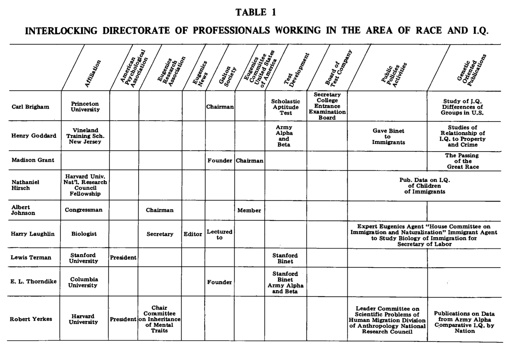

```{r setup, include=FALSE}
knitr::opts_chunk$set(echo = FALSE, message = FALSE, warning = FALSE)
```

---

[The Association of Black Psychology](http://www.abpsi.org) has been publishing the [Journal of Black Psychology](https://journals.sagepub.com/home/jbp) since 1974. I just learned about it. So, I'm reading it, because that's what you do when you find out that you missed an entire foundational field in psychology.

I'm a cognitive psychologist who spends a large part of my research time considering how cognition in general is supported by computations of learning and memory processes. I'm also interested in psychology more broadly: how it fits together as a discipline, and how the institutions of psychology work, how psychology influences society, etc. 

My impression  of my own field, cognition, is that it is highly fragmented. Theree's lots of veryone doing their own thing. There is no unified field theory of anything. Wondering about the "point" of things in cognitive psychology has sucked years of my life away. I guess I enjoy it, and like many other disciplines, perhaps struggling with the point is part of the point. Points don't come for free.

I still think of myself as a NKOTB, [hanging tough](https://www.youtube.com/watch?v=By86PcLufOU) in psychology, oh, oh, oh, oh, oh. In my case, when you grow up in a northern Canadian small town, and then start grad school in 2001 (checks CV), you enter into a field that has been doing its thing without you for a long time. And, your job is to figure out a small part of that landscape, dig a new hole somewhere, and convince everyone else that no one looked in the hole before. If you do a good of this, you can dig into that hole for the rest of your life and never have to leave. I've been digging holes. It's not that I haven't been wondering why. I come up with lots of reasons to dig the holes I dig. 

In any case, to wrap this up. I was recently appalled by the Psych Science publishing the now retracted racist IQ paper. I haven't been paying attention to the scope of racism in my own discipline. By tugging at the thread of the history of IQ research, which I also mostly didn't learn about in my training, I've been horrified to discover just how much eugenics played a role in founding and propagating psychology [@yakushkoEugenicsItsEvolution2019]. 

I'm in the process of climbing out of my research hole to learn about the racist and eugenicist ideologies that have dug the rabbit holes of psychology. As a part of this work, I found out the Journal of Black Psychology has been dismantling these issues from their inception, so I'm here to learn from the experts.

I've already done some reading and skimming through the journal. So, even though I know this work will inform me about structural racism and eugenics in psychology, I also know it will inform me about many other issues that I wasn't thinking so much about. The papers I have read so far are building towers of perspective over the holes of psychology. I'm excited to read more, I need to start keeping notes:

Let's start with Vol 1, Issue 1, 1974


---

```{r, results='asis', echo=FALSE}
library(knitcitations)
library(RefManageR)
bib <- read.bibtex("refs.bib")

in_text_ref <- function(x){
  b<-capture.output(print(x,.opts = list(bib.style = "authoryear", first.inits = TRUE, style = "markdown",no.print.fields=c("URL","urldate","issn","doi"))))
  cat("### ")
  cat(b,collapse=" ")
  
}
```

## @smithEditorial1974

```{r, results='asis', echo=FALSE}
in_text_ref(bib["smithEditorial1974"])
```

It's interesting to flip through the first issue of journals. For example, I found it interesting to flip through the first issue in volume 1 of Psychological Review, which at the time was the journal for the American Psychological Association.

It is obvious when you read the Journal of Black Psychology, that the creation of the journal and new society (the Association of Black Psychologists) was partly motivated by a reaction against the APA. What was the reaction about?

I'll consider this briefly from the lens of eugenics. Did you know that the founder of Psychological Review, James McKeen Catell, was a eugenicist? That's something. It's part of a deeply disturbing structural foundation of psychology. Some of this foundation is not particularly salient. For example, it's not easy to find the word eugenic or eugenics in Psychological Review (try to find it using Psycinfo). 

```{r}
knitr::include_graphics("img/eugenic.png")
```

That's curious. 

However, if you know who is a eugenicist, because they for example founded the whole thing (e.g., Francis Galton), you can see that several known eugenicists published papers in the first issue of Psychological Review. You just have to connect those dots. TBH, it's really more of a question of who isn't a eugenicist in that issue.

If you read about eugenics, you learn that eugenicists just want to breed the best people to make society a better place for eternity. They also want to enact negative eugenics on anyone they don't like, and attempt to eliminate them (e.g., forced sterilizations, Nazi genocide). This is just scratching the surface of the abhorrent practices and ideologies of eugenicists. They talk A LOT about doing this for the betterment of mankind. Their version of betterment is VERY SCARY. 

It is very intriguing to read the very first editorial in Psych Review, which is written by an APA president at the time. Sidenote, did you know that between 1892 and 1947, there were 31 APA presidents that were members or leaders of eugenics societies [@yakushkoEugenicsItsEvolution2019]. Have you ever wondered why that is? Or, say how it was that psychology was both created and weaponized by eugenicists to propagate eugenics policies. 

In any case, I haven't been able to determine precisely whether George Trumbull Ladd was a eugenicist or not when he wrote the presidential address for APA printed in the first issue of Psych review [@laddPresidentAddressNew1894]. However, I did read the address. It doesn't say eugenics anywhere. Ladd talks about three things, in order of most to least controversial. Roughly, 1) stats and methods issues, 2) Psychology as a science issues, and 3) Bettering mankind issues.

When discussing 1 & 2, Ladd acknowledges that there are differences of opinion in the room about these issues. When he gets to issue number 3, he says, "on the third of my three points...no considerable divergence of opinion is to be anticipated here". I know how to read this room. Devoting the final piece of his address to the pressing need to better society is what it sounds like. A massive dogwhistle to eugenicists. In my opinion, Ladd is pointing out that he knows and the audience knows that they all agree that they are eugenicists. Maybe some of these psychologists weren't card carrying eugenicists. But, more than enough were, for way to long. 

Also, the eugenics of white psychologists wasn't something that disappeared overnight. It hasn't dissappeared to this day. It became more deeply entrenched in psychology at many levels. Black psychology is partly a revolution against the structures of white racism and eugenics in psychology. And, it is with this context that I truly appreciate reading the first issue in the Journal of Black Psychology. This marks a line in their scholarship announcing their intention to deconstruct white racism in psychology, and also build their own psychology that is not fundamentally a tool for eugenics. Imagine having a psychology that was not used as a tool to wipe people out. It is a brave moment and an honor to read about the Black psychologists who took up this mission.

---

## @williamsHistoryAssociationBlack1974

```{r, results='asis', echo=FALSE}
in_text_ref(bib["williamsHistoryAssociationBlack1974"])
```

I'm not a member of APA and I don't think I've ever been to an APA conference. But, if there was one APA conference I would've wanted to see, it would be the 77th meeting in 1969. Read the paper to find out why. The Association of Black Psychologists is an independent psychological society, this is a glimpse of the origin story.

This is a rich moment in time, and not being a historian, I'm woefully unequipped to discuss this. One point that I'll draw out is the issue of testing, that is educational testing.

For example, @williamsHistoryAssociationBlack1974 writes that, "ABPsi adopted the following six-point statement on testing:

The Association of Black Psychologists fully supports those parents who have chosen to defend their rights by refusing to allow their children and themselves to be subjected to achievement, intelligence, aptitude and performance tests, which have been and are being used to:


1) Label black children as uneducable;
2) Place black children in special classes;
3) Potentiate inferior education; .
4) Assign black children to lower educational tracks than whites:
5) Deny black children higher educational opportunities; and
6) Destroy positive intellectual growth and development ofblack
children."

Also, that, "It became increasingly clear as the year progressed that APA did not intend to endorse the moratorium on testing since it had a vested interest in the testing movement. We could not expect the Educational Testing Service to endorse the moratorium either, inasmuch as much of its multimillion-dollar annual budget derives from testing. Neither could we expect the Psychological Corporation (publisher of the Wechsler Intelligence Scales) or Houghton-Mifflin (publisher of the Stanford-Binet) to endorse the testing moratorium. The Black Psychologists decided to move independently of APA. In closing: Charles Thomas has been elected "Honorary Chairman for Life" of ABPsi for his formative pioneer efforts."

What is the broader context, why did APBsi advocate for a moratorium on testing? First, obviously this form of testing: IQ tests, standardized tests throughout school, SAT, GRE, etc. is abundant in everyday american life right now. As a Canadian growing up I took these provincial tests every 3 years or so. I don't think we had an SAT, not sure. I took the GRE. I've never taken an IQ test. There's testing everywhere for sure today. 

Full disclosure: I don't have kids, so I haven't thought about testing a whole lot. In our doctoral program we've recently debated whether we will require the GRE or not for admissions this year. We are doing a trial run of not requiring it. I read emails about pros and cons. I didn't have much to say really. I was/am on sabbatical, and didn't put time into the issue. I've put some time in now. I will now firmly advocate against requiring GREs ever again. Why? Perhaps, you can guess. Eugenics.

If it is not abundantly clear. I despise eugenics. Guess who was behind the organized efforts to test the hell out of schoolchildren everywhere? Eugenicists. Why would they do this? So, they could separate people into desired and undesired groups with pretty science numbers, and then help the desired groups (whites), and hurt the undesired groups, as much as possible. Remember also that eugenicists is another word for many psychologists. I don't have time here to go into the psychologists responsible for promulgating IQ tests, and then school testing for the purposes of eugenics. But, obviously these horrendous policies impacted the Black community in a profoundly negative way, for a very long time. If Eugenicist psychologists were trying to hurt your children, wouldn't you call for a moratorium on testing? WHY IS TESTING STILL HAPPENING TODAY?!?!?!?!? This is a moratorium request that has been happening for a while. The Black Psychologists have been leading this movement.

Can you believe we are only at the first actual article past the editorial? 

---

NOTE: I'm going to be bouncing back and forth a bit, and missing things here and there. It's a big journal.

---


## @hilliardReviewLeonKamin1976

```{r, results='asis', echo=FALSE}
in_text_ref(bib["hilliardReviewLeonKamin1976"])
```

I just ordered the Kamin book on IQ testing. Also, this is a book review worth reading. Consider this table of notable early psychologists who were also eugenicists, from the book review.

```{r}

```

Some excerpts that capture several important issues:

```{r}
knitr::include_graphics("img/IQ_Review_A.png")
```

```{r}
knitr::include_graphics("img/IQ_Review_B.png")
```

---

## @andrewsInvestigationAttitudesSexual1976

```{r, results='asis', echo=FALSE}
in_text_ref(bib["andrewsInvestigationAttitudesSexual1976"])
```

I can't remember ever being brought to tears by reading a psychology paper. @andrewsInvestigationAttitudesSexual1976 brought me to tears.

This paper is about sexual behavior in Black mentally retarded adults. One of the reasons that this paper brought me tears was to consider what the paper would have said if it wasn't written by a Black psychologist. For example, can you imagine what a white eugenicist psychologist would say? I can't imagine a population more vulnerable to the fear and attacks of racists and eugenicists. It's pretty damn clear they wouldn't advocate in favor of how to ensure that Black mentally retarded adults have the freedom to enjoy their own expressions of sexuality. Compared to the prevailing alternative, Black psychology is very human. If you're looking for reasons why Black psychology needs to be a thing...first off, read more Black psychology, and also this right here.


---

## @boykinExperimentalPsychologyBlack1977

```{r, results='asis', echo=FALSE}
in_text_ref(bib["boykinExperimentalPsychologyBlack1977"])
```

I need to read this paper again. It touches on several issues that are difficult and worth thinking about with respect to experimental psych, and cognition, which I think of as a branch/extension/version of experimental psych. 

Note to self to come back here, erase this sentence, and add thinking.

@boykinExperimentalPsychologyBlack1977 begins by saying:

```{r}
knitr::include_graphics("img/Boykin77_1.png")
```

This aptly indicates both the content and style of the remaining prose. For content, as the title promises, we will get some reflections on the science/philosophy of experimental psychology, and some ideas specifically about educating Afro-American children. Basic/applied science is a hanging thread throughout. 

As well, I appreciate the style. All too often I read about the science of psychology in terms of a warped purity ideology. You know the one, "There is only one true science, and only science done correctly by the pure and true scientist can be science." This is not that. There are no "ultimate answers" here, just a bunch of interesting ideas to think about. Boykin goes on to say:

```{r}
knitr::include_graphics("img/Boykin77_2.png")
```

There's a lot of context that could be brought into the task of scoping experimental psychology, especially with respect to education. Although @boykinExperimentalPsychologyBlack1977 focuses on links between experimental psych and education, but also on the broader question of whether/how so-called "basic" experimental psychology should be "applied":

```{r}

```

Boykin goes on to discuss the empirical research method in terms of usual suspects such as, the role of induction, deduction, determinism/causality, observation/control of regularities in nature, and trust in objective scientists. He presents a argument against the idea that a person can step outside themselves as a dispassionate objective observer, and suggests an alternative notion rooted in African philosophy, that man and nature exist in a relationship of harmonic unity; and from that perspective, self-separation for the purposes of being a neutral observer is an absurdism.

I'm a practicing cognitive psychologist, and I sometimes have the headspace to think about what I practice at this level. Admittedly, I often do not. At some point I ended up roughly embracing my own version of transcendental realism. At the moment, I'm less worried about the possibility of, limits on, or absurdism of objectivism. I'm more worried about what is sometimes behind the research.

For example, in the domain of IQ testing, it is clear that eugenicists had a purpose in using IQ tests. It is also clear that eugenicists were highly organized and deeply infiltrated society with their ideas and policies, especially with respect to this kind of testing. (Acutally, as a sidenote, obviously I am obsessed with eugenics right now, so even though I am ostensibly thinking about what Boykin is saying, I'm also doing that from the lens of other things going on with me right now. So, I totally agree with Boykin about this). In some formal sense, IQ testing is traditionally not apart of experimental psychology, and is more in the vein of differential psychology. So, why am I bringing it up in the context of experimental psychology?

First, I know many modern cognitive psychologists who continue to use IQ tests in their research. TBH, I haven't had conversations with them about what they are up to. I've seen some "discussions" on twitter, and they weren't pretty. In any case, I suspect most modern psychologists who use IQ tests are not eugenicists. I'm not claiming they are. I further suspect that there are notions about the "neutral" and "objective" nature of scientific tools. For example, one might acknowledge that eugenicists did a bad thing with IQ tests, and then propose that the IQ tests that weren't bad (they were made with science!), the eugenicists using them were ("IQ tests don't kill people, eugenecists do?"). Perhaps this argument is easier to swallow with other more "neutral" tests. For example, it's obvious that IQ tests are biased in numerous ways; for example, see the BITCH-100 test [@williamsBITCH100CultureSpecificTest1972].

Nevertheless, the basic ideology is something like tools can never be inherently bad or good, it's obviously how they are used that make them bad or good. I think some scientists riff on this in terms of motivating basic science. For example, the thinking might be, "I can make any kind of science tool I want, because I am scientist, and this tool will be a science tool, and no one can say if it is bad or good, and I can forget about that question, and I don't have to take responsibility for my creations, and if I had to think about the ethical implications of research, it would take forever, and someone would find a way to stop me, and then all basic science would be doomed forever." Sad.

So, to return to IQ tests, it seems there is a strategy to legitimize the measure by pointing at it and saying it is science. In my mind it is an act of juxtaposition, and argument by authority. You see, psychologists are scientists, and they made IQ tests, and therefore IQ tests are science, and all science is neutral, objective and true, and worth doing, so therefore we must continue to use IQ tests forever. We are forced to do this because the prime directive of science bends us to its will. Also we see, there are over 100 years of IQ test research. It is the most sciencey thing in all of psychology, how can it be ignored? If you are against IQ research you are against science!

In any case, I'm wandering a bit, and about to go get lunch. The what is science debate is often a red-herring. In the context of IQ stuff, I think it's a distraction from the eugenic purposes of IQ tests. Some better questions are:

1. What are all the ways that IQ tests (and similar tests) have been employed by eugenicists and psychologists to enact, enforce, and maintain eugenic policies.

2. How much of the above is still going today

3. When in history, have major organizations responsible for, or complicit in, these acts of eugenics taken the step to apologize for their actions, as a first step to repairing the actions.

4. If you as a researcher are continuing to engage in a research domain that is clearly eugenic in origin, or even eugenic adjacent (eugenicists are good at cover stories I think), how are you taking steps to be anti-eugenic in your research. 

5. If you are a psychologist, especially one who is not a eugenicist, then you should reflect on whether or not you are doing things that are "accidental eugenics". That is participating/contributing to a eugenic enterprise that has become structurally a part of modern psychology, even if no one uses those words. 

6. Don't be an accidental eugenicist. Maybe get a motivational poster if you have a problems slipping back into accidental eugenicism.

I have more questions, this is a work in progress, I'm going on a lunch break.

Still need lunch, but I'm trying to put my finger on a thing.

There many tools of psychology that have been "touched" by eugenics. Does that mean they are still bad? For example, school testing, and things like gifted school programs were more than "touched" by eugenics, they were explicit eugenics policy. Does that mean they are necessarilly bad? Can you do work in these areas and not be an accidental eugenicist? I don't know the answer to this question. I do know the answer needs to be concrete and specifically anti-eugenics. It can't be, "everyone knows X or Y is not for eugenics anymore, it's just a tool, and look, this tool really does make society a better place...". Well, that's what the eugenicists said.

Back from lunch, AC broke, days went by, and I've got off on a tangent. 

@boykinExperimentalPsychologyBlack1977 suggests that the many interests of experimental psychologists (e.g., learning, memory, attention, etc.) ought to find some application in the education of black children. I agree, seems like this basic science should be applied here. At the same time, I don't think I have any settled opinion on basic/applied science issues in cognition. For example, it's obvious that there is a tonne of basic cognitive science that is so far away from being applied. Even though coggies use the words learning and memory, and kids use "learning and memory" in school, the concepts of learning and memory as they are strictly meant in the confines of the laboratory are impoverished behond recognition from what goes on in the real-world. My postdoc advisor would sometimes mention that the science of cognition has a timescale of 1 sec, and it's not hard to see why. I'm not claiming that basic science in this domain can't ever be applied. I'm saying lots of it can't right now. Does that mean basic science should stop if it can't be applied to real problems? I don't necessarilly think so, the science of cognition is hard. The difficulties of applying basic cognition principles to the classroom is partly evidence of how hard cognition is, and perhaps also evidence of how basic cognition can get carried away with itself.

A personal note. If I look at some major threads in my own research program, I can see some attempts to balance, or at least connect my basic work with applied work. But, even in my best moments, my work has very scant application. For example, I've published extensively on the task of skilled typing. I have used this task because it is convenient to collect performance measures (e.g., precise timing from pressing keys on keyboard), and experts abound. In this work, I've been mostly interested in testing general ideas about how learning and memory processes work in the context of acquiring a fairly complex motor skill. This might seem very applied on the surface...however, it couldn't be further from the applied science of typing. I'll be the first to admit that I have no scientific idea about what you can do to improve your own typing performance besides practice, practice, practice, but you already knew that. I do think that some of my basic work can be applied here, but I haven't done that application myself.

Anyway, Boykin raises questions about basic/applied science in a way that doesn't also raise panic about the destruction of basic science. Anecdotally, I've seen and heard various concerns raised about "applied" science taking over "basic" science. There needs to be both them, and they ought to exist in harmonic unity.

Boykin is not concerned about the productive nature of the scientific method, only that it be contextualized, and even put to good use within his community. In other words, he spends some time deconstructing some of the objectivity associated with "true blue" experimental psychology. If there was a statue for, "I'm doing experimental psychology, which by its fundamental nature is a value free proposition, and I am just a neutral tool contributing to the great library of knowledge in the sky, I can do no wrong", it should be knocked down.

More important, Boykin does some constructing too. For example, he describes affective and cognition dimensions of developing children, and argues for the inclusion of another dimension: vervacity. What is vervacity? It reminded me of umami. I grew up without the word umami, but I obviously ate things that had it. Umami is good stuff, just like verve. I'll leave it to Boykin describe behavioral and psychological vervacity. From him, my takeaway was the contrast between how people move and resonate with ascetic classroom environment versus the vervistic environment of the Black church. As Boyking says, maybe school needs more soulfuness.

Finally, I appreciated the concluding paragraph, if someone didn't already do this kind of memory experiment, it's a thesis waiting to happen. Also, note to self, I wonder to what extent the Boykin's notion of vervacity has been incorporated into theories of embodied cognition. I just did a quick google scholar search. @boykinExperimentalPsychologyBlack1977 has been cited 64 times, I didn't see any articles from the embodied cognition literature citing Boykin. Too bad, vervacity seems like a concept worth exploring (this was the first I had come across it in psychology)...OK, just came back from google scholar again, this time searching "vervistic", and there are a bunch of papers using this word and exploring the concept. Very cool! I'd like to learn more about that, but must press on.

```{r}
knitr::include_graphics("img/Boykin77_4.png")
```


---


## References


