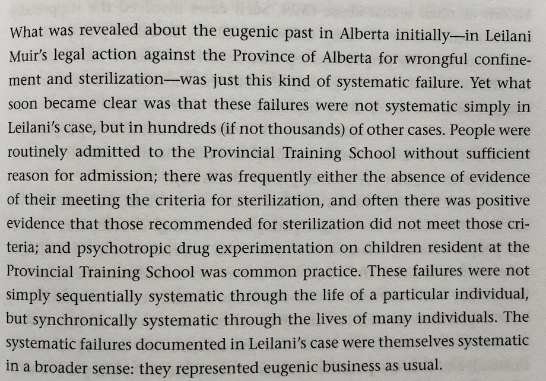

```{r setup, include=FALSE}
knitr::opts_chunk$set(echo = FALSE, message = FALSE, warning = FALSE)
```

---

I'm working through the task of learning about influences of eugenics on psychology and society. As a part of this, I'm reading Robert A. Wilson's, "The Eugenic Mind Project" [@pressEugenicMindProject]. I'll use this page to write notes about what I'm reading.

Wilson has circuitous path to writing this book. He's an Australian, has worked in US and Canada, now back in Melbourne. While in Edmonton, Alberta, he developed an interest in western Canadian eugenics and working with survivors of forced sterilization. He also was the project director for the [Eugenics Archives](http://eugenicsarchive.ca), which is a herculean effort by many people to create an online repository of knowledge around eugenics in Canada and the world.

# part I Eugenics activities: Probing eugenics

## 1 Standpointing Eugenics

I'm only on pg. 2, but had to start writing. I'm not a social scientist, so have much to learn about theory and practice in that domain. Concurrently with researching eugenics I am also [reading through the Journal of Black Psychology](https://crumplab.github.io/blogposts/7_2_20_JBP/7_2_20_JBP.html). In this other avenue of reading, I am finding that I am overwhelmingly impoverished as a white male in understanding many Black issues. I have no lived experience as a Black person, how could I understand? I mention this because it connects to standpoint theory. I'd never heard of standpoint epistimology before, and Wilson summarizes it as, "standpoint theory emphasizes the positive value that thinking about knowledge and value from certain kinds of marginalized standpoint can have". The take home for me is that "lived experience" brings something valuable the table. I dig that very much. So, Wilson says he will present a standpoint eugenics, or at least a standpoint-ish eugenics. 

Wilson's eugenics in a nutshell, "Eugenics arose in the nineteenth centure both as a proposed, meliorative science--a science of human improvement or betterment-- and as a social movement...distinctive aim to use science/tech to regulate the sorts of people there would be in future generations". This is fairly neutral language for what was/is an aggressively racist and classist movement that has committed atrocities all around the world.

pg. 9, James Watson appointed to director of the Office of Human Genome Research 1988...Watson was director of Cold Spring Harbor Laboratory since 1968, [previously the Eugenics Record Office](https://en.wikipedia.org/wiki/Eugenics_Record_Office), and has expressed several pro-eugenics views after leaving the directorship.

pg. 10, early 2000s 4/33 states that passed sterilization laws made apologies, following legal settlements in Alberta between survivors and the province that sterilized them

pg. 11 "...view of eugenics as simply a regrettable past..." this seems like a common and very unfortunate view of eugenics that needs to change. Especially given the "recent revelations of ongoing sterilizations in Australia, California, and India..."

pg. 11-- Eugenics survivor Leilani Muir and her legal battle against Alberta...classified as a "moron" as child [see Psychologist/Eugenicist Henry Goddard's and his IQ advocacy](https://en.wikipedia.org/wiki/Henry_H._Goddard).

TODO: need to flesh out what I will call the "moron hysteria" created by IQ testing and Goddard among others. Goddard argued for classifying "feeble-minded" people into classes by IQ, e.g., idiots ~ 20, Imbeciles ~ 40, Morons ~ 70, see Goddard's "Who is a Moron?" @goddardWhoMoron1927. The fear was that morons are basically normal competent people who are able to hide in society, but they will also destroy the human race if they are allowed to breed. The only way to discover morons was to IQ test them, and then employ eugenics polices to prevent morons from breeding.

pg. 13 -- Institutional complicity...guess who was the founding chair of the U of Alberta's Philosophy Department? Prof. John MacEachran, the original head of Alberta's Eugenics Board. He was the longest serving department chair...continued to approve sterilizations until he was 88 (eugenics board in Alberta repealed in 1972).

I'm pretty sure that Psychology as a discipline has not grappled with, understood, apologized for, and repaired it's own institutional complicity in eugenics. I mean 31 of the first many APA president's were eugenics leaders [@yakushkoEugenicsItsEvolution2019].

pg. 15-16. Wow, boning up on my recent Albertan history that happened while I lived there. Premier Ralph Klein tried to use the notwithstanding clause to limit any settlements made to eugenics survivors for any reason. This legislation was withdrawn in 24 hours becuase of public backlash.

pg. 16 - interesting, U of A phil dept. makes a small committee in 1998 "the MacEachran Sub-Committee", that displayed the history, and made recommendations (e.g., take down MacEachran's name, don't use his him for honorifics, ensure teaching of eugenics in courses)

## 2 Characterizing Eugenics

A brief history of eugenics, as well considering how to grapple with the past and presentness of eugenics in society. The eugenic mind is partly an attempt to elucidate the ideology and thinking that motivates and sustains eugenicists

Galton...key components of eugenic thought
Eugenics as Applied science .. Pearson, Fisher

"The ugly us-versus-them racial and ethnic diviseness that depicts an inferior Eugenic Other as the deep root of contemporary social probelms is just its most obvious manifestation".

pg 34 eugenics as a social movement, "a fervent social movement, one championed by many community leaders-- from politicians, to university presidents and provosts, from farmers to members of elite and learned societies, from radical progressives to political conservatives". Also became widespread around the world, with a very active national/local organizations

TODO: Look up "The Oxford Handbook of the History of Eugenics" for a geographically inclusive range of national contexts for eugenics movements [@OxfordHandbookHistory2010]

Eugenics should be studied "in" and "and" dimensions...In specific local places and regions (e.g., western canada), and related to other social phenomena, e.g., eugenics and genetics, sexuality, race, etc. Clearly, AND psychology.

pg. 36. Eugenics, Race and ethnocentrism

Fear of immigrants, reducing immigration, eugenics polcies...Racial Hygiene socities, forced assimilation (Canadian residential schools)

40-- Mental abilities, feeblemindedness, Psycho-eugenics.

Galton's obsessions with mental ability as the highest order thing to breed for

Institutionalization of "feeble-minded" people
The threat of "feeble-minded" people...responsible for all societies ills

The short history and long past...Where the "long past" is used to build a noble vision of eugenics.

Takeaways...Eugenics is a very multitudinous thing that is difficult to characterize. It is much more than a relic of the past. This chapter emphasizes the need to invoke something like a contemporary understanding of the eugenic mind past and present, because the long past is still happening.

## 3 Specifying eugenic traits

As I read this I am wondering whether Wilson will go into the role of differential psychologists in developing tools to measure these traits.

Eugenic traits are the ones that eugenicists ostensibly want to select for in their breeding programs. Eugenicists identify some of these traits by writing about them in numerous publications. 

pg. 54, getting into the ERO (Eugenic Records Office at cold springs, on long island, NY). One task they were doing was collecting geneological studies, to map out which people had good traits etc. It is eye-opening to read "biographies" in the Eugenical News, where they amazing traits of specific individuals are fawned over.

Charles Davenport (director of ERO) had an alphabet map that standardizes eugenic traits (in this case negative one), for tracing and elimination purposes.

```{r}
knitr::include_graphics("img/ERO.png")
```

Here is an example geneological survey using the letters to identify "degeneracy" throughout the family.

```{r}
knitr::include_graphics("img/ERO2.png")
```

By 1939, the ERO had made ~ one million index cards tracing lineages using the above methodology. ERO in general gives an idea of eugenic traits in practice.

pg 60 -- eugenic laws

Intended to regulate human breeding generationally 

- Forced sterilization
- marriage restriction laws
- immigration policy and law

 60+ Focus on sexual sterilization laws
 
p 69. Institutionalization and eugenics

forced sterilization in alberta, sterilization without consent

eugenic traits in alberta legislation that called for sterilization

## 4 Subhumanizing the targets of eugenics

What sorts of people should there be? Eugenics and bioethics

the black stork (film)

```{r}
knitr::include_graphics("img/4A.png")
```

Good question:

```{r}

```

Eugenic Now

Ashley X

# part II Eugenic variations: The persistence of Eugenics

## 5 Where do ideas of human variation come from?

pg. 104, "marked variation", there's lots of differences, why are some marked as important over others? marked as disablement or pathologized

106 -- how to respond to the puzzle of marked variation

social construction of disability

where does "normalcy" come from

This chapter is develops broad ideas and questions, and places them largely in an academic context

## 6 A socio-cognitive framework for marked variation

some theoretical development

Thalidomiders

## 7 Back doors, Newgenics, and eugenics Underground

prenatal screening backdoor

lots of stuff to think about here

## 8 Eugenics as wrongful accusation

"Question here is not about one about the extremes of eugenics, but about the routinezed, normalized forms that eugenics subsequently took." -- e.g., after the world was horrified by the Nazi atrocities in the name of eugenics, many eugenics practices went on as usual in many democratic countries.

Talks about what went down in Alberta: Why did eugenics persist there

1. Subhumanizing tendencies...survivors were held as subhumans
2. Procedural indifference...institutions just didn't really care about contemporary knowledge, e.g., that IQ tests were seriously flawed and shouldn't be used

How did ignorance about eugenics in Alberta contribute? How did value shifting contribute? Neither is enough to explain the persistence

```{r}

```

Beyond moral panic

Bystanders

# Part 3 Eugenic Voices: Knowing agency at the margins

## 9 Knowing Agency

Marginal knowing, "knowing agenct at the margins"

Further articulation to situate a standpoint eugenics within broader discourse including standpoint theory in general

The politics of epistemic apartheid..."who knows?" "who is allowed to know what"

## 10 Eugenics unbound: Survivorship for the subhuman

"Whose standpoint?"

Race, lived reality, group-based agency

Who should develop a standpoint theory of eugenics?

Eugenic survivors

## Brief notes after reading

Still letting the book simmer, I will come back here after a few days and collect some more thoughts. For now, I'm very glad to have read this. There was some personal moments in that I was raised in Northern Alberta, and I can't remember ever learning about forced sterilization in Alberta, or the roots of eugenicism throughout the province and Canada in general. 

I didn't really know what to expect from this book, all I knew was the Wilson was the project director for the [Eugenics Archives](http://eugenicsarchive.ca), and that was such a great website, how could I not read this book. 

This is a multi-faceted composition, ranging from a historical treatment of eugenics in the Albertan context, to the construction of arguments about how to have knowledge about eugenics in the past and the present. In the latter effort, Wilson is deeply into the academic side of the social sciences, but is nevertheless approachable. The social science side of things along with moral philosophy and bioethics are heady topics, I have much to learn in that regard.

Some immediate takeaways that threaded through my entire reading.

1) Standpoint eugenics. Wilson develops and advocates for a standpoint eugenics; and, in the process he asks what exactly that should entail. He argues that people in the margins, survivors of eugenics, have unique knowledge bearing on eugenics issues that are necessary to understand the eugenic mind. He positions standpoint eugenics within philosophical questions about knowledge. For example, who can know what? If there are standpoints, whose should be used?

2) The "eugenic mind". I found this phrase confusing throughout, perhaps it was purposely ambiguous. What does it refer to? It could refer to the kind of mind that eugenicists sought to breed through eugenics policies. In some sense it does. But, I think Wilson is talking more about the project to understand the mindset of eugenics, both within an individual and society. What the mindset entails, and how pervasive it is. Wilson deconstructs the notion that eugenics is a relic of the past, so the "eugenic mind" is very much alive today, and society would do well to recognize and counteract this way of thinking and behaving.

3) Insitutional complicity: This is one of the topics I am most interested in with respect to the relationship between eugenics and psychology. Wilson does not probe the depths of the eugenic/psychology combo, which I will call structural eugenics in Psychology. My sense is that the institutions of Psychology are complicit in numerous ways that should be identified and repaired. Perhaps even following somewhat the example set by the U of Alberta philosophy department.


## References


