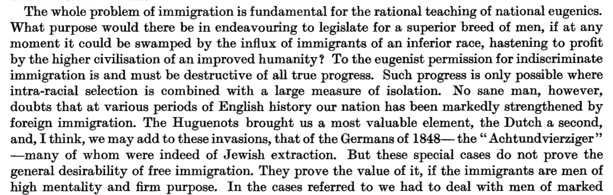

```{r setup, include=FALSE}
knitr::opts_chunk$set(echo = FALSE, message = FALSE, warning = FALSE)
```

---

I'm working through the task of learning about influences of eugenics on psychology and society. As a part of this, I'm reading the Oxford Handbook of the History of Eugenics [@bashfordOxfordHandbookHistory2010]. I'll use this page to write notes about what I'm reading.


# 1 Transnational Themes in the History of Eugenics


```{r, results='asis', echo=FALSE}
library(knitcitations)
library(RefManageR)
bib <- read.bibtex("refs.bib")

in_text_ref <- function(x){
  b<-capture.output(print(x,.opts = list(bib.style = "authoryear", first.inits = TRUE, style = "markdown",no.print.fields=c("URL","urldate","issn","doi"))))
  cat("## ")
  cat(b,collapse=" ")
  
}
```

---

```{r, results='asis', echo=FALSE}
in_text_ref(bib["paulDarwinianContextEvolution2010"])
```

Some history beginning with Darwin and his cousin Galton (coiner of eugenics). Galton develops that idea that "good" human traits can developed by human breeding. Somewhat contextu. alizes Galton among peers and related ideas. Some extended summary of Galton's ideas and Darwin's reaction to them.

In short, load societies problems onto hereditary traits, propose to abolish societies problems by regulating which people are allowed to live over generations.

Apparently Galton's "Hereditary Genius" [@galtonHereditaryGenius1869] sold poorly, perhaps because of its anti-religioun position.

30 years later, Galton bankrolls the Eugenics Record Office (1904), and turned into "The Francis Galton Laboratory for the Study of National Eugenics". This lab still runs today. Back then it was directed by Galton's disciple Karl Pearson.

August Weismann's germ cells and somatic cells (1883)

Turn of the century, there is broad concern about degeneration, and that "hereditary weakness would fatally undermine" Britain's war machine. Statistics research shows that the highborn have a low birthrate, and the scum are over-producing.

Galton gives address in 1901, "The possible improvement of the human breed, under the existing conditions of law and sentiment". The tenor is changed to identify the groups in Britain that are threatening society if they continue to reproduce. Some of the rhetoric apparently changes from mostly positive eugenics (encourage elite breeding), to include negative eugenics (preventing degenerates from breeding). "Raise the average by reducing the undesirables."

---

```{r, results='asis', echo=FALSE}
in_text_ref(bib["levineAnthropologyColonialismEugenics2010"])
```

What were the catalysts of eugenics polices in the 1910s 20s that sought to limit the reproduction of the "unfit"?

Eugenics arises in a context of increased anthropology, colonialism, and new ideas about heredity and evolution. There are population of savage others and the imperial need to subject them.

Note to self...I don't know much about the origins and history of anthropology.

Early Anthro questions...are humans derived from a single origin? Debate and growing camps of "progressionist" and "degenerationist" anthropologists. Need to capture primitive manners and practices before colonialism destroyed them. Allying early anthropology (with its task to define and measure civilization) with imperial expansion.

Sidenote: I'm going to start using ~this kind of punctuation~ to refer to rough paraphrasing.

A worldview where ~civilization and imperialism are upward and progressive, moving away from the world of the savages~

Savage, widespread usage by sixteenth century, lots of different meaning, "radical strangeness"...savages are all the same, Grant Allen "...know one savage and you know them all", they are beneath civilized society, Sir Alexander Grant, savages are "the swamps and backwaters of the stream of noble humanity".

Monogenists and polygenists debated about human origins, which became totally racialized, and mapped to "primitive" vs. "civilized". European superiority complexes. Both camps had racial hierarchies of goodness. Ideas of halted races, the permanence of undesirable qualities of primitives, evolutionary destiny has no room savages. "dying race" theory, inevitability of self-immolation (self-inflicted extinction). "They do it to themselves"

~Savages are aggresive and bloodthirsty, and feeble~

The prospects of european degeneracy: Given that european society is better than savage societies which destroy themselves, there is a rising existential threat, what happens if european society begins to degenerate like the savages?

...many of the things noticeable in the savages are lingering in ourselves

Close of the 19th century and widespread fears of degeneration in Europe and settler colonies, and in America...not new considering concepts of biblical moral degeneracy had been around for a while.

Thomas Malthus and his population control ideas, and subsequent paranoia. Many books about the threat to european white supremacy e.g., Madison Grant' The passing of the Great Race (1916).

Race-based immigration restrictions

"Miscegenation" fears, "mixed-race breeding fear", Australian approach of "breeding out the color". Different kinds of advocacy in different countries about whether mixing would be bad or good to eliminate the "savage" strains. Could whites live in tropical climates? Or would they degenerate?

Fear of elimination of sexual difference and male-dominance

Galton and Pearson and the perpetuation of an imperially fit nation of British Men...Pearon's statistical studies of Jewish children. The new statistics is set in the context of savage anthropology, imperialism, supremacy, and eugenics.

Brief summary of Chapter: Anthropology was pretty fucked up.

---

```{r, results='asis', echo=FALSE}
in_text_ref(bib["pearsonProblemAlienImmigration1925"])
```

Time for a short detour to read one of Pearson's papers [@pearsonProblemAlienImmigration1925]. Note to self, need to include more of this history in my statistics textbook.

Pearson opens with rants about indisciminant immigration the unknown horrors of race-mixing to create hybrids. He is very concerned that even if the UK could have really high standards of measurement for high quality immigrants, whether they would want them anyway..you unless they are whites.

Pearson says that eugenics and immigration policy are fundamentally connected.

```{r, echo=FALSE}

```

Pearson argues that English Jews are fine, but polish/russian jews often are bad people, but not always...therefore, he advocates that cold-hard statistics must be used to measure jews.

This whole paragraph is bonkers:

```{r, echo=FALSE}
knitr::include_graphics("img/Pearson2.png")
```


Goes on to measure ~500 jewish children and their parents, and look for correlations between parental traits (e.g., literacy, employment), and offspring traits (intelligence), lots of other correlations (hair color, eye color, looking for strains of whiteness).

This goes on and on, Pearson was trying to "objectively" and comprehensively measure the "fitness of the Jewish immigrant stock".

Pearson's conclusions:

```{r, echo=FALSE}
knitr::include_graphics("img/Pearson3.png")
```

Sigh, I guess I need to go and read part two. Hmm, haven't been able to find part II yet, but I did find part III and part III(cont.). This is a comprehensive method for using "data science" for the purpose of racial profiling in the name of eugenics. It is an obvious blueprint about measurement methods that eventually lead to Nazi genocide.

Well, got a bit distracted...returning to the eugenics book

---

```{r, results='asis', echo=FALSE}
in_text_ref(bib["turdaRaceScienceEugenics2010"])
```

~Race, class, and gender are essential to the changing matrix of eugenic thought~

Aim is to chart out the racist - eugenicist linkage...alsoan argument about how to think about eugenics in a historical context.

Lene Koch, "eugenics should not be dismisses as an unscientific, amateurish activity".

Eugenics and Racial Hygiene, Alfred Ploetz (1860-1940) Grundlinien einer RassenHygiene (the foundations of racial hygiene), founder of German eugenic movement.

Ploetz becomes interested in Galton after launching the Journal of Social and Racial Biology

Ploetz wanted to "increase and further hereditarily "superior" individuals, and to decrease -if elimination was not possible- the racially undesirable. It was future oriented in terms of created a supreme Aryan society over the generations.

Generally pretty consistent with British, American, and Scandinavian eugenics.

Eugenics and anthropology were highly racialized in 1900-45. Lots of eugenic ideas of racial superiority raised in political discourse in the interwar period.

As biological basis for race erodes, eugenicists have to deal with this in their rhetoric. Eugenicists saw themselves as scientists and modern-day nation builders. 

Nature vs nurture debate...It's interesting read eugnics literature and see them contort their arguments so it doesn't matter if something is nature or nuture in terms of whether they advocate for getting rid of people they don't like.

biochemical races, discovery of blood groups, serology

Pauline Mazumdar "Blood-group serology offered a model system for human genetics, and for its practical arms, eugenics and racial hygiene." Blood could be a new way to define popuilations...i.e., more scientific ways to claim white supremacy

Franz Boas (1858-1942) authority in 20th century anthropology...founder of cultural relativism, one of the first detractors of scientific racism.
 - finally, I have come across a contemporary who advocates against eugenics [@boasEugenics1916] on several lines.
 
More opponents of eugenics...Julian S Huxley, Alfred C. Haddon "We Europeans" (1935)

usefulness and need for counternarrative

---

```{r, results='asis', echo=FALSE}
in_text_ref(bib["roll-hansenEugenicsScienceGenetics2010"])
```


Sets eugenics within some contemporaneous scientific context, including developing views on genetics, and eventual rejection of a biological basis for race.

Dissappearance of Eugenics from discourse 1950s onward.

I didn't see any mention of psychology as a context for discussion.

---

```{r, results='asis', echo=FALSE}
in_text_ref(bib["roll-hansenEugenicsScienceGenetics2010"])
```


 


## References


