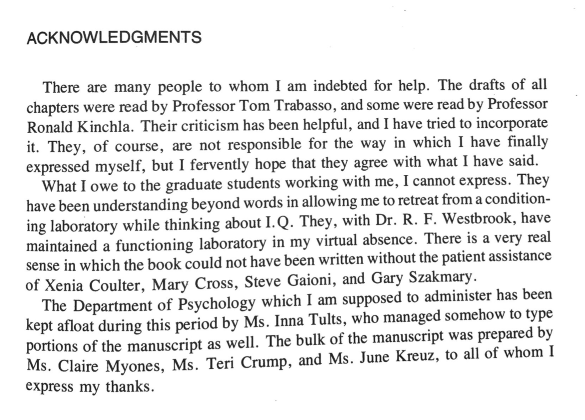
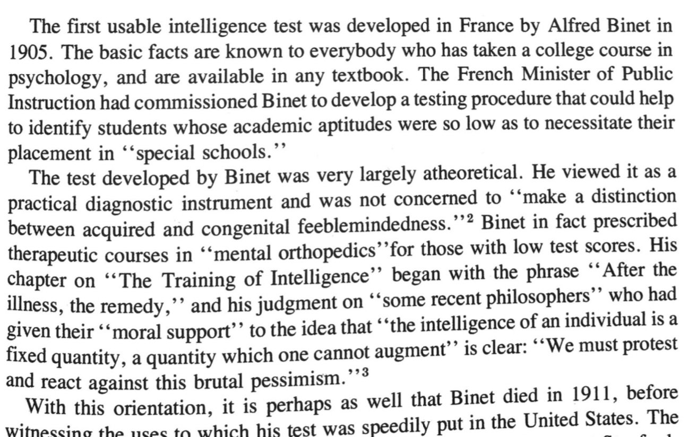
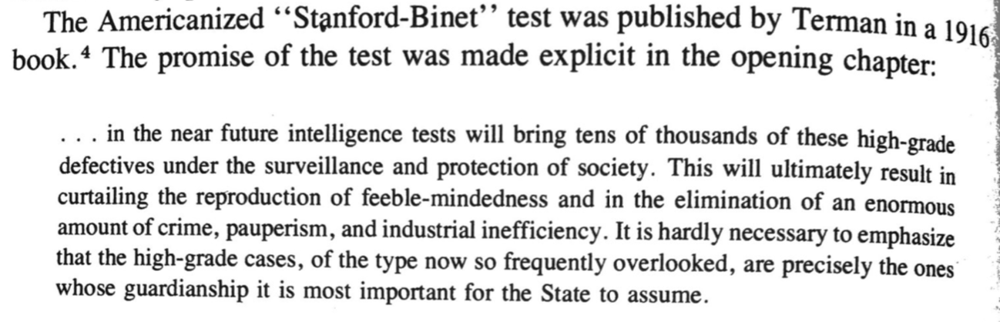

```{r setup, include=FALSE}
knitr::opts_chunk$set(echo = FALSE, message = FALSE, warning = FALSE)
```

---

I'm working through the task of learning about influences of eugenics on psychology and society. As a part of this, I'm reading Leo Kamin's, The Science and Politics of IQ [@kaminSciencePoliticsIQ1974]. I'll use this page to write notes about what I'm reading.

It seems that Kamin put his research and duties as chair on pause to write this book.

```{r}

```

## Intro

Kamin sets out to show that there is no heredity basis for IQ. In the first few chapters he place IQ testing in the context of eugenics and social policy, then he turns to a debunking of the data. 

Some good questions: Why do some psychologists persist in believing that IQ is heritable even though the data dont support the conclusion?

"The answer, I believe, is related to the second major conclusion of this work. The IQ test in America, and the way in which we think about it, has been fostered by comen committed to a particular social view. That view includes the belif that those on the bottom are genetically inferior victims of their own immutable defects. The consequence has been that the IQ test has served as an instrument of oppression against the poor--dressed in the trappings of science, rather than politics."

## Pioneers of IQ testing in America

*Binet, Alfred*, French psychologist who developed the first usable IQ test in France. According to Kamin, Binet seemed to be aware of the eugenics context of his work, and that he was not interested in hereditary concerns about feeblemindedness.

```{r}

```

*Terman, Lewis* from Stanford, translated the binet test to English. Published "Stanford-Binet" in 1916. APA president in 1923. A stern eugenicist.

```{r}

```

*Goddard, Henry* Vineland Training School in New Jersey. Argues for classifying "feeblemindedness" into groups based on IQ (idiots, imbeciles, morons). Eugenicist. Classist, racist. Generally the  worstist.

*Yerkes, Robert* From Harvard. Administered the Alpha and Beta tests to the Army (2 million). APA president in 1917. Read his eugenics in the eugenics review [@yerkesEugenicBearingMeasurements1923].


## Psychology and the immigrant

## Separated Identical twins

## Kinship Correlations

## studies of adopted children

## The accuracy of secondary sources

## IQ in the uterus

## conclusions


## References


