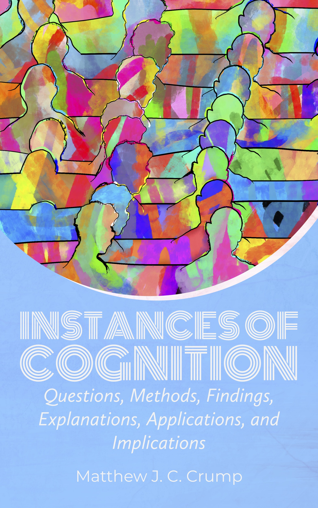
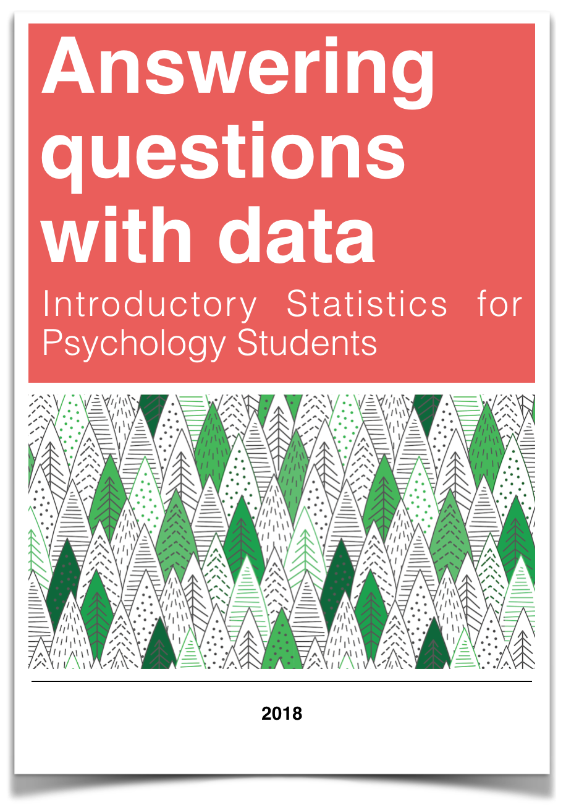
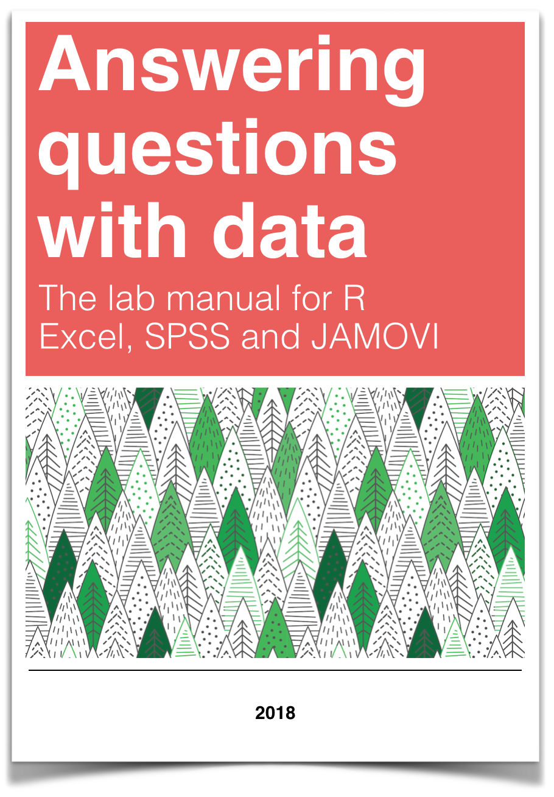
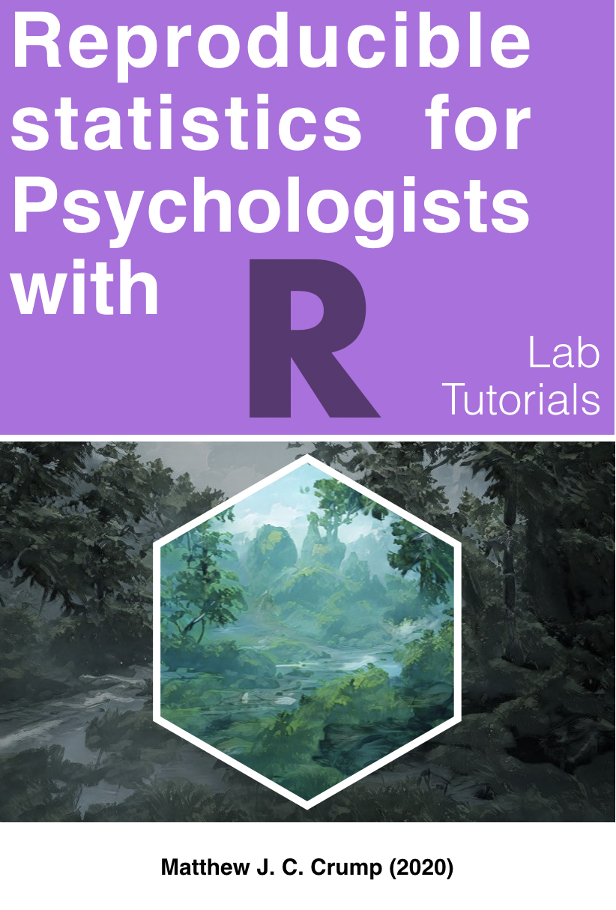
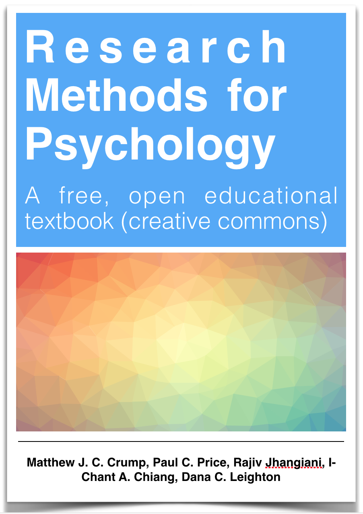
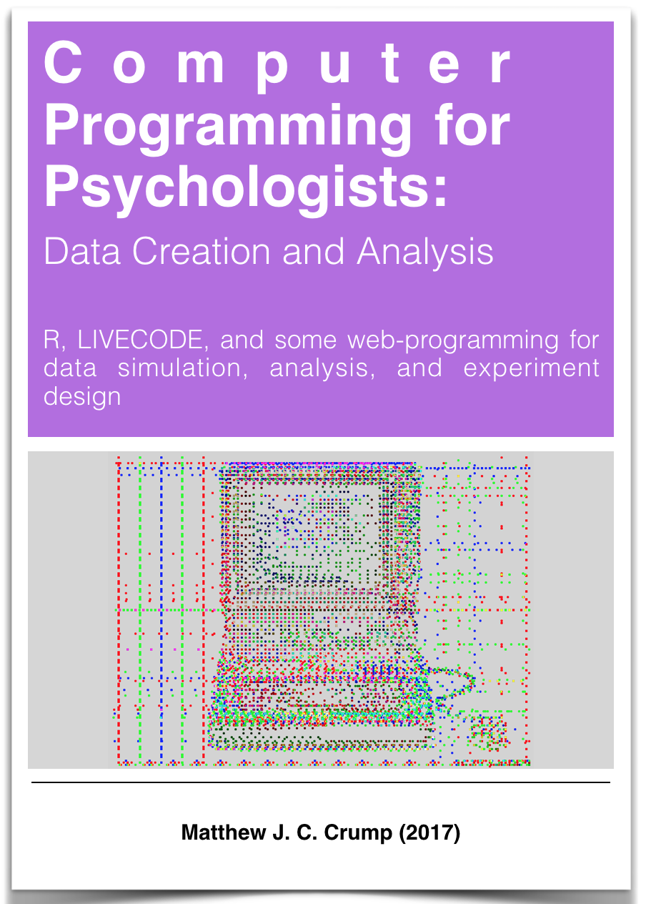

```{r}
source("home/helpers.R")
```

::::::::::::::::::::::::::::::::::::::: {.fp .home}
:::::::: fp-hero
:::::: fp-hero-text
[\~/crumplab]{.fp-kicker}

# Computational Cognition Lab

::: fp-lead
The Computational Cognition Lab at Brooklyn College of CUNY investigates learning, memory, attention, performance, and semantic cognition.
:::

::: fp-chips
[computational modeling]{.chip .c-pink} [natural language processing]{.chip .c-violet} [reproducible research]{.chip .c-blue} [big data & online methods]{.chip .c-green} [statistics, R & open source]{.chip .c-yellow} [learning, memory, attention & performance]{.chip .c-orange}
:::

::: fp-affil
[Department of Psychology](http://www.brooklyn.cuny.edu/web/academics/schools/naturalsciences/undergraduate/psychology.php), Brooklyn College · [Cognitive and Comparative Psychology](https://ccp-cuny.github.io), Graduate Center of CUNY
:::
::::::

::: fp-hero-art
{fig-alt="Hexagon diagram of the lab's research areas: computational modeling, natural language processing, reproducible research, big data and online methods, statistics, R and open source, and learning, memory, attention and performance."}
:::
::::::::

:::::::::::::::::::::::::::::::: bento
:::: {#publications .card .span-8 .c-pink}
::: card-head
[┌─ publications]{.card-label} [all publications →](Publications.qmd){.fp-more}
:::

## Recent work

```{r}
#| output: asis
recent_pubs(5)
```
::::

::::: {#blog .card .span-4 .c-violet}
::: card-head
[┌─ blog]{.card-label} [all posts →](Blog.qmd){.fp-more}
:::

## Latest posts

::: {#latest-posts}
:::
:::::

::::: {#books .card .span-12 .c-blue}
::: card-head
[┌─ books]{.card-label} [all books →](Books.qmd){.fp-more}
:::

## Open textbooks

Free, open-source books for teaching cognition, statistics, research methods, and programming, all licensed under Creative Commons.

::: shelf
[Instances of Cognition](https://www.crumplab.com/cognition/textbook/index.html){.shelf-item} [Answering Questions with Data](https://crumplab.github.io/statistics/){.shelf-item} [Answering Questions with Data: The Lab Manual](https://crumplab.github.io/statisticsLab/){.shelf-item} [Reproducible statistics for psychologists with R](https://crumplab.github.io/rstatsforpsych/){.shelf-item} [Research Methods for Psychology](https://crumplab.github.io/ResearchMethods/){.shelf-item} [Programming for Psychologists](https://crumplab.github.io/programmingforpsych/){.shelf-item}
:::
:::::

::::: {#courses .card .span-6 .c-green}
::: card-head
[┌─ courses]{.card-label} [all courses →](Courses.qmd){.fp-more}
:::

## Teaching

::: {#recent-courses}
:::
:::::

::::: {#software .card .span-6 .c-yellow}
::: card-head
[┌─ software]{.card-label} [all software →](Apps.qmd){.fp-more}
:::

## Apps and packages

::: app-grid
[MINERVA Space Echo [audio plugin]{.fp-note}](https://www.crumplab.com/MinervaSpaceEcho/){.app} [PCASynth [audio plugin]{.fp-note}](https://github.com/CrumpLab/PCASynth){.app} [RsemanticLibrarian [R package]{.fp-note}](https://crumplab.github.io/RsemanticLibrarian/){.app} [midiblender [R package]{.fp-note}](https://www.crumplab.com/midiblender/){.app} [vertical [R package]{.fp-note}](https://crumplab.github.io/vertical/){.app} [jspsychr [R package]{.fp-note}](https://crumplab.github.io/jspsychr/){.app}
:::
:::::

:::::: {#people .card .span-4 .c-orange}
::: card-head
[┌─ people]{.card-label} [all people →](People.qmd){.fp-more}
:::

:::: person
{fig-alt="Portrait of Matthew Crump"}

::: person-text
[Matthew Crump](people/matt_crump.qmd)

Principal Investigator
:::
::::

The lab is run by Dr. Matthew Crump and student research assistants from undergraduates to doctoral students.
::::::

:::: {#join .card .span-4 .c-pink}
::: card-head
[┌─ join]{.card-label} [about joining →](Opportunities.qmd){.fp-more}
:::

## Opportunities

Dr. Crump has mentored students interested in cognition at all levels. There will be limited opportunities for students to gain research experience in the lab for the 2024-2027 period, as Dr. Crump is serving a three year term as Department Chair.
::::

::::: {#fun .card .span-4 .c-violet}
::: card-head
[┌─ fun]{.card-label} [more →](Fun.qmd){.fp-more}
:::

## Elsewhere

::: {#fun-list}
:::
:::::

:::::::: {#contact .card .span-12 .card-contact}
::: card-head
[┌─ contact]{.card-label}
:::

:::::: contact-grid
::: {}
## Matthew Crump

Professor, Department of Psychology\
Brooklyn College of CUNY

[mcrump\@brooklyn.cuny.edu](mailto:mcrump@brooklyn.cuny.edu)
:::

::: {}
[address]{.contact-key}

2900 Bedford Avenue\
Brooklyn, NY 11210

Office: 4401 James Hall\
Lab: 4303 James Hall
:::

::: {}
[phone]{.contact-key}

718-951-5000 x. 6068

[elsewhere]{.contact-key}

[GitHub](https://github.com/CrumpLab) · [YouTube](https://www.youtube.com/c/CrumpsComputationalCognitionLab) · [Google Scholar](https://scholar.google.com/citations?user=49EVuVcAAAAJ&hl=en)
:::
::::::
::::::::
::::::::::::::::::::::::::::::::
:::::::::::::::::::::::::::::::::::::::
