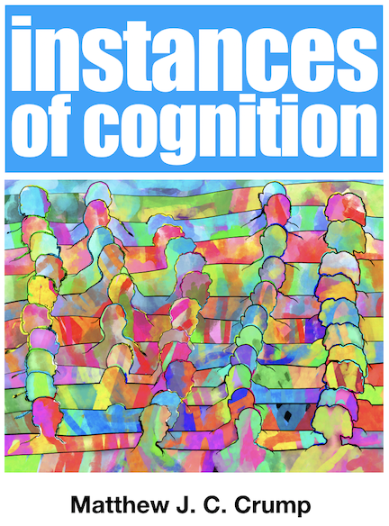

**April 2022**

Adding lots of new content to the lab's youtube channel.

Check it out and subscribe here:

<https://www.youtube.com/c/CrumpsComputationalCognitionLab?sub_confirmation=1>

July 2021

:::: {style="display: flex;"}

::: {}

Thanks to the CUNY OER initiative, I got a small grant to write another textbook. This time it is for Cognitive Psychology (an undergraduate intro textbook). Writing is in progress, and should be mostly done by September 2021. The book will be an OER (open-educational resource) and free to use, edit, and remix. 

<https://www.crumplab.com/cognition/textbook/>

The textbook is being written in R Markdown and [hosted on github](https://github.com/CrumpLab/cognition). The link is already public, and the content is constantly changing as I write it.

:::

::: {}

```{r, echo=FALSE, out.width="100%"}

```

:::

::::


March 2021

- updated links so they actually work
- Excited that Drew Shives will be joining the lab as a doctoral student in Fall 2021!!! Welcome Drew!

February 2021

Teaching PSYC 7709G Pt II, and writing lots of new content for the grad stats OER:

- <https://crumplab.github.io/psyc7709Lab/>

January 2021

Submitted a grant! Fingers crossed.

- Answering questions with data: Teaching computational skills in introductory statistics to psychology undergraduates. NSF: IUSE (EHR: ESL I), Submitted February 2021, PI Crump, Co-PI: Krishnan. 

December 2020

 - Crump, M. J. C. (2020, December 10). Reproducible statistics for psychologists with R: Lab Tutorials. https://doi.org/10.17605/OSF.IO/KBHGA
 - Updated this website
 
---

September 2020

 - In a lab unrelated activity, I released an album with lots of synthesizer sounds <https://distrokid.com/hyperfollow/homophony/vo>

---

August 2020

 - Rebooting my youtube channel [Programming for Psychologists](https://www.youtube.com/channel/UCSaZ1htKwtZ1GuqI1xGjuSA?), preparing for online teaching, and creating tutorials for vertical
 - Create course website for PSYC 73800 Cognitive Psychology <https://crumplab.github.io/psyc73800/>
 - Create course website for PSYC 7709G Stats Lab <https://crumplab.github.io/psyc7709Lab/>
 - Submitted OER proposal to develop graduate statistics and undergraduate cognitive psychology content

---

April-July 2020

 - Crump, M. J. C.; Jamieson, R. K.; Johns, B. T.; and Jones, M. N. Controlling the retrieval of general vs specific semantic knowledge in the instance theory of semantic memory. In Denison, S.; Mack, M.; Xu, Y.; and Armstrong, B. C., editor(s), *Proceedings of the 42nd Annual Conference of the Cognitive Science Society*, pages 3261–3267. [Project Website](https://crumplab.github.io/ITS2/)
 - Vuorre, M.; and Crump, M. J. C. Sharing and organizing research products as R packages. *Behavioral Research Methods.* Accepted.[Project Website](https://crumplab.github.io/vertical/)
 - Johns, B. T.; Jamieson, R. K.; Crump, M. J. C.; Jones, M. N.; and K., M. D. J. Production without Rules: Using an Instance Memory Model to Exploit Structure in Natural Language. *Journal of Memory and Language.* Accepted.

---

Februrary-March 2020

 - Sabbatical Trip...came home early :(

---

January 2020

 - Submitted to CogSci 2020: Crump, M. J. C.; Jamieson, R. K.; Johns, B. T.; and Jones, M. N. Controlling the retrieval of general vs specific semantic knowledge in the instance theory of semantic memory. 

---

December 2019

 - Visiting Scholar @ NYU with Todd Gureckis
 - Developing [vertical](https://crumplab.github.io/vertical/),  an R-package to assist with creating, curating, communicating reproducible research assets with Matti Vourre.

---

November 2019

 - Presented Semantic Librarian @ SCIP 2019
 - <https://www.semanticlibrarian.com>

-----

October 2019

 - Visiting Scholar @ University of Manitoba
 - working on the role of instance-based memory processes underlying inferential reasoning with Randy Jamieson
