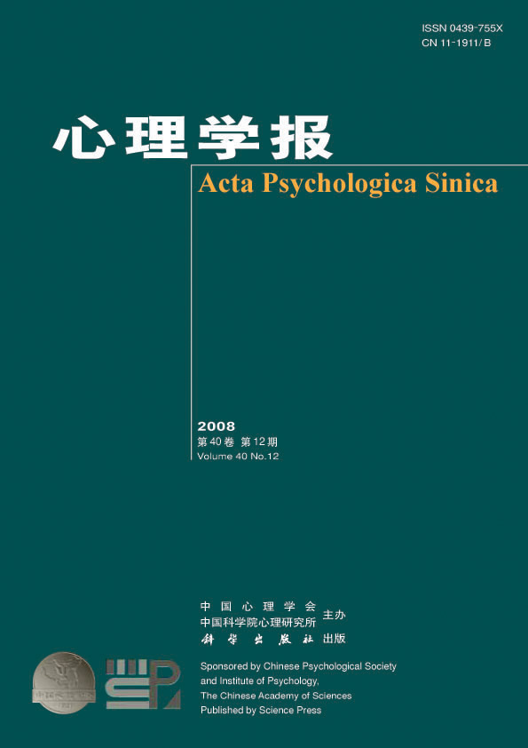

Oct 2020

:::: {style="display: flex;"}

::: {}

My first journal article [Training and transfer effects of response inhibition training with online feedback on adolescents and adults’ executive function](http://journal.psych.ac.cn/acps/EN/10.3724/SP.J.1041.2020.01212) have been successfully published on the Top 1 Psychology journal in China, named Acta Psychologica Sinica (心理学报).

:::

::: {}

```{r, echo=FALSE, out.width="100%"}

```

:::

::::
---
March 2021
- updated links so they actually work
- Excited that Drew Shives will be joining the lab as a doctoral student in Fall 2021!!! Welcome Drew!
---
