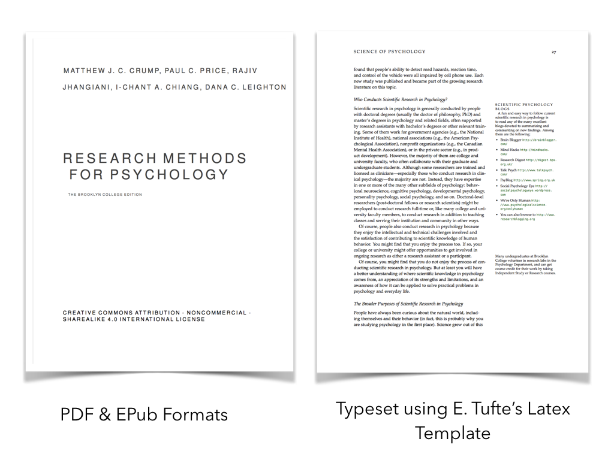

```{r setup, include=FALSE, echo=FALSE}
options(htmltools.dir.version = FALSE)
knitr::opts_chunk$set(echo = FALSE,message=FALSE,warning=FALSE, cache = TRUE)
```

class: pink, center, middle, clear

# OERs at Brooklyn College

---

# Overview

1. Why OERs
2. Examples
3. Tools for making OERs
4. Considerations for new faculty

---

# Why OERs?

1. Students pay zero-textbook cost
2. Many existing OERs across content areas, see resources @ [BC Library](http://libguides.brooklyn.cuny.edu/research/oer)
3. Most OERs CC (creative commons) licensed, allowing anyone to remix, re-use, edit, edit, modify, etc.
4. Existing resources can help you make your course better
5. Making new resources can help you make the course you want
6. Making your course open allows other people to help you make your material better

---

class: pink, center, middle, clear

# Examples

---

# Research methods

```{r}

```


---

# PDF & epub formats

```{r}

```


---

# Web book format

```{r}

```

---

# Inline commenting with Hypothes.is

```{r}

```

---

# Workflow pipeline

```{r}

```

---

# Online workflow tutorial

[https://crumplab.github.io/OER_bookdown/](https://crumplab.github.io/OER_bookdown/)

```{r, out.width="300px", fig.align='center'}
knitr::include_graphics("imgs/OER.png")
```

---

class: pink, center, middle, clear

# One more example

---

# Introductory statistics

[https://crumplab.github.io/psyc3400/](https://crumplab.github.io/psyc3400/)

```{r, out.width="500px", fig.align='center'}

```

---

# Github for code and content

```{r, out.width="500px", fig.align='center'}

```

---


