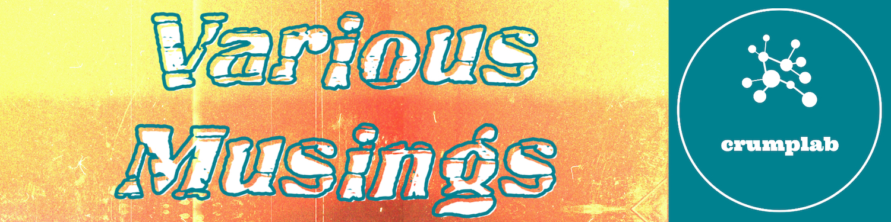
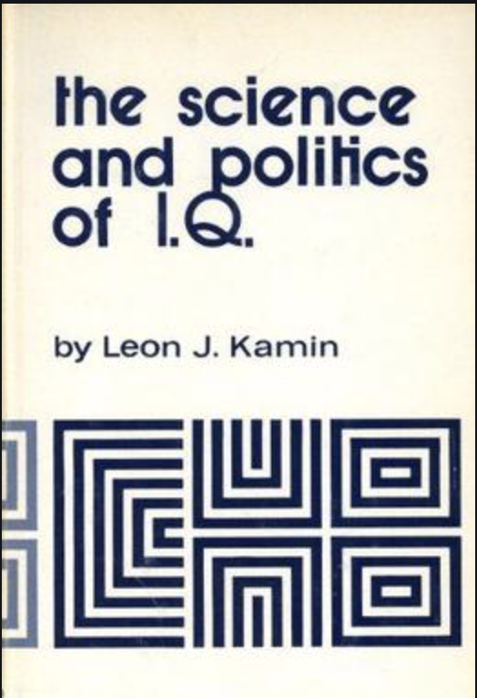
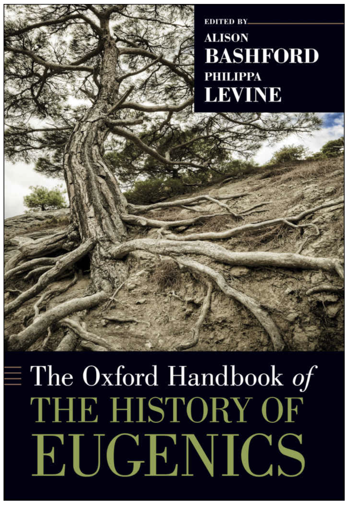

```{css, echo=FALSE}
.page-header {
    display: none;
  }
```



```{r setup, include=FALSE}
knitr::opts_chunk$set(message=FALSE,warning=FALSE, cache=FALSE)

```

#

This blog is a public-facing expression of me working through various ideas and methods, mostly around cognitive psychology and how it sits within a scientific and social context. When I'm not working on these words, they sit here, and when I am working on them, they change. I'm attempting to use my writing process to evaluate and compose perspectives, some of which may be my own... it's confusing because I use writing to know if I think something, but I keep changing the words as I learn what I think.

---

<div class="row">
<div class="col-sm-9">

## [Learning to code for Ornament and Crime Hemisphere suite](https://crumplab.github.io/blogposts/7_28_20_OC/7_28_20_OC.html)

July 28, 2020

Some notes on learning how to program applets in the hemisphere suite for the open source euro-rack module Ornament and Crime

</div>
<div class="col-sm-3">

```{r, echo=F, out.width="100%"}
knitr::include_graphics("images/blog/OC.png")
```

</div>
</div>

---

<div class="row">
<div class="col-sm-9">

## [Version control, public discourse, and epistemic access](https://crumplab.github.io/blogposts/7_20_20_versioncontrol/7_20_20_versioncontrol.html)

July 20, 2020

Some thoughts on using version control systems as a process for public discourse

</div>
<div class="col-sm-3">


```{r, echo=F, out.width="100%"}
knitr::include_graphics("images/blog/git.png")
```

</div>
</div>


---

<div class="row">
<div class="col-sm-9">

## [Psychology and Eugenics connections](https://crumplab.github.io/blogposts/7_13_20_PsychEugenics/7_13_20_PsychEugenics.html)

July 13, 2020

Making notes and connecting dots about the pervasiveness of eugenics ideology among psychologists. 


</div>
<div class="col-sm-3">

```{r, echo=F, out.width="100%"}
knitr::include_graphics("images/blog/eugenics.jpg")
```


</div>
</div>

---

<div class="row">
<div class="col-sm-9">

## [The Science and Politics of IQ](https://crumplab.github.io/blogposts/7_9_20_KaminIQ/7_9_20_KaminIQ.html)

July 9, 2020

Reading through Leo Kamin's The Science and Politics of IQ (1972), and taking notes here

</div>
<div class="col-sm-3">

```{r, echo=F, out.width="50%"}

```

</div>
</div>

---

<div class="row">
<div class="col-sm-9">
## [The Oxford Handbook of the History of Eugenics](https://crumplab.github.io/blogposts/7_8_20_HistoryEugenics/7_8_20_HistoryEugenics.html)

July 8, 2020

I'm reading through the Oxford Handbook of the History of Eugenics and collecting my notes here.

</div>
<div class="col-sm-3">

```{r, echo=F, out.width="100%"}

```

</div>
</div>

---

<div class="row">
<div class="col-sm-9">

## [The Eugenic Mind Project](https://crumplab.github.io/blogposts/7_7_20_EugenicMind/7_7_20_EugenicMind.html)

July 7, 2020

I'm reading the Eugenic Mind Project by R. A. Wilson, and writing about it here.
</div>
<div class="col-sm-3">

```{r, echo=F, out.width="100%"}
knitr::include_graphics("images/blog/EM.jpg")
```

</div>
</div>

----

<div class="row">
<div class="col-sm-9">

## [Reading the Journal of Black Psychology](https://crumplab.github.io/blogposts/7_2_20_JBP/7_2_20_JBP.html)

July 2, 2020

I'm reading the Journal of Black Psychology from the beginning, and making notes here.

</div>
<div class="col-sm-3">

```{r, echo=F}
knitr::include_graphics("images/blog/JBP.png")
```


</div>
</div>

--------------------------

# A Hodge-Podge Theory of Method (HP-TOM)

I'm smoking a pork shoulder today, so naturally I felt compelled to produce a hodge-podge theory of method to express my cluttered views on science before I head out to buy potato buns.

[My half-smoked HP-TOM is right here](https://crumplab.github.io/blogposts/hodgepodge/hodgepodge.html). And, again for the record. I have been smoking a pork shoulder.

--------------------------

# playjareyesores | an R package for detecting  plagiarism

2019-06-20, last compiled: `r Sys.Date()`

Plagiarism, it happens. I've run into it on more than one occasion, from students and faculty! Needless to say, it really urks me.

My university provides access to plagiarism detection services like Turnitin and Safeassign, however these tools can be cumbersome to use. For example, if you have 100 students turn in 100 papers, then you might hope the scores from these programs would help you identify the papers that were the same. They do and they don't. For example, you might get a paper that says 90% the same, but when you check it, you see that two students copied the assignment instructions into their paper, making the documents similar. Or you might get 5% the same, but when you check it, you see that although most of the paper doesn't appear to be copied, there is this one whole paragraph that's identical... 

To solve particular comparison problems I have also sometimes resorted to using R for plagiarism detection. So, I thought I would begin to put some of my code into a package I'm calling `playjareyesores`:

 - package website: [https://crumplab.github.io/playjareyesores/](https://crumplab.github.io/playjareyesores/)
 - github repo: [https://github.com/CrumpLab/playjareyesores](https://github.com/CrumpLab/playjareyesores) 

