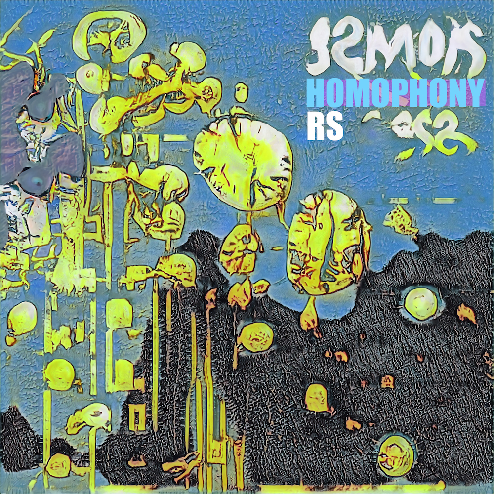
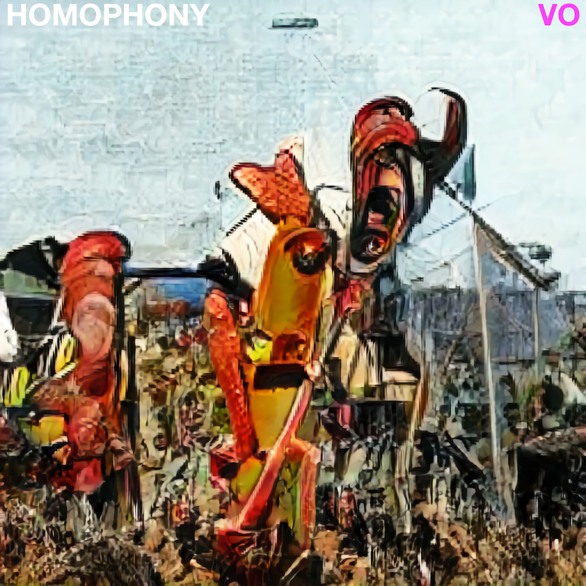

```{css, echo=FALSE}
.page-header {
    display: none;
  }
```


#

```{r setup, include=FALSE}
knitr::opts_chunk$set(message=FALSE,warning=FALSE, cache=TRUE)
```

<br>

# Music

----

::::: {.row}
:::: {.col-sm-9}
::: {.col-sm-9}

## [RS](https://distrokid.com/hyperfollow/homophony/rs)

Released in Fall 2020, available on most major music streaming services <https://distrokid.com/hyperfollow/homophony/rs>. 

Cover art generated by an AI. 

More synthpop, less vocoder


:::
::::

:::: {.col-sm-3}
```{r rs, out.width='100%', echo=F}

```
::::
:::::

----

::::: {.row}
:::: {.col-sm-9}
::: {.col-sm-9}

## [VO](https://distrokid.com/hyperfollow/homophony/vo)

Released in Fall 2020, available on most major music streaming services <https://distrokid.com/hyperfollow/homophony/vo>. 

Cover art generated by an AI. 

Synthpop, lots of vocoder.


:::
::::

:::: {.col-sm-3}
```{r vo, out.width='100%', echo=F}

```
::::
:::::

----

# Painting

----

::::: {.row}
:::: {.col-sm-9}
::: {.col-sm-9}

## [things](https://crumplab.github.io/things/)

When I find to make visual things I take pictures of them, and post them here <https://crumplab.github.io/things/>

:::
::::

:::: {.col-sm-3}
```{r things, out.width='100%', echo=F}
knitr::include_graphics("images/fun/things.jpg")
```
::::
:::::


