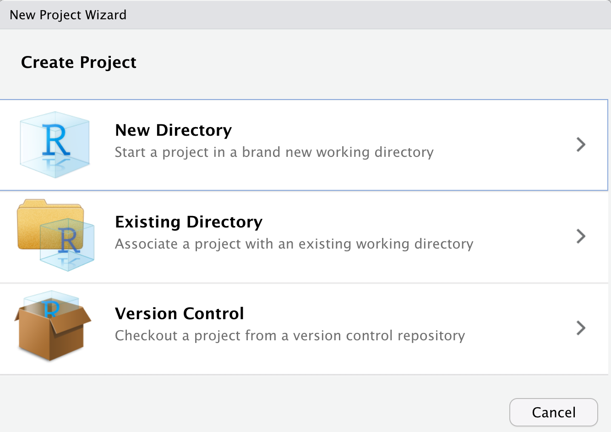
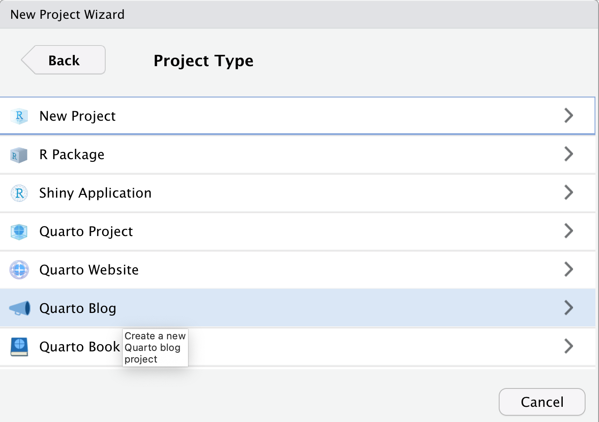
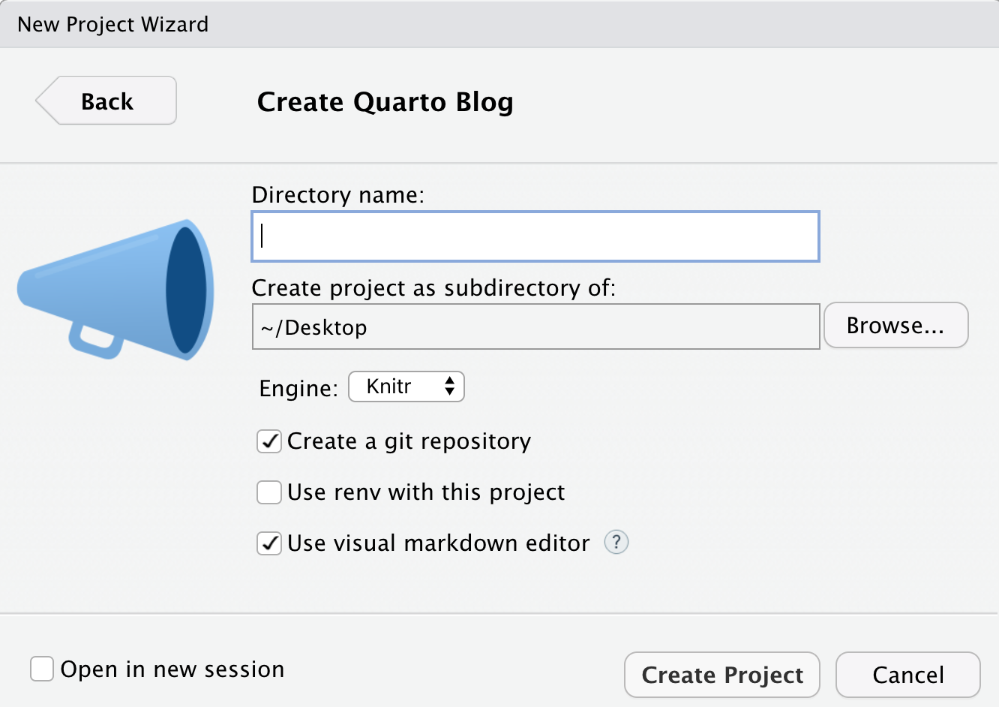
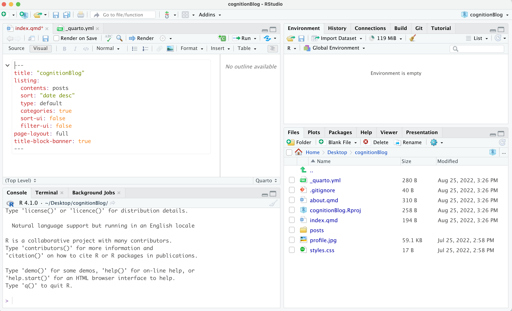
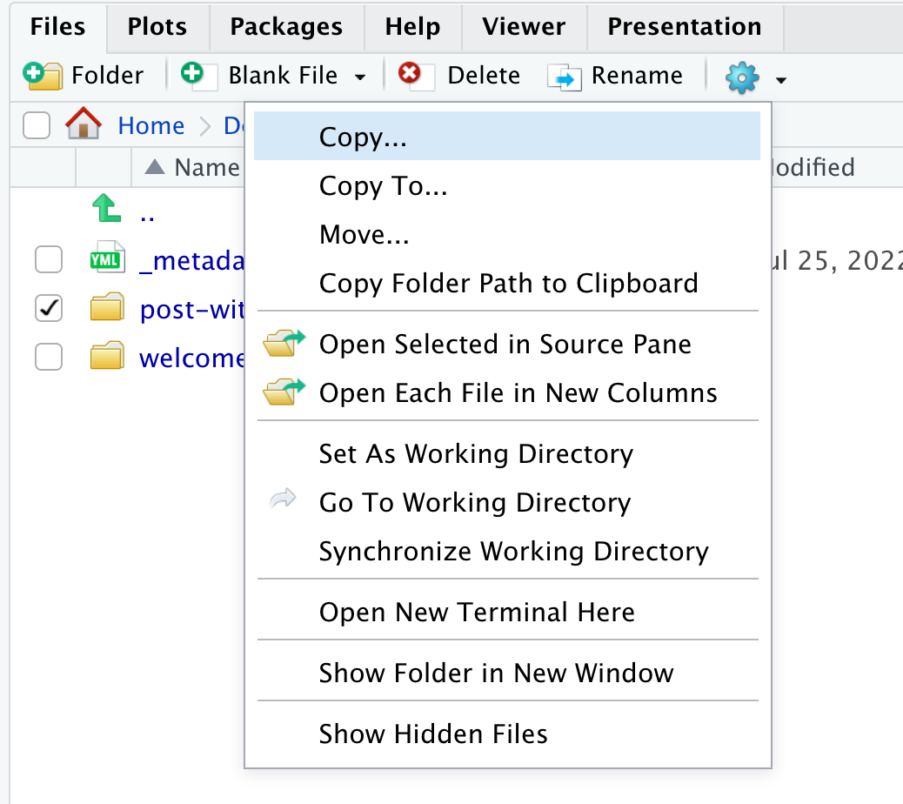
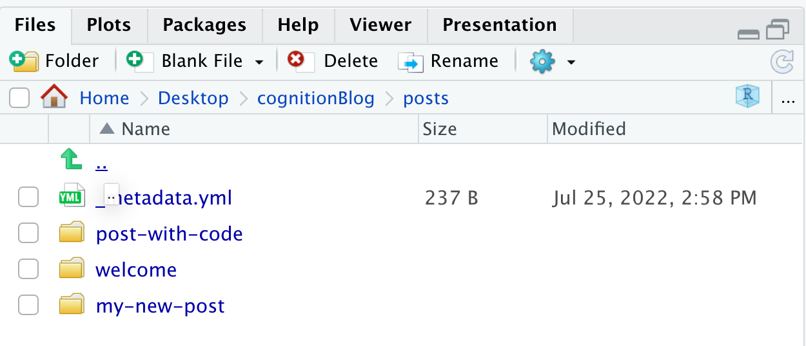
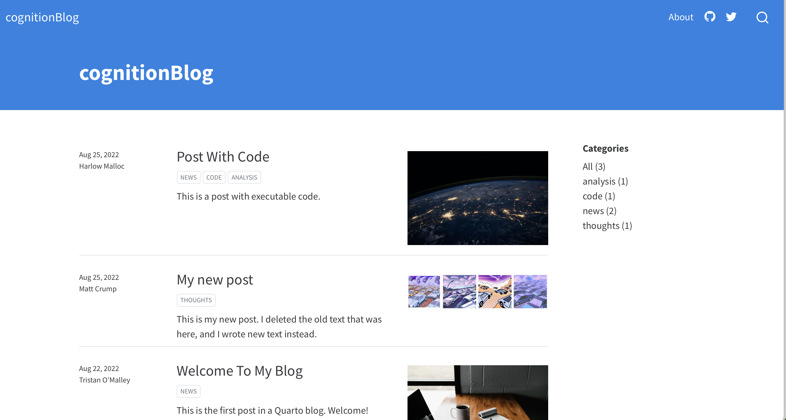

```{r, include = FALSE}
knitr::opts_chunk$set(
  collapse = TRUE,
  comment = "#>",
  echo = FALSE
)
```

```{css, results='asis', echo=F}
@media (min-width: 1400px) {
    body {
        font-size:18px
    }

    .col-md-3 {
        margin-left: 5rem
    }

    .row {
        --bs-gutter-x: -20%!important;
    }

    .row>main {
        max-width: 40rem;
    }

}

```

I often assign "blogging" as an optional way for students to engage in course material. There are lots of ways to get a blog up and running on the internet, and my preference is to suggest that students adopt and learn R Markdown and RStudio for their blogging workflow. Many of my students are unfamiliar with computer programming in R, so learning how to blog with R can be a useful gateway to computational skills.

R Studio now comes packaged with [Quarto](<https://quarto.org>), which provides yet another blogging workflow. This post is intended for my students as a quick guide to setting up a quarto blog.

## Overview

Here's an outline of what is in store. You will need to download some free software to your computer and make a free account on Github.com. After the software is downloaded you will be able to open a blogging template (with all the files you need to get started), edit and make new posts, and preview the blog on your computer. Finally, we'll discuss how to share the blog on the internet. At the end, you should be able to make your own new blog posts using this workflow. Last, you do not need to know how to program in R to do this.

I intend to make a video overview and put it here, but the text-based instructions should be enough to get you started as well.

## Get the software you need

1.  Sign up for a free account at <https://github.com>. This a website for sharing open-source software, but it can also be used to serve your blog as a website for free.
2.  [Download Github Desktop](https://desktop.github.com) and install it on your machine. This should install the version control software git on your system, and you can use Github Desktop to easily push your blog from your local computer so that it can be viewed on Github.com.
3.  [Download R](https://cran.rstudio.com) and install it on your machine. R is a programming language capable of many things, and it needs to be on your machine before you can run R Studio.
4.  [Download R Studio Desktop](https://www.rstudio.com/products/rstudio/download/#download) and install it on your machine. R Studio is called an "IDE" or integrated development environment, that you can use to write your blog with quarto.

## Make a quarto blog project

If you already have R Studio on your machine, then make sure you have the latest version, which includes **quarto**.

1.  Open up R studio.
2.  Choose File -\> New Project
3.  You should see a pop-up menu
4.  Choose "New Directory"

```{r}

```

5.  Choose "Quarto Blog" for project type

```{r}

```

6.  The blog files will be stored in a new folder, give your new folder a simple name (no spaces). This will also be the name for your github repository later on. Make sure "Create a git repository" is clicked. Then press create project.

```{r}

```

## Compile your blog

If everything went smoothly, then you should be looking at a new R Studio project with the source code for you blog. I named my project "cognitionBlog", and this is what I am looking at after pressing "Create Project".

```{r}

```

This is an R Studio project with a template for making a blog. As you learn more about quarto, you will be able to modify and customize the blog to your own liking. Quarto is a very powerful document creation system that can be used to make websites, blogs, slide decks, books, and more; and, you can find more info about it here: <https://quarto.org>.

For the purpose of this tutorial, I'll try to keep things as simple as possible so you can start blogging.

You should be able to see a **preview** of what the blog will look like right away.

1.  Go to the "build" tab in the top right hand corner, and press "Render website".

```{r}
knitr::include_graphics("imgs/build.png")
```

2.  You may see a preview of the website in the R Studio browser window, and you can click this little button to preview the blog in your default browser.

```{r}
knitr::include_graphics("imgs/rstudio_browser.png")
```

## Writing your own posts

I recommend learning to blog with quarto by opening and modifying the template files.

You can see all of the files in your project by clicking on the files tab:

```{r}
knitr::include_graphics("imgs/rstudio_files.png")
```

The default quarto blog is a bare-bones website with a list of blog posts and an about page. You can change the title of the blog in "index.qmd", and add more info to the about page by writing new text in "about.qmd". But, let's focus on making a new post.

First, navigate into the "posts" folder. The template contains two existing posts. Each post is in its own folder.

```{r}
knitr::include_graphics("imgs/rstudio_posts.png")
```

To make a new post, you can "copy" an existing folder for a post and give it a new name.

```{r}

```

I named my new post "my-new-post", and now I can see it listed as a folder beside the original two from the template.

```{r}

```

Let's click into the folder and edit the "index.qmd" file. Here are the files inside the folder:

```{r}
knitr::include_graphics("imgs/newpostfiles.png")
```

Clicking on "index.qmd" should open the file in the R studio text editor (on the left):

```{r}
knitr::include_graphics("imgs/indexqmd.png")
```

I edited this file and gave it a new title, new author, etc. Then I deleted the text at the bottom and wrote my own first blog post.

```{r}
knitr::include_graphics("imgs/mypost.png")
```

Now, if I render the website again (from the build tab), my new post is automatically added to the list of posts (they are listed in order by date).

```{r}

```

You could now be off to the races. To further customize, delete the template posts you don't want and replace them with your own. At this point your blog is only on your local computer. If you want to share it on the internet, then follow the next steps to share your blog using Github.com.

## Share your quarto blog on Github.com

The written instructions below may not be enough for a new user to get the blog published to Github. You can view more in-depth instructions from quarto here <https://quarto.org/docs/publishing/github-pages.html>. Or, I recommend watching the video (which I plan to put up shortly.) The steps might appear complicated, but it's not too bad once you get everything set up.

1.  Open up Github Desktop
2.  Go to preferences and sign in to your Github.com account
3.  "Add" your blog project folder to Github Desktop
4.  Publish to github.com and uncheck private repository (if you want other people to see it.)
5.  You should now be able to see your new repository in your github.com profile, which means you should be able to see a copy of your blog files in the repository.

I've been leaving out some of the technical details. Briefly, in this blogging workflow you write your blog in a ".qmd" document, which stands for "quarto" markdown. This is a plain text file. When you "render the website", the quarto engine creates the necessary html and other web-files needed to display your blog. By default all of these web-files are stored in the "\_site" folder.

In the last step, we are going to change where the files are saved from "\_site" to a new folder named "docs". This is because Github.com can conveniently serve files located in "docs" folders as websites.

To change the output directory from `_site` to `docs` open up `_quarto.yml`, and add the line `output-dir: docs` just like this:

    project:
      type: website
      output-dir: docs

When you render the website again, you should see a new `docs` folder with your blog files.

Push your changes to github so that your repository, and activate the github pages option under your repository settings. Then you should be able to view your blog live from the URL given by github pages.

## Write more and push to publish

Once you have everything set up you should be able to:

1.  Make new posts by copying an existing one.
2.  Publish them by rendering the website on your computer, and pushing your changes to Github.com

And, that's it. Happy blogging.
