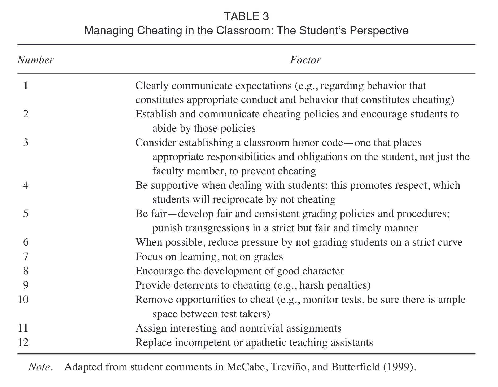
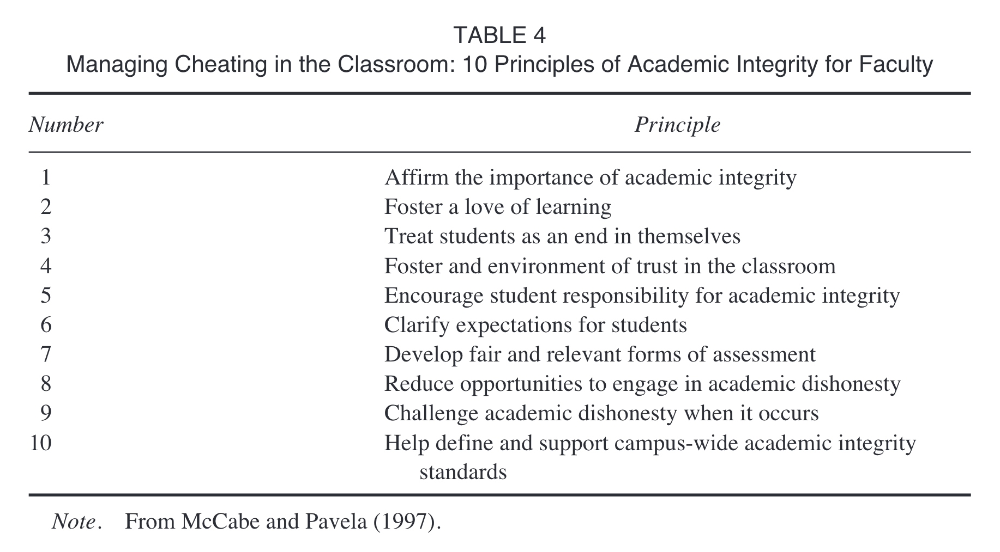

```{r, include = FALSE}
knitr::opts_chunk$set(
  collapse = TRUE,
  comment = "#>",
  out.width="50%",
  fig.align = "center",
  echo=FALSE
)
```


```{css, results='asis', echo=F}
@media (min-width: 1400px) {
    body {
        font-size:18px
    }

    .col-md-3 {
        margin-left: 5rem
    }

    .row {
        --bs-gutter-x: -20%!important;
    }

    .row>main {
        max-width: 40rem;
    }

}

```

In a previous version of this post, I shared a detective/thriller themed story about academic integrity issues arising in a course I taught. The story picked up more attention than I anticipated. I shared the story as part of a course assessment writing exercise, which has now been completed, and the original post is no longer available.

Part of my course assessment exercise was to learn more about the literature on cheating behavior. I conducted a short literature review on that topic and am posting brief notes about a few of the papers.

For teaching psychology, I found this paper to be most relevant and current:

Jenkins, B. D., Golding, J. M., Le Grand, A. M., Levi, M. M., & Pals, A. M. (2022). When Opportunity Knocks: College Students’ Cheating Amid the COVID-19 Pandemic. Teaching of Psychology, 009862832110590. https://doi.org/10.1177/00986283211059067


## Sporadic notes


Drake, C. A. (1941). Why students cheat. The Journal of Higher Education, 12(8), 418–420. https://doi.org/10.2307/1976003

From 1941...

Speculates on why students cheat as well as how the behavior seems elicited by the competitive structure of higher ed.

Gave a class of 126 students an opportunity to cheat. Reports that about 30% of students cheated. Students with lower grades cheated more than students with higher grades.

---

Wrightsman Jr, L. S. (1959). Cheating---A research area in need of resuscitation. Peabody Journal of Education, 37(3), 145--149. <https://doi.org/10.1080/01619565909536899>

Laments that there isn't much empirical work on cheating, and that most prior work repeatedly demonstrates the same finding: giving students the opportunity to cheat by allowing them to grade their own tests (and change their answers) elicits cheating behavior (the duplicating technique).

Estimates between 10-90% cheating rates from research giving students opportunity to cheat when grading their own exams.

Calls for more research on cheating that occurs in actual testing situations.

---

Hetherington, E. M., & Feldman, S. E. (1964). College cheating as a function of subject and situational variables. Journal of Educational Psychology, 55(4), 212. https://doi.org/10.1037/h0045337

pick-your-poison-psychology

sigh, but there are some head-bending t-tests

---

Zastrow, C. H. (1970). Cheating among college graduate students. The Journal of Educational Research, 64(4), 157–160. https://doi.org/10.1080/00220671.1970.10884124


ABSTRACT Forty-five graduate students received three quizzes in one of their courses, and also filled out the Minnesota Multiphasic Personality Inventory (MMPI) and a questionnaire on cheating. The main findings were: (a) the inci dence of cheating among these graduate subjects was found to be at least as extensive as reported in prior studies among undergraduate students?at least eighteen of the forty-five (40%) graduate subjects cheated on the quizzes; (b) pressure to obtain good grades was the main reason subjects felt they cheated in the past; (c) there was a lack of consensus whether certain behaviors constitute cheating; (d) no significant personality differences were found between cheaters and non-cheaters; (e) the MMPI results provided evidence in support of the doctrine of specificity of moral behavior.

---

Baird Jr, J. S. (1980). Current trends in college cheating. Psychology in the Schools, 17(4), 515–522. https://doi.org/10.1002/1520-6807(198010)17:4<515::AID-PITS2310170417>3.0.CO;2-3

Abstract

The purpose of this study was to investigate the frequency, methods, and correlates of college cheating. A questionnnaire measuring 7 subject variables and 33 specific behaviors was administered to 200 students. The finding that about 75% of those surveyed had cheated in college was interpreted as supporting an hypothesized trend toward increasing dishonesty. Data on approval and guilt, reasons for cheating, reactions to cheating, and specific techniques were included. It was found that sex, year in shcool, grade point average, academic major, fraternity-sorority membership, and extracurricular participation were significantly related to cheating. The conclusions supported the importance of traditional explanatory variables and suggested an interpretation based on attribution theory.

---

Nuss, E. M. (1984). Academic integrity: Comparing faculty and student attitudes. Improving College and University Teaching, 32(3), 140–144. https://doi.org/10.1080/00193089.1984.10533862

Thoughtful and worth the read

---

McCabe, D. L., & Trevino, L. K. (1993). Academic dishonesty: Honor codes and other contextual influences. The Journal of Higher Education, 64(5), 522–538.

Measured student self-reported cheating rates by survey. Large N. Between colleges with and without honor codes.

---

McCabe, D. L., Treviño, L. K., & Butterfield, K. D. (2001). Cheating in academic institutions: A decade of research. Ethics &Behavior, 11(3), 219–232. https://doi.org/10.1207/S15327019EB1103_2

Abstract

This article reviews 1 decade of research on cheating in academic institutions. This research demonstrates that cheating is prevalent and that some forms of cheating have increased dramatically in the last 30 years. This research also suggests that although both individual and contextual factors influence cheating, contextual factors, such as students’ perceptions of peers’ behavior, are the most powerful influence. In addition, an institution’s academic integrity programs and policies, such as honor codes, can have a significant influence on students’ behavior. Finally, we offer suggestions for managing cheating from students’ and faculty members’ perspectives.

Table 1 shows Self-Admitted Cheating—Summary Statistics which range from 44 to 82%.

```{r}

```

```{r}

```

---

Bowers, W. J. (1964). Student dishonesty and its control in college. Bureau of Applied Social Research, Columbia University.

A first? large-scale survey on cheating in US colleges.

---

Hollis, L. P. (2018). Ghost-students and the new wave of online cheating for community college students. New Directions for Community Colleges, 2018(183), 25–34. https://doi.org/10.1002/cc.20314

"I got very excited and signed up for several classes at the community college. My employer was paying for the online class but I should have remembered that I would be the one who’d have to take the classes in the end. I didn’t think about it . . . caused me a panic attack. . . . I took some of the classes and did some of the projects but I knew from the beginning that there was no way I could take the online classes and complete them myself. After having that epiphany, I realized that I’d be on the hook for part of the course fee if I didn’t take my online classes and complete them (yes, my employer would only pay if I passed the class) . . . Anyway, I did a bit of research and found No Need To Study. Hiring them was the best decision ever! No Need To Study works lightning fast; it is like they know the classes inside out, taking my classes in record time. I got my classes done! My employer paid and I have the certifications now."

<https://www.noneedtostudy.com/take-my-online-class/>
<https://acemyassignment.com/>
<https://www.paymetodoyourhomework.com/>

Hiring ghost students to take online classes appears to be big business. Offers some tips on deterrence.

---

Stiles, B. L., Wong, N. C. W., & LaBeff, E. E. (2018). College cheating thirty years later: The role of academic entitlement. Deviant Behavior, 39(7), 823–834. https://doi.org/10.1080/01639625.2017.1335520

---

Krienert, J. L., Walsh, J. A., & Cannon, K. D. (2021). Changes in the tradecraft of cheating: Technological advances in academic dishonesty. College Teaching, 1–10. https://doi.org/10.1080/87567555.2021.1940813

---

Burgason, K. A., Sefiha, O., & Briggs, L. (2019). Cheating is in the eye of the beholder: An evolving understanding of academic misconduct. Innovative Higher Education, 44(3), 203–218. https://doi.org/10.1007/s10755-019-9457-3


---

Ives, B. (2020). Your Students Are Cheating More than You Think They Are. Why?. Educational Research: Theory and Practice, 31(1), 46–53.

Evaluates neutralization theory approach to academic misconduct.

Neutralization theory posits a five-factor system to explain how students justify academic misconduct:

1. Denial of Responsibility
2. Denial of Injury
3. Denial of Victim
4. Condemnation of the Condemner
5. Appeal to higher loyalties

This theory was developed in the context of juvenile delinquency and often applied to academic misconduct.

Table 1 is reasons for Academic misconduct from a sample of university students from 6 institutions in Romania.

Factor analysis suggests student reasons have a single dimension, not five dimensions.

Suggests Achievement Goal Theory as a better model (Urdan, 1997).

---

Daumiller, M., & Janke, S. (2019). The impact of performance goals on cheating depends on how performance is evaluated. AERA Open, 5(4), 2332858419894276. https://doi.org/10.1177/2332858419894276

---

Jenkins, B. D., Golding, J. M., Le Grand, A. M., Levi, M. M., & Pals, A. M. (2022). When Opportunity Knocks: College Students’ Cheating Amid the COVID-19 Pandemic. Teaching of Psychology, 009862832110590. https://doi.org/10.1177/00986283211059067

**GOOD SUMMARY PAPER**

Nice overall summary of background, and reports on open ended self-report questions from students about their cheating behavior.

74.8% reported cheating

1/205 reported being caught.

No impact of demographics


---
